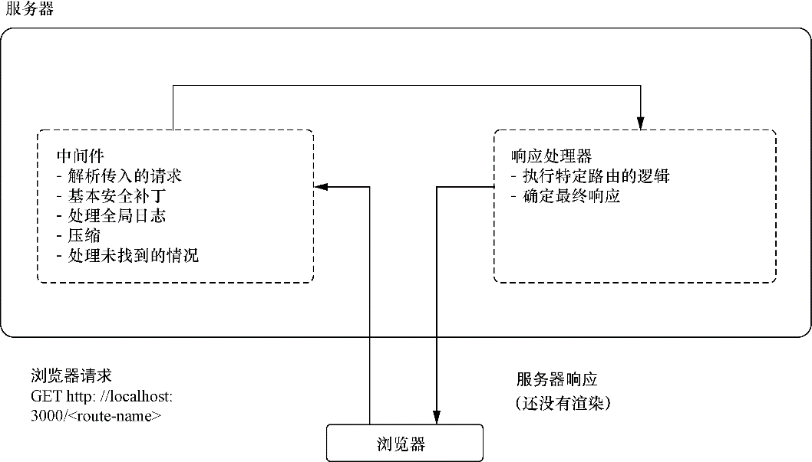
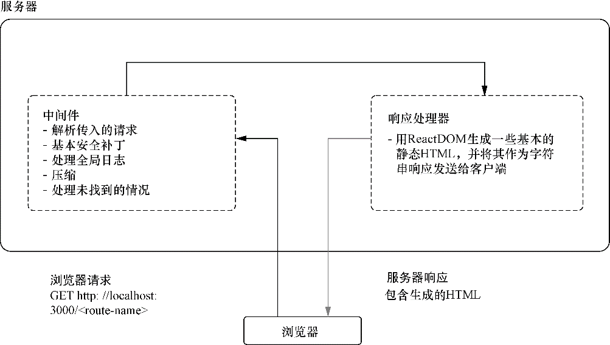

### 12.4　在服务器上渲染组件

我们已经简要地了解了服务器端渲染的一些权衡，现在就可以开始深入研究并了解如何使用React实现服务器端渲染。让我们从要用的React API开始。ReactDOMServer（通过 `require ('react-dom/server')` 或 `import ReactDOM from 'react-dom/server'` 来访问）暴露了4个重要方法，可以用于为组件生成初始HTML：

+ `renderToString` ；
+ `renderToStaticMarkup` ；
+ `renderToNodeStream` ；
+ `renderToStaticNodeStream` 。

依次来看一下这些方法。

首先，我们有 `ReactDOMServer.renderToString` 。 `renderToString` 所做的正如其名：它接收一个React元素，并根据调用该方法时存在的初始状态和属性（默认值或传递进来的值）从组件生成对应的HTML标记。如前面几章所了解的，React元素是React应用最小的构建单元。它们是用 `React.createElement` （或者更通常地说，由JSX）创建的，而且它们要么从字符串类型创建，或是从React组件类创建。这个方法看起来像这样：

```javascript
ReactDOMServer.renderToString(element) string
```

当在服务器上渲染时，就像往常一样使用组件和传递属性。到目前为止，在服务器上使用React与以往最主要的区别是，在服务器上使用React缺乏DOM和浏览器环境。这意味着，React不会运行 `componentWillMount` 这样的生命周期方法，也不会保存状态或使用其他特定于DOM的特性。


**练习12-1**

服务器端渲染可能涉及大量的复杂性，不应该被视为所有应用程序标准的或者“必备”的特性。花点时间考虑如何实现（或者选择不实现）以下类型的应用的服务器端渲染：

+ 没有面向公众部分的企业级应用；
+ 严重依赖广告的社交媒体网站；
+ 电子商务应用；
+ 视频托管平台。


`ReactDOM.renderToStaticMarkup` 会做与 `renderToString` 一样的事情，但不会附加任何React在客户端“接管”时需要的额外的DOM属性。当想要进行基本的模板或静态站点的生成而不需要任何额外的属性时，这非常有用。 `renderToStaticMarkup` 与 `renderToString` 几乎完全相同：

```javascript
ReactDOMServer.renderToStaticMarkup(element) string
```

在此之后我们将不再使用 `renderToStaticMarkup` ，但是了解了如何使用React来实现SSR，在将来的项目中使用它就应该很简单了。

你可能已经注意到，前两个方法与 `renderToNodeStream` 和 `renderToStaticNodeStream` 存在明显的互补关系。你猜对了。这两个方法与前两个方法基本相同，只是它们利用了Node的Streams API，并且是在React 16中与Fiber Reconciler及许多其他更改一起被引入的。Streams通常在Node.js中使用，如果你用过Node可能会对其有所了解。如果没有用过，也没有关系，我们的目的在于，这些基于流的方法是异步的，这使它们相对于其同步方法具有显著的优势。有段时间，React服务器端渲染的一个小缺点就是这些方法是同步的。如果应用需要渲染包含许多组件的复杂页面，这对应用无疑是个挑战。在本章稍后，在了解将服务器端数据获取作为服务器端渲染的一部分时，我们会探讨这些方法。

对可用的API方法有了一定了解之后，我们就可以专注于 `renderToString` 了。 `RenderTo- String` 会生成React可以在客户端处理和使用的代码。React-DOM还有另外一个方法 `hydrate` ，其工作原理与我们常用的常规的 `render` 方法几乎一模一样，主要区别在于 `hydrate` 专门处理服务器端渲染生成的标记内容。

如果在一个节点上（该节点已经有了React-DOM在服务器上生成的标记内容）调用 `ReactDOM.hydrate()` ，那么React会保留现有的HTML标记并比以往少做些工作。这通常意味着在初始启动时，除了更快的初始加载（取决于发送了多少数据，以及服务器负载、网络、天气等其他因素），React要做的工作要少得多。我不会再强调这一点，但请记住，SSR不是魔法，如果做的事情是加载大型JavaScript文件、不切分代码或违背其他最佳实践，会轻易抵消任何性能改进。

到目前为止，还没有接触任何服务器文件。本章范围有限，服务器编程超出了本书的范围，因此我们不会太多涉及Node.js运行时或Web服务器编程范式。如果想了解更多关于Node和服务器端编程的内容，去看看Alex Young等人编写的《Node.js实战（第2版）》。

我们将通过关注需要在服务器上进行的更改来开始SSR的构建。代码清单12-3展示了主应用程序服务器代码，这是在让其与React协同工作之前的样子。我已经包含了所有东西，以便你对这段代码做什么有个大概感受。大多数代码都是简单的Express应用可能会用到的样板中间件，但它们中的大多数与SSR没有直接关系。图12-3将代码清单12-3中的代码置于本章到目前所讨论的渲染方法的上下文中。


<center class="my_markdown"><b class="my_markdown">图12-3　如代码清单12-3所示，这是服务器代码所做的基本工作。它设置好服务器，添加一些样板
 中间件，然后提供一个精简的HTML文件，其会依次下载应用文件</b></center>

代码清单12-3展示了应用程序的（基本）服务器设置。当将其放入本章讨论的SSR方法的上下文中时，它符合以客户端为中心的范式。在这种方式中，服务器通常只发送一个不包含预先渲染内容的HTML文件。构建工具目前负责生成和提供HTML文件。该文件包含对脚本的引用，这些脚本将下载并执行应用的渲染和管理工作，但服务器上没有做任何渲染（目前还没有！）。

代码清单12-3　从服务器开始（server/server.js）

```javascript
import { __PRODUCTION__ } from 'environs';  ⇽--- 使用ES模块语法，通过ESM在Node 8.5或更高版本中可用
import { resolve } from 'path';
import bodyParser from 'body-parser';
import compression from 'compression';
import cors from 'cors';
import express from 'express';
import helmet from 'helmet';
import favicon from 'serve-favicon';
import hpp from 'hpp';
import logger from 'morgan';
import cookieParser from 'cookie-parser';
import responseTime from 'response-time';
import * as firebase from 'firebase-admin';
import config from 'config';
import DB from '../db/DB';
const app = express();  ⇽--- 设置可应用于所有传入请求的中间件，处理日志、一些基本的安全保护、传入请求的解析
const backend = DB();
app.use(logger(__PRODUCTION__ ? 'combined' : 'dev'));
app.use(helmet.xssFilter({ setOnOldIE: true }));
app.use(responseTime());
app.use(helmet.frameguard());
app.use(helmet.ieNoOpen());
app.use(helmet.noSniff());
app.use(helmet.hidePoweredBy({ setTo: 'react' }));
app.use(compression());
app.use(cookieParser());
app.use(bodyParser.json());
app.use(hpp());
app.use(cors({ origin: config.get('ORIGINS') }));
app.use('/api', backend);  ⇽--- 响应请求，将在此与React-DOM进行集成
app.use(favicon(resolve(__dirname, '..', 'static', 'assets', 'meta',
     'favicon.ico')));
app.use((req, res, next) => {  ⇽--- 错误处理代码，它将捕获从其他路由转发的错误并将这些错误发送给客户端
    const err = new Error('Not Found');
    err.status = 404;
    next(err);
});
app.use((err, req, res) => {
    console.error(err);
    return res.status(err.status || 500).json({
        message: err.message
    });
});
module.exports = app;
```

我们期望迈出的第一步是引入React-DOM并尝试渲染一个简单的组件。在继续集成应用之前，先渲染一个包含一些文本的简单 `div` 。在这个小示例中我们将使用 `React.createElement` ，这样就不必处理服务器文件的转译问题，但是稍后将组件拉进来使用时，将能够在其他文件中使用JSX。这是因为使用了 `babel-register` ，一个用于开发的Babel库，其能够动态转译代码。可以在index.js中看到引入的 `babel-register` 。在生产环境中不要这么做。我们会使用Webpack和Babel之类的工具将代码编译成包。

对于第一次尝试，要做的所有事情就是插入一条简单的消息作为 `div` 的子内容并将其发送给客户端。一旦准备好了，就运行服务器并检查返回的结果。图12-4展示了代码清单12-4所做的工作。


<center class="my_markdown"><b class="my_markdown">图12-4　现在使用React-DOM来渲染简单的HTML字符串并将其发送到客户端。从某种意义上说，
 这就是SSR的全部（创建静态标记，并将其发送到客户端）。我提到的复杂性往往来自（除了其他
 事项）获取创建文本所需要的所有数据、协调与客户端的流程，以及进行优化</b></center>

代码清单12-4　尝试服务器端渲染

```javascript
//...
app.use('/api', backend);
app.use(favicon(resolve(__dirname, '..', 'static', 'assets', 'meta',
     'favicon.ico')));
app.use('*', (req, res, next) => {  ⇽--- 在请求处理程序中，创建HTML字符串并将其发送出去
    const componentResponse = ReactDOMServer.renderToString(  ⇽--- 使用renderToString并传入一个基本的React元素
        React.createElement(  ⇽--- 用div来创建一个不带属性的元素
            'div',
            null,
            `Rendered on the server at ${new Date()}`  ⇽--- 传入一个带有时间戳的简单文本作为子内容
        )
    );
    res.send(componentResponse).end();  ⇽--- 将响应发送到客户端
});
//...
```

进行了代码清单12-4中的更改之后，在终端执行 `node server/run.js`  启动服务器，然后通过另一个会话用cURL发送请求，接着应该就会看到从服务器返回的响应。在此之前，我们每次从服务器发送相同的HTML字符，而该文档会在此之后加载应用的脚本。React会运行并将应用程序渲染为DOM（创建DOM节点，分配事件监听器，等等），通过这种新方式，可以将首次渲染委托给服务器并让React接手。代码清单12-5展示了如何运行服务器并使用cURL查看从服务器返回的响应。

代码清单12-5　检查第一个服务器端渲染的响应

```javascript
$ npm run server:dev
// ... in a different terminal session
$ curl -v http://localhost:3000  ⇽--- 请求运行服务器，检查返回的内容
> GET / HTTP/1.1
> Host: localhost:3000
> User-Agent: curl/7.51.0
> Accept: */*
>
< HTTP/1.1 200 OK  ⇽--- 应该能在请求中得到返回的头信息，但最关心的是响应体
< X-Powered-By: react
< X-XSS-Protection: 1; mode=block
< X-Frame-Options: SAMEORIGIN
< X-Download-Options: noopen
< X-Content-Type-Options: nosniff
< Access-Control-Allow-Origin: *
< Content-Type: text/html; charset=utf-8
< Content-Length: 144
< ETag: W/"90-gXhNJUy73fc2MSrpr7eaKDZ7OV8"
< Vary: Accept-Encoding
< X-Response-Time: 0.795ms
< Date: Mon, 08 May 2017 10:26:55 GMT
< Connection: keep-alive
<
* Curl_http_done: called premature == 0
* Connection #0 to host localhost left intact
<div data-reactroot="">Rendered on the server at Mon May 08 2017 03:26:55
     GMT-0700 (PDT)</div>  ⇽--- 最外层的HTML元素上有特定的react-root和react-checksum属性
```

至此，已经完成了第一次服务器端渲染。使用React来创建React组件的字符串表示形式并将其发送给客户端。现在，因为React还没有被加载，因此它无法从服务器放手的地方接续，但一经引入，它就能接管了。尝试运行相同的命令，但选择使用 `renderToStaticMarkup` ，看看来自服务器的HTTP响应有何不同。

