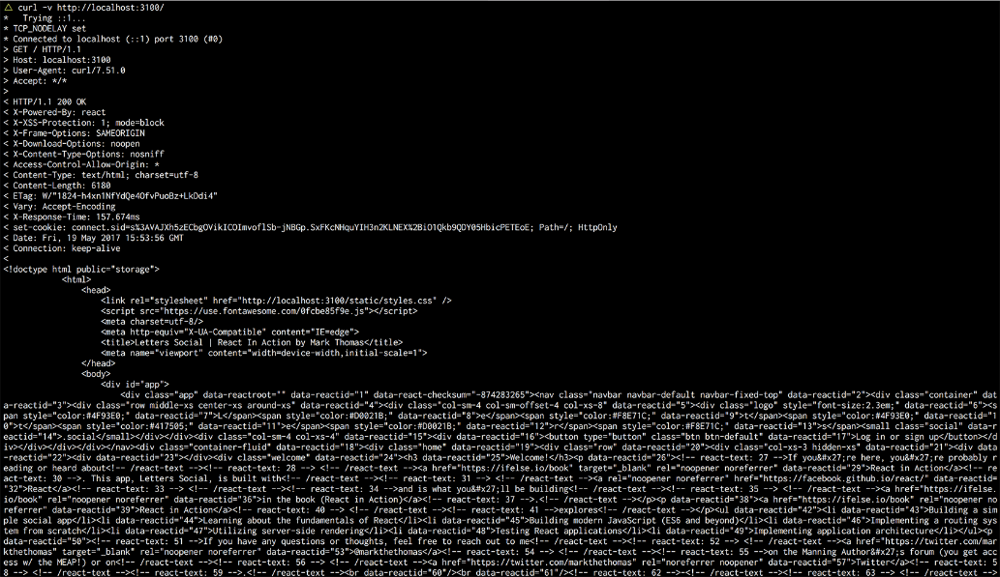

### 12.6　使用React Router处理已验证的路由器

现在服务器已经设置好了，你可以稍微清理一下应用程序的客户端。你需要确保使用了新的路由设置，还需要移动一些与身份验证相关的逻辑以便更好地使用React Router。为此，将使用React Router提供的一组特性：钩子（hook）。与挂载、更新和卸载组件的生命周期方法的工作方式类似，React Router为路由之间的跳转开放了某些钩子。有很多方式使用这些钩子，包括以下几种：

+ 允许在完成URL转换之前，为页面触发数据获取或检查用户是否登录；
+ 在用户离开页面时做清理工作或者结束分析会话，并不局限于进入相关的事件；
+ 使用React Router的钩子甚至可以做同步或异步工作，所以你不会受任何限制；
+ 将pageview事件发送到像Google Analytics这样的分析平台。

图12-6展示了在React Router v3中使用钩子的基本流程。React Router在底层与History API进行交互，但公开这些钩子以便让应用程序中的路由更容易。如果想更多了解React Router v3 API或者探索社区编写的其他有用的指南，可以在GitHub上查看这些文档。


<center class="my_markdown"><b class="my_markdown">图12-6　React Router在Route组件上公开了一些事件处理器。可以用这些事件处理器挂钩到由用户或
 代码触发的路由跳转过程。注意“redirect”不是3XX状态码的HTTP重定向</b></center>

使用onEnter钩子检查某些路由的已登录用户，如果没有经过身份验证的用户，则将其重定向到登录页面。现实中，开发者应该从安全的角度透彻地对应用进行思考并花费大量时间思考如何防止用户跳转到他们不应该访问的页面。还需要确保将安全策略延伸到服务器。但就目前而言，Firebase和路由钩子应该足以保护一些路由。代码清单12-10展示了如何为受保护的页面设置 `onEnter` 钩子。你可能已经看出了上一章中的身份验证逻辑，之前在登录action中使用过这个逻辑。图12-6展示了这一过程如何工作。

代码清单12-10　设置onEnter钩子（src/routes.js）

```javascript
import React from 'react';
import { Route, IndexRoute } from 'react-router';
import App from './pages/app';
import Home from './pages/index';
import SinglePost from './pages/post';
import Login from './pages/login';
import Profile from './pages/profile';
import NotFound from './pages/error';
import { firebase } from './backend';  ⇽--- 导入Firebase和isServer实用程序
import { isServer } from './utils/environment';
import { getFirebaseUser, getFirebaseToken } from './backend/auth';
async function requireUser(nextState, replace, callback) {  ⇽--- React Router钩子接受3 个参数：nextState、replace函数和回调函数
    if (isServer()) {  ⇽--- 如果在服务器上，则继续
       return callback();
    }
    try {
        const isOnLoginPage = nextState.location.pathname === '/login';  ⇽--- 需要知道当前是否处于登录页面，以避免无限重定向
        const firebaseUser = await getFirebaseUser();  ⇽--- 使用示例代码库中包含的Firebase实用函数来获取Firebase用户和token
        const fireBaseToken = await getFirebaseToken();
        const noUser = !firebaseUser || !fireBaseToken;  ⇽--- 如果没有token或用户并且不在登录页面，我们需要重定向用户
        if (noUser && !isOnLoginPage && !isServer()) {  ⇽--- 如果没有token或用户并且不在登录页面，我们需要重定向用户
            replace({
                pathname: '/login'
            });
            return callback();
        }
        if (noUser && isOnLoginPage) {  ⇽--- 如果没有用户信息，但在登录页面，允许继续
            return callback();
        }
        return callback();
    } catch (err) {
        return callback(err);  ⇽--- 如果出现错误，将其传入回调函数
    }
}
export const routes = (
    <Route path="/" component={App}>
        <IndexRoute component={Home} onEnter={requireUser} />
        <Route path="/posts/:postId" component={SinglePost}
     onEnter={requireUser} />  ⇽--- 使用属性将钩子添加到适当的组件上
        <Route path="/login" component={Login} />
        <Route path="*" component={NotFound} />
    </Route>
);
```

在继续之前，需要做的最后一点设置是清理应用程序主文件并替换链接组件。代码清单12-11展示了客户端主文件的简化版本。

代码清单12-11　清理应用的index文件（src/index.js）

```javascript
import React from 'react';
import { hydrate } from 'react-dom';
import { Provider } from 'react-redux';  ⇽--- 从React-DOM导入并使用hydrate方法，这样它就可以处理服务器端渲染的HTML标记
import { Router, browserHistory } from 'react-router';  ⇽--- 导入Router和browserHistory
import configureStore from './store/configureStore';
import initialReduxState from './constants/initialState';
import { routes } from './routes';  ⇽--- 导入routes
import './shared/crash';
import './shared/service-worker';
import './shared/vendor';
// NOTE: this isn't ES*-compliant/possible, but works because we use
     Webpack as a build tool
import './styles/styles.scss';
// Create the Redux store
const store = configureStore(initialReduxState);
hydrate(  ⇽--- 从React-DOM导入并使用hydrate方法，这样它就可以处理服务器端渲染的HTML标记
    <Provider store={store}>  ⇽--- 将应用包装在ReduxProvider中
        <Router history={browserHistory} routes={routes} />  ⇽--- 把routes和browser History传入Router组件
    </Provider>,
    document.getElementById('app')
);
```

已经使用 `browserHistory` 设置了React Router，但同样也可以使用基于哈希或内存中的历史记录来进行设置。它们与浏览器的历史记录稍有不同，因为它们使用了不同的浏览器History API。基于哈希的历史记录API可以通过更改URL中的哈希片段来工作，但不会更改用户的浏览器历史记录。基于内存的历史记录则根本不操作URL，更适合本地开发或React Native（下一章会介绍）。

如果在本地运行应用程序，应该能够看到服务器端渲染好了所有内容并将其发送到客户端。React应该会如期接管并让应用产生交互。但你可能会注意到一件事：带链接的路由似乎不起作用了。这是因为我们构建了自己的链接组件，它还与旧路由器集成在一起。幸运的是，要解决这个问题，只需要把一直使用的历史模块替换成React Router使用的历史模块。这更改应该很简单，但值得指出的是，当选择或自建路由器时，可能会影响应用程序的大部分内容。链接、页面间的改变、属性的访问方式都可能会受到路由的影响，我们应该考虑到这一点。

我们需要做的主要更改是替换掉链接组件使用的历史模块。React Router仍然使用浏览器History API，但可以使用React Router提供的功能来与路由器进行同步，而不是使用之前使用的东西。由于我们集中包装了导航，因此任何需要路由用户的操作应该都能在新设置中很好地工作。代码清单12-12展示了需要修改的行。除此之外，不需要修改其他任何东西。

代码清单12-12　替换历史模块（src/history/history.js）

```javascript
import { browserHistory } from 'react-router';  ⇽--- 只需要修改几行代码；让React Router知道转换
const history = typeof window !== 'undefined'
   ? browserHistory  ⇽--- 只需要修改几行代码；让React Router知道转换
   : { push: () => {} };
const navigate = to => history.push(to);
export { history, navigate };
```

做好这些修改后，应该就能在服务器上使用React Router进行渲染了！我们来总结一下。

+ 当请求进来时，将请求的URL传递给React Router的 `match` 实用工具来获得想要渲染的组件。
+ 使用 `match` 返回的结果，通过React DOM的 `renderToString` 方法来构建HTML响应并将其发回给客户端。
+ 如果用cURL或开发者工具来检视开发服务器（使用 `npm run server:dev` 来运行），应该能在响应中看到组件的HTML（见图12-7）。


<center class="my_markdown"><b class="my_markdown">图12-7　检视服务器端渲染的应用。可以使用React-DOM创建应用程序的HTML，然后将其发送到客户端。注意，由于还没有进行任何服务器端的数据获取，因此不会期望看到任何动态数据填充到应用程序中（如post）</b></center>

