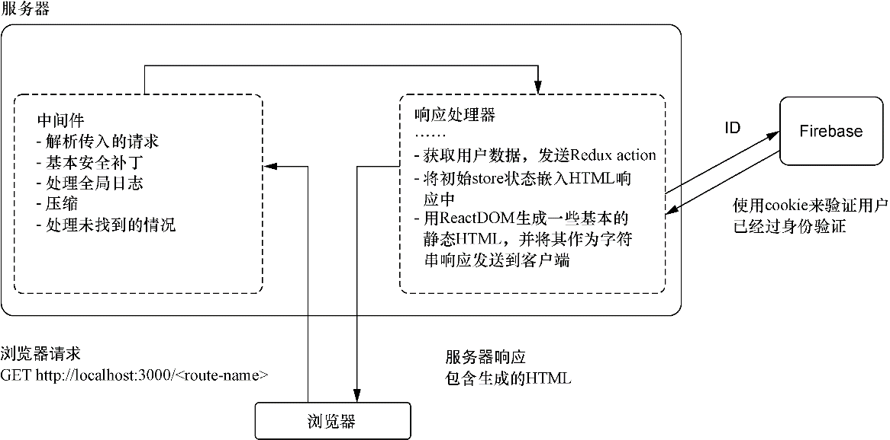
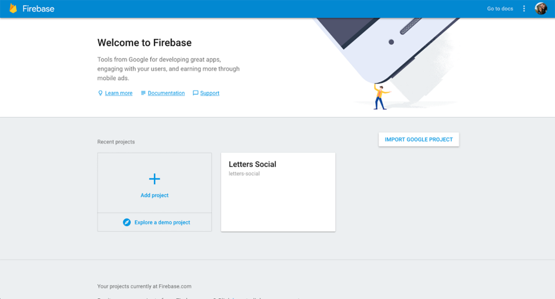
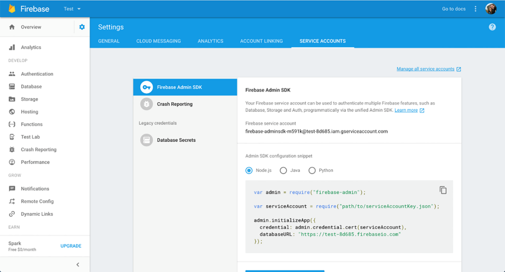
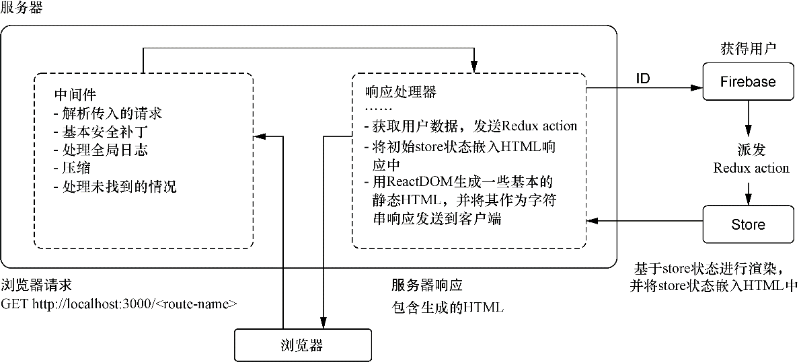
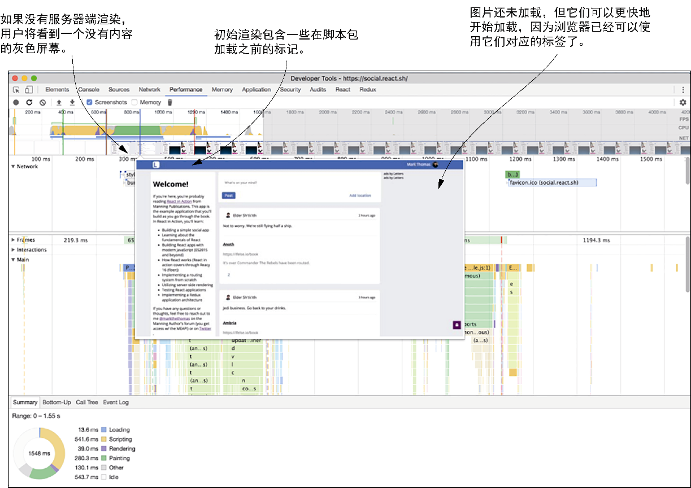

### 12.7　带数据获取的服务器端渲染

服务器端渲染已经被集成到应用程序中了，这可能会对应用程序的接触和性能产生潜在的好处，但仍然还有改进的空间。我们在发送应用程序之前并没有将应用渲染到它的完整状态。不管用户是否登录，我们发送的荷载都是相同的。当前还是由浏览器来做接下来的事情，如开始身份验证流程和加载帖子。服务器端渲染也是同步的，因为还没有使用 `renderToNodeStream` 。本节我们将改进服务器端渲染以利用这个API并在服务器端集成Firebase，如此就可以进行对身份验证状态有感知的渲染。图12-8展示了集成了数据获取的服务器端渲染的概览。


<center class="my_markdown"><b class="my_markdown">图12-8　带数据获取的服务器端渲染。这总体上与我们所做的渲染是相似的，主要区别在于需要在渲染过程中获取数据。渲染输出会基于用户是否登录、用户数据的内容以及用户何时登录而不同</b></center>

Firebase提供了一种与浏览器端方式类似的服务器端API交互的方式。这样，即使在服务器上也能继续将Firebase视为数据库。其他情况下，开发者可能会用HTTP调用微服务或数据库来确定用户是否存在以及他们是否处于验证状态。这里将持续使用Firebase，因为我们关注的是React，但要注意，这里可以在不同情况下将Firebase替换为查询微服务或数据库。

如果你尚未创建Firebase账户，那现在正是时候创建。我分发的应用源代码使用了该账户的公共token，但要使用Firebase的用户管理API，需要拥有真实的账户（可以使用它来访问用户信息，这是我不希望大家做的事情）。要设置Firebase账户，请注册一个账户（应该可以使用已有的谷歌账户）。在那里可以创建任意名称的项目。

之后，需要进行Firebase Admin SDK的设置。因为流程可能会随着时间变化，所以就不在这里进行详细说明了。我们最感兴趣的是用户管理API。你不需要再在项目中安装任何其他东西，因为项目依赖中已经包含了Node.js的Firebase SDK。

作为设置的最后一部分，你需要替换应用程序中的Firebase键，因为它们还是Letter Social项目的键，可能与你的键发生冲突。你可以在源代码的config目录中找到它们。development.json和production.json这两个文件分别包含了开发环境和生产环境的配置变量。你可以根据需要随意编辑这些变量以及其他变量（也许想自己定制应用程序并将其部署到站点上！）。图12-9展示了Firebase控制台和服务账户页面。生成新私钥并将下载的文件移动到主应用程序的代码库中，我们之后将很快会用到它。



<center class="my_markdown"><b class="my_markdown">图12-9　创建新的Firebase项目并生成新私钥，这将允许开发者对Firebase平台进行
 身份验证并使用SDK管理服务器上的用户</b></center>

现在已经解决了这些后勤方面的问题，可以继续编写代码了。我们希望使用Firebase平台来验证服务器应用，如此就能够验证和获取Firebase用户来渲染完整的应用程序状态。你可能已经在Firebase平台的页面上看到了如何进行该操作的示例代码片段，但代码清单12-13展示的是如何在服务器端配置Firebase Admin SDK。

代码清单12-13　在服务器端集成Firebase (server/server.js)

```javascript
// ...
import * as firebase from 'firebase-admin';  ⇽--- 导入Firebase Admin SDK
import config from 'config';
// Initialize Firebase
firebase.initializeApp({
    credential: firebase.credential.cert(JSON.parse(process.env.LETTERS_
     FIREBASE_ADMIN_KEY) ),  ⇽--- 将字符串化的JSON文件设置为环境变量，解析它以便Firebase能够正常工作
    databaseURL: 'https://letters-social.firebaseio.com'
});
// const serviceAccount = require("path/to/serviceAccountKey.json");  ⇽--- 使用Firebase进行身份验证的另一种方式
// admin.initializeApp({
//  credential: firebase.credential.cert(serviceAccount),
//  databaseURL: "https://test-8d685.firebaseio.com"
// });
// Our dummy database backend
import DB from '../db/DB';
//...
```

现在，当服务器运行时，它将自动连接到Firebase并让开发者使用Admin SDK与用户交互，这样开发者就能够通过了解发出请求的用户是谁的方式来获取数据。为什么这很重要？你可能还记得我在前面几章中说过，服务器端路由可能很复杂，因为它涉及客户端和服务器的同步。但我们在这里并不会做非常复杂的事情，而这正是我要指出的。服务器端渲染可能很快就会变得非常复杂。

万幸的是，开发人员并不需要做任何令人畏惧的事情，他们要做的是以一种以前可能没有用过的方式使用Redux。由于Redux并没有限制只能在浏览器中运行，因此也可以将其用于服务器上的状态管理。这里简要罗列了完成允许数据获取的渲染所要做的事情：

+ 从前面几章存储的cookie中获取用户token；
+ 使用Firebase验证token并且当用户存在时获取用户；
+ 如果没有有效的token（可能过期了），清除cookie并将其送往登录页面；
+ 如果是有效用户，则从服务器获取用户信息并向store 发送action；
+ 根据store的状态渲染合适的路由组件；
+ `JSON.stringify` 当前store的状态并将其嵌入到需要发送给浏览器的HTML中。

这听起来挺复杂，但别着急，只是在之前执行的服务器端渲染流程中添加了一小步。我们从Firebase获取数据并使用这些信息进行渲染，而不是每次都渲染相同的内容。记住，这样做的好处是“完整”地渲染应用，这样用户就可以立即看到内容。

在服务器中使用Redux是“通用”JavaScript的一个很好的例子。如果Redux严重依赖浏览器API，那么很难甚至不可能将它集成到服务器上，你不得不采取完全不同的方式。实际上，可以根据需要重新创建store，根据API和Firebase的响应更新它，然后就像在浏览器中那样用store来渲染应用程序。图12-10展示了在本章上下文中看到的服务器端渲染过程。


<center class="my_markdown"><b class="my_markdown">图12-10　将数据获取作为渲染过程一部分的服务器端渲染</b></center>

在这一流程中我们使用了来自浏览器的cookie验证用户的token是否有效，然后从Firebase获取用户并将action发送到服务器端创建的Redux store中。这里渲染的仍然是静态HTML，但这次是使用更新后的状态进行渲染，这样应用程序就可以用新数据进行渲染了。这里还将状态嵌入到HTML响应中，如此浏览器就能够在服务器停下的地方继续。在执行此操作要注意的一点是，Redux store不会在服务器的内存中被重新创建或者持久化。我曾参与过的一些项目在本地开发过程中曾短暂地发生过这样的问题，很难追踪。除了让人感到厌烦，这还意味着服务器会为每个发出请求的人渲染相同的用户数据，因为store状态没有被清理。这在生产环境中是无法接受的安全漏洞。我提到这一点是为了帮你认清现实，协调浏览器和服务器可能很复杂，必须小心谨慎，以便出现棘手的bug或者安全漏洞。

来看一下完成数据获取和渲染过程所需的代码。代码清单12-14展示了获取数据和处理一些（由于过期和无效token引起的）基本错误的初始步骤。下一步，我们使用React-DOM的 `renderToNodeStream` 集成异步服务器端渲染，进一步改善服务器端渲染。

代码清单12-14　为服务器端渲染获取数据（server/server.js）

```javascript
// ...
        const store = configureStore(initialReduxState);  ⇽--- 创建Redux store的实例
        try {
            const token = req.cookies['letters-token'];  ⇽--- 从请求的cookie中获取用户token
            if (token) {
                const firebaseUser = await firebase.auth()
                                                   .verifyIdToken(token);  ⇽--- 用Firebase验证token并使用响应从JSON API获取用户
                const userResponse = await fetch(
                    `${config.get('ENDPOINT')}/users/${firebaseUser.uid}`  ⇽--- 用Firebase验证token并使用响应从JSON API获取用户
                );
                if (userResponse.status !== 404) {  ⇽--- 如果用户存在，拆包API的JSON响应（这里使用的是isomorphic-fetch库和async/await语法）
                    const user = await userResponse.json();
                    await store.dispatch(loginSuccess(user));  ⇽--- 多亏Reduxthunk，我们可以发送在登录时使用的异步action创建器并等待它们完成后再继续
                    await store.dispatch(getPostsForPage());.
                }
            }
        } catch (err) {
            if (err.errorInfo.code === 'auth/argument-error') {  ⇽--- 如果有类似token过期这样的错误，将错误发送到store
                res.clearCookie('letters-token');
            }
            // dispatch the error
            store.dispatch(createError(err));  ⇽--- 如果有类似token过期这样的错误，将错误发送到store
        }
        //...
```

这就是使用用户上下文全面渲染应用程序所要做的大部分工作。这个方法的一个缺点是，如果有许多具有不同数据获取需求的页面，就很难满足这些需求。你没有办法说：“啊，我们在请求X页面，X页面需要Y数据。”但有很多方法可以做到这一点，如果有兴趣了解更多有关这方面的内容以及新版React Router的内容可以访问我的博客。

为了完成渲染的改进工作，还需要再做些事情。首先，需要找到方法注入React-DOM返回的HTML字符串。因为它需要与流一起工作，所以以前的模板字符串的方式需要修改。我们将使用两个函数来为应用程序编写HTML，而不是直接注入生成的HTML。其中一个函数将包含应用程序需要的头信息（关于应用程序的元信息、Open Graph数据、CSS链接等），另一个函数将在HTML响应中嵌入Redux store的状态。我们需要嵌入状态，以便浏览器接管时不会重新执行服务器已经完成的任何工作。我们希望尽量少地渲染，而不是更多。代码清单12-15展示了HTML wrapper组件，我们将把组件和Redux store的状态传递给它。

代码清单12-15　嵌入Redux状态

```javascript
const ogProps = {
    updated_time: new Date(),
    type: 'website',
    url: 'https://social.react.sh',
    title: 'Letters Social | React in Action by Mark Thomas from Manning
     Publications',
    description:
        'Letters Social is a sample application for the React.js book React in
    Action by Mark Thomas from Manning Publications. Get it today at
    https://ifelse.io/book'
};  ⇽--- 应用程序的基本元数据——一些样板代码由于与当前讨论无关而被省略
export const start = () => {  ⇽--- 将应用注入主div中，以便当React-DOM在浏览器端接管工作时，就不必重做服务器做过的工作
    return `<!DOCTYPE html><html lang="en-us">
        <head>
            <link rel="stylesheet" href="/static/styles.css" type="text/css" />
            <link rel="stylesheet" href="https://api.mapbox.com/mapbox.
     js/v3.1.1/mapbox.css" />
            <meta http-equiv="X-UA-Compatible" content="IE=edge" />
            <title>
                Letters Social | React in Action by Mark Thomas from Manning
     Publications
            </title>
            <link rel="manifest" href="/static/manifest.json" />
            <meta name="viewport" content="width=device-width,initial-scale=1" />
            <meta name="ROBOTS" content="INDEX, FOLLOW" />
            <meta property="og:title" content="${ogProps.title}" />
            <meta property="og:description" content="${ogProps.description}" />
            <meta property="og:type" content="${ogProps.type}" />
            <meta property="og:url" content="${ogProps.url}" />
            <meta property="og:updated_time" content="${ogProps.updated_time}" />
            <meta itemProp="description" content="${ogProps.description}" />
            <meta name="twitter:card" content="summary" />
            <meta name="twitter:title" content="${ogProps.title}" />
            <meta name="twitter:description" content="${ogProps.description}" />
            <meta property="book:author" content="Mark Tielens Thomas" />
            <meta property="book:tag" content="react" />
            <meta property="book:tag" content="reactjs" />
            <meta property="book:tag" content="React in Action" />
            <meta property="book:tag" content="javascript" />
            <meta property="book:tag" content="single page application" />
            <meta property="book:tag" content="Manning publications" />
            <meta property="book:tag" content="Mark Thomas" />
            <meta name="HandheldFriendly" content="True" />
            <meta name="MobileOptimized" content="320" />
            <meta name="theme-color" content="#4469af" />
            <link
                href="https://fonts.googleapis.com/css?family=
        Open+Sans:400,700,800"
                rel="stylesheet"
            />
        </head>
       <body>
            <div id="app">
    `;
};
export const end = reduxState => {  ⇽--- 浏览器中的Reduxstore 能够从服务器停止的地方接管，因此以JSON字符串格式化的形式嵌入store
    return `</div>
        <script id="initialState">
            window.__INITIAL_STATE__ = ${JSON.stringify(reduxState)};
        </script>  ⇽--- 浏览器中的Reduxstore 能够从服务器停止的地方接管，因此以JSON字符串格式化的形式嵌入store
        <script src="https://cdn.ravenjs.com/3.17.0/raven.min.js"
     type="text/javascript"></script>
        <script src="https://api.mapbox.com/mapbox.js/v3.1.1/mapbox.js"
     type="text/javascript"></script>
        <script src="/static/bundle.js" type="text/javascript"></script>
        </body>
    </html>`;
};
```

这样的话，就需要修改Redux store以便它可以接管。代码清单12-16中的代码主要做了两件事：确保每次在服务器上从头开始创建Redux store（以防止出现前面提到的潜在bug），并教会它从DOM读取初始状态。代码清单12-16展示了对生产store所做的这些小修改（开发版本不是由服务器渲染的，因此没有要接管的初始状态）。

代码清单12-16　为SSR修改Redux store（src/store/configureStore.prod.js）

```javascript
//...
let store;  ⇽--- 如果是在服务器上，则希望每次都返回一个新的store
export default function configureStore(initialState) {
    if (store && !isServer()) {
        return store;  ⇽--- 如果是在服务器上，则希望每次都返回一个新的store
    }
    const hydratedState =
        !isServer() && process.env.NODE_ENV === 'production'  ⇽--- 如果不在服务器上且应用又处于生产模式，则从DOM上查找状态，如果找到就用它
            ? window.__INITIAL_STATE__
            : initialState;
    store = createStore(
        rootReducer,
        hydratedState,
        compose(applyMiddleware(thunk, crashReporting))
    );
    return store;
}
```

现在store将能够从服务器嵌入的数据中读取初始状态，而不必重复工作。还剩下什么？你可能还记得在本章开头服务器端渲染有可用的异步选项。目前使用的是React DOM的 `renderToString` 方法，但它是同步的，如果很多用户同时访问应用，这可能会成为服务器的瓶颈。React 16引入了一个用于服务器端渲染的异步选项，我们将在这里使用它。除了用Node.js的streams来替代同步方法，用法基本相同。


**练习12-2　开源代码库**

你已经做了一些工作来将服务器端渲染集成到Letter Social应用中。你可以使用Redux进行服务器端渲染，但将其扩展到大型应用或引入新的数据获取需求的（如其他页面的数据），可能需要进行一些重构并重新思考如何实现服务器端渲染。有一些使用React进行服务器端渲染的开源库，他们可以帮助解决在服务器端渲染组件的问题。作为加深理解使用React进行服务器端渲染的练习，花点儿时间看看这些库和它们的源代码。你可能会惊喜地发现，通过服务器端渲染可以实现什么（优化的渲染，如react-server）以及抽象能够让服务器端渲染变得多容易（如Next.j）。


如果以前使用过Node.js，那么可能会比较熟悉streams。如果没有，也没关系。Node.js中的Streams是处理流数据的抽象接口，包括读或写文件、转换和压缩图像以及处理HTTP请求和响应。代码清单12-17展示了如何利用React-DOM的新API—— `renderToNodeStream` 。

代码清单12-17　异步服务器端渲染（server/server.js）

```javascript
        res.setHeader('Content-type', 'text/html');  ⇽--- 写入Content-type头信息，这样浏览器就可以知道预期的内容类型
        res.write(HTML.start());  ⇽--- 浏览器应该尽可能快地开始加载页面，因此先把应用的第一部分发送出去
        const renderStream = renderToNodeStream(  ⇽--- 创建一个用于应用渲染的流
            <Provider store={store}>
                <RouterContext {...props} />
            </Provider>
        );
        renderStream.pipe(res, { end: false });  ⇽--- 用管道将渲染的应用连到浏览器上，但不要结束流
        renderStream.on('end', () => {  ⇽--- 当流触发了结束事件并且渲染也完成了，发送剩余的HTML并结束响应
            res.write(HTML.end(store.getState()));
            res.end();
        });
```

有了这些，Letter Social现在就完全渲染给用户了。使用开发者工具检视文档加载过程并查看服务器发送的内容，就可以直接观察到这一点了（图12-11展示了与你看到的内容类似的画面）。如果在生产模式下运行应用，可能会看到速度上的差异，但在Chrome或Firefox的开发者工具中，可以逐帧查看应用程序的加载情况。你会看到服务器正在发送一个完整的Web页面，而不只是在应用程序加载完成之后渲染。


<center class="my_markdown"><b class="my_markdown">图12-11　如果使用Chrome开发者工具检视social.react.sh的Performance选项卡，我们将看到服务器
 正在发送已被完全渲染的HTML，而不是等到应用包加载完毕后才开始渲染应用</b></center>

