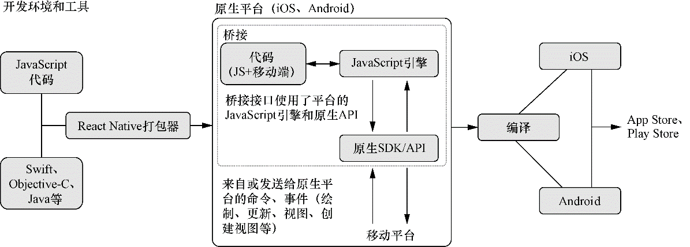

### 13.1　介绍React Native

在React Native出现之前，创建移动应用程序时会有几个选择。可以使用iOS和Android平台以及可用的语言，也可以选择一种可用的hybrid方法。虽然hybrid的实现方式各不相同，但它们通常使用了Web视图（可以认为是“移动端浏览器”）并暴露了一些原生SDK的接口。这种方法的一个缺点是虽然可以让开发者编写允许使用许多熟悉的Web API和风格的原生应用程序，但应用程序并不是“真正的原生”，并且有时在性能上和整体感觉上会有明显的差异。好处是没有移动开发经验的团队或开发人员也可以使用Web开发相关的技能并能够创建移动端应用程序。

移动开发主题以及平台、语言和硬件如何在这个世界扮演不同的角色超出了本书的范围。但hybrid与全原生方法之间的选择与React Native的讨论相关，因为React Native提供了一种新的可选方案。使用React Native可以构建“真正原生”的应用程序，但你可以结合使用JavaScript和平台特定的代码（如Swift或Java）。

React Native的目标是，将React构建用户界面的风格和概念带到移动应用程序的开发中，并融合移动和浏览器开发的最佳方面。它鼓励跨平台共享代码（同时针对iOS和Android设备的组件），允许在合适的地方编写原生代码，并编译成原生应用程序——同时使用许多与React类似的风格。

让我们看一下React Native的一些高级特性。

+ 使用React Native，可以编写使用原生代码（Swift或Java）的JavaScript应用程序并编译成运行在iOS或Android上的原生应用程序。
+ React Native可以在Android和iOS上创建相同的UI元素，潜在地简化移动应用程序的开发。
+ 开发人员可以在需要时添加自己的原生代码，因此并没有限制只使用JavaScript。
+ React Native应用与React共享习语，并且在某些情况下提供相同的组件驱动、声明性概念以及API，在设计UI时使用。
+ 用于构建React Native应用程序的开发者工具允许重新加载更改后的应用程序而无须等待很长的编译周期。这通常可以节省开发人员的时间并带来更愉快的体验。
+ 共享代码和针对多个平台的能力有时可以减少投在构建特定应用或项目的工程师数量；也可以减少维护的代码库，让工程师可以更轻松地在Web和原生平台之间切换。
+ 可以将React Web应用的逻辑和其他方面与React Native应用共享，如业务逻辑，甚至某些情况下的样式。

React Native如何工作？它可能看起来像是某种神秘的黑盒子——接收JavaScript并输出编译后的原生应用。要使用它，并不需要了解React Native的每个部分如何工作，就像不需要知道React-DOM的细节也可以编写出色的React应用程序一样。但对正在使用的技术至少有个有效的了解往往是有帮助的。

使用React Native可以创建混合JavaScript和原生代码的应用程序。React Native通过在应用程序和底层移动平台之间创建某种桥梁来使之成为可能。大多数移动设备都可以执行JavaScript，React Native正是利用这一点来运行JavaScript。当JavaScript与任何原生代码一起执行时，React Native的桥接系统使用 `React` 核心库和其他库将组件的层次结构（包括事件处理、状态、属性和样式）转换为移动设备上的视图。

当发生更新（例如，用户按下按钮）时，React Native将原生事件（按下、摇动、地理定位事件或其他任何事件）转化为JavaScript或原生代码可以处理的事件，它还根据状态或属性的更改来渲染适当的UI。React Native还会打包所有代码并进行必要的编译，以便可以将应用程序发布到苹果应用商店或谷歌的Play Store。

关于这些过程以及React Native的工作方式还有很多东西，但是在设备上运行的JavaScript与原生平台API和事件之间进行转换的基本过程就是React Native“魔力”发生的地方。结果是一个不但可以使用而且在性能方面没有打折扣的平台。这是以前移动应用hybrid方法所面对问题的一个很好的折中，而且这也避免了传统移动开发的一些痛点。图13-1说明了其工作原理的概览。


<center class="my_markdown"><b class="my_markdown">图13-1　React Native通过在JavaScript和底层原生平台之间创建桥接的方式来工作。大多数原生
 平台实现了JavaScript虚拟机或其他原生运行JavaScript的方式。该桥接方式支持运行应用
 程序的JavaScript。React Native桥接系统将在底层平台和JavaScript之间传递消息，
 以便将原生事件转换为React组件可以理解和响应的事件</b></center>

这听起来与本书所学的React有所不同，在很多方面确实如此。但比差异更重要的是相似之处。我将在下一节介绍更多内容，可以查看代码清单13-1中的代码，看看React Native组件与目前使用的组件有多少相似之处。

尽管我在本章中没有介绍如何搭建React Native项目，但仍然可以看出代码清单13-1中的代码所做的工作。你可以用手机扫描二维码来查看React Native练习应用。这是尝试React Native的一个很好的方式，无须进行任何搭建或配置。

可能会注意到一件重要的事情，组件的元素（View、Text）类似于前面几章组件中的 `div` 和 `span` 元素。这是宽泛的React概念跨平台存在的例子。组件的各个元素是什么并不重要，重要的是可以复用以及组合它们，如代码清单13-1所示。

代码清单13-1　React Native示例组件

```javascript
import React, { Component } from 'react';  ⇽--- 即使在原生应用中，仍然可以使用常规的React.Component
import { Text, View } from 'react-native';  ⇽--- React Native内置了构建移动应用的基本要素
export default class WhyReactNativeIsSoGreat extends Component {
    render() {
        return (
            <View>  ⇽--- 可以使用React Native组合组件，这里的view组件就像浏览器中的div标签（常用布局组件）
                <Text>  ⇽--- Text更像是浏览器中的span标签
                    If you like React on the web, you'll like React Native.
                </Text>
                <Text>
                    You just use native components like 'View' and 'Text',
                    instead of web components like 'div' and 'span'.
                </Text>
            </View>
        );
    }
}
```

还有一些别的像React VR这样的项目，其关注点与你使用的Web UI更加不同，但却使用了相同的模式和概念。这是React平台最强大的方面之一，在跨平台时尤为明显。

