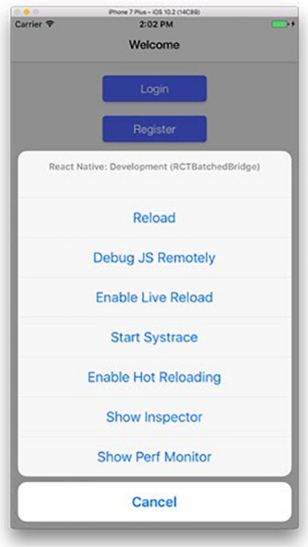

### 13.2　React和React Native

React和React Native有多相似？除共享名称之外，它们都使用了 `React` 核心库，但针对的是不同的平台（浏览器和移动设备）。本节将简要介绍React和React Native的一些异同之处。让我们比较一下React和React Native的一些重要方面。

+ 运行时——React和React Native针对的是不同的平台。React针对浏览器，因此着重于使用浏览器特定的API。你可以在每个API中看到这方面的一些结果。例如，class、ID以及其他属性在基于Web的React组件中很常见。原生平台使用不同的布局和样式语义，因此在React Native组件上不会看到太多这样的属性。基于浏览器的应用和移动端的应用还在不同类型的设备上运行，因此，在考虑React和React Native时，不应该忽视线程、CPU利用率以及底层技术的其他差异等。
+ 核心API——许多React特定的API（如在组件生命周期、状态、属性等中使用的API）在React和React Native中是相似的。但每个平台为网络、布局、地理定位、资源管理、持久化、事件和其他重要领域实现了不同的API。React Native旨在从面向浏览器的世界引入一些熟悉的API，像用于网络的Fetch API和用于布局的Flexbox API。React Native也会暴露事件，但它们针对的更多是移动平台（如 `OnPress` ）。这些差异可能是一个小的障碍，但幸运的是，有些库可以帮助消除Web和原生API之间的差异，如 `react- primitives` 。
+ 组件——基于Web的React项目没有“内置”组件（例如，用于图片、文本布局或其他UI元素）。开发人员需要自己创建这些组件。相对地，React Native包含了用于文本、视图、图片等的组件。这些是为移动应用创建UI时所需的基本类型，类似于浏览器环境的DOM元素。
+ `React` 核心库的使用——React和React Native都使用 `React` 核心库进行组件定义。每个项目使用不同的渲染系统将所有内容连接在一起并与设备（浏览器或移动设备）进行交互。用于Web的React使用 `react-dom` 库，而React Native实现了自己的系统。这种做法让使用者能够用类似的方式跨平台地编写组件。
+ 生命周期方法——React Native组件也具有生命周期方法，因为它们继承自相同的React基类，并且这些方法由平台特定的系统（React-DOM或React Native）处理。
+ 事件类型——React-DOM实现了一个综合事件系统，它允许组件以标准的方式处理浏览器事件，移动应用程序暴露了其他事件。一个例子是手势。使用者可以用手势在触摸设备上进行平移、缩放、拖动等更多操作。用React Native组件编写的组件允许响应这些事件。
+ 样式——由于React Native并不针对浏览器，因此需要以稍微不同的方式设计组件的样式。常规的移动开发中没有CSS API，但可以将大多数CSS属性用于React Native。React Native提供了特定的API，但属性之间不可能做到一一对应。以CSS动画为例。CSS规范和浏览器实现它的方式与iOS和Android支持和实现动画的方式不同，因此需要以不同的方式制作动画并为每个平台使用正确的API。学习用于样式的新API需要花费时间并且会阻碍在Web和原生项目之间直接共享CSS样式。然而，值得庆幸的是，有些库可以处理React和React Native，如 `styled-components` 。随着React Native日益普及，我们应该会看到更多这样的跨平台库被开发出来。
+ 第三方依赖项——与React一样，仍然可以将第三方组件库用于React Native。许多流行的库（如React Router和 `styled-components` ）甚至包括针对React Native的变种（如前所述）。React Native最吸引人的一个方面是它仍然可以利用JavaScript模块生态系统。
+ 分发——虽然可以将React应用程序部署到几乎任何现代浏览器中，但React Native应用程序需要平台特定的分发工具来进行开发和最终发布（如Xcode）。通常需要使用React Native构建过程来编译应用程序以进行最终上传。iOS和Android工具的“walled garden”性质是开发移动应用程序的众所周知的权衡。
+ 开发工具——针对Web的React运行在浏览器中，因此可以得益于任何浏览器特定的工具来辅助调试和开发。对于React Native，并不需要有平台特定的工具，但工具仍然有用。项目间的一个关键区别是React Native专注于热加载，而默认情况下这并不属于React。热加载可以加速移动开发，因为不必等待应用程序编译。图13-2展示了使用React Native时可以访问的一些开发者工具的示例。

<b class="my_markdown">图13-2　React Native附带了许多有助于性能、调试和其他功能的开发者工具。这些工具还意味着，尽管仍然可以使用平台特定的工具进行开发，但开发者对Xcode这类开发工具的严格依赖降低了。虽然有很多原因，但React Native提供的出色的开发人员体验似乎是它作为一项技术被普遍接受的一个原因</b>

