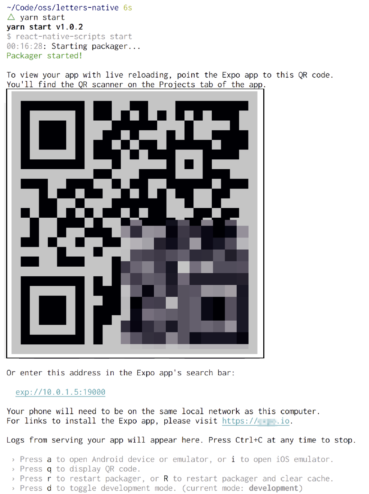

### 13.4　最简单的“Hello World”

虽然我不会介绍如何将React Native与Letters Social集成，但本节还是会花点时间介绍一个基本的“Hello World”示例，以便可以看到React Native的实际效果。我们将在Letters Social的代码仓库之外工作，因此请随意将应用代码放在任何想要跟踪的地方。运行代码清单13-2中的命令即可开始。

代码清单13-2　安装create-react-native-app

```javascript
cd ./path-to-your-react-native-sample-folder
npm install -g create-react-native-app
create-react-native-app .
```

运行完这些命令后，应该能够看到在所选的目录中创建了许多文件以及一些指令。这些命令与Create React App（一个专注于Web平台的React.js的类似的项目）中的命令类似。图13-3显示了当开始使用Create React Native App库时应该看到的内容。


<center class="my_markdown"><b class="my_markdown">图13-3　当在开发模式下启动应用程序时，应该会看到React Native打包程序启动并看到类似此处所示的消息。按照指示确保在本地计算机上设置了Expo XDE。根据所选的目标环境，打开Android或iOS模拟器</b></center>

Create React Native App工具安装了一些依赖项，创建了一些样板文件，设置了构建过程，并将Expo React Native工具包集成到项目中。Expo SDK扩展了React Native的功能，使处理硬件技术变得更加容易。Expo XDE开发环境使管理多个React Native项目变得容易，也让构建和部署变得轻松。

你不会构建任何实质性的东西，但可以思考并体验一下使用React Native开始构建应用程序是多么容易。一旦使用 `yarn start` 运行React Native打包器，打开其中一个模拟器（Android或iOS），就可以看到正在运行的应用程序。替换掉一些样板代码就能看到热加载的发生。代码清单13-3展示了一个简单的组件，它在挂载后会从星球大战API获取一些数据。请注意，React Native已经使用了Flexbox和Fetch这样的现代Web API（在前面几章中使用了Fetch的polyfill）。

代码清单13-3　简单的React Native示例（App.js）

```javascript
import React from 'react';
import { StyleSheet, Text, View } from 'react-native';  ⇽--- 不像React，React Native为UI提供了基础组件
export default class App extends React.Component {
    constructor(props) {  ⇽--- 构造函数、状态初始化以及生命周期方法在React和React Native中是一样的
        super(props);
        this.state = {
            people: []
        };
    }
    async componentDidMount() {  ⇽--- 也可以在React Native应用程序中使用像async/await这样的现代JavaScript特性
        const res = await fetch('https://swapi.co/api/people');
        const { results } = await res.json();
        this.setState(() => {
            return {
                people: results
            };
        });
    }
    render() {
        return (
            <View style={styles.container}>  ⇽--- 即使样式与在React Native中看起来比较相似，但这里不是在使用CSS
                <Text style={{ color: '#fcd433', fontSize: 40, padding: 10 }}>
                    A long time ago, in a Galaxy far, far away...
                </Text>
                <Text>Here are some cool people:</Text>
                {this.state.people.map(p => {  ⇽--- JSX表达式在React Native和React中是一样的
                    return (
                        <Text style={{ color: '#fcd433' }} key={p.name}>
                            {p.name}
                        </Text>
                    );
                })}
            </View>
        );
    }
}
const styles = StyleSheet.create({  ⇽--- 在React Native中创建样式表需要使用它的Stylesheet API对组件进行样式设置
    container: {
        flex: 1,
        backgroundColor: '#000',
        alignItems: 'center',
        justifyContent: 'center'
    }
});
```

如果对应用进行了更改，应该会看到打包器实时响应并更新正在运行的应用程序，如图13-4所示。我希望这能让你了解在React Native中构建应用程序是多么容易。你可能习惯于在Web上进行热加载，但对移动开发来说，编译-检查-重新编译的周期可能会占用大量时间。


<center class="my_markdown"><b class="my_markdown">图13-4　应该能够看到修改在运行应用程序代码的模拟器中立即得到反映</b></center>

至此，已经创建了第一个React Native组件，并给出了相关的代码，这可以让你简要了解该技术的工作原理以及使用起来有多容易。

