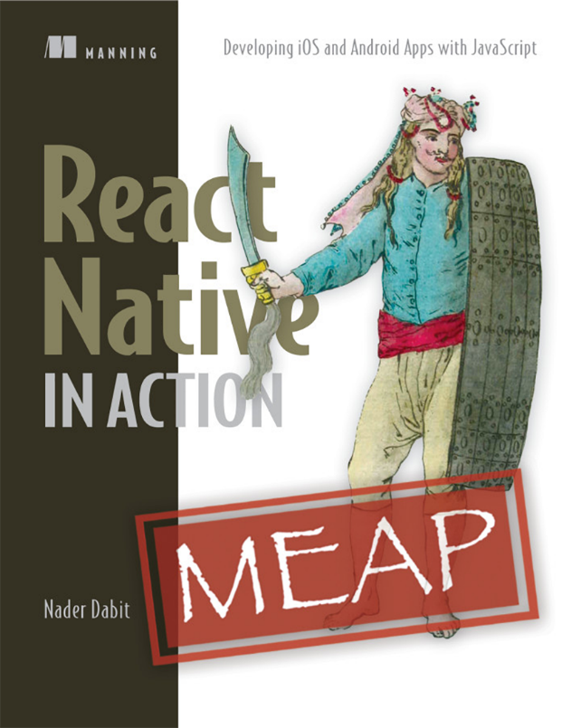

### 13.5　下一站

在React文档、库生态及社区中你会看到的短语之一是“一次学习，到处编写”（learn once，write anywhere）。这是对Java社区中流行的“一次编写，到处运行”（learn once，run anywhere）这个短语的一种致敬，这也是React范例的标志之一。正如我们在本章中所看到的，你可以学习React概念并将其应用于各种平台（从Web到移动再到VR）。每当学习如何在新平台上使用React时，都会有平台特定的差异和细微差别，但大部分React知识都可以轻松转换。这就是使用React如此令人愉快原因之一。

如果想继续学习React Native，有很多资源可供查看。一个是Nader Dabit的React Native in Action，如图13-5所示，它可以与本书很好地搭配起来使用，因为它让你从学完React后继续学习，并对React Native做了一个极好的介绍。你运用到目前为止从本书中习得的知识，并借助这个势头投身于使用React Native构建移动应用程序。如果团队正在考虑将React Native用于接下来的项目，那么它也是一个很好的资源。

<b class="my_markdown">图13-5　Nader Dabit的React Native in Action为iOS、Android和Web开发人员提供了构建强大、复杂的React Native应用程序所需的技能。如果你仍然对React感到好奇，那么它是接下来的最佳选择</b>

让你开始使用React Native的另一个好资源是Create React Native App项目。Create React Native App为新React Native项目提供了一个很好的起点，并为刚开始使用React Native的人提供了一个很好的示例应用。它包含一些用于构建React Native应用程序的预设库和工具，但允许“卸去”并重置为默认值。如果对Create React App或Create React Native App感兴趣，请在GitHub上查看Create React Native App、Create React App和React Native文档。

