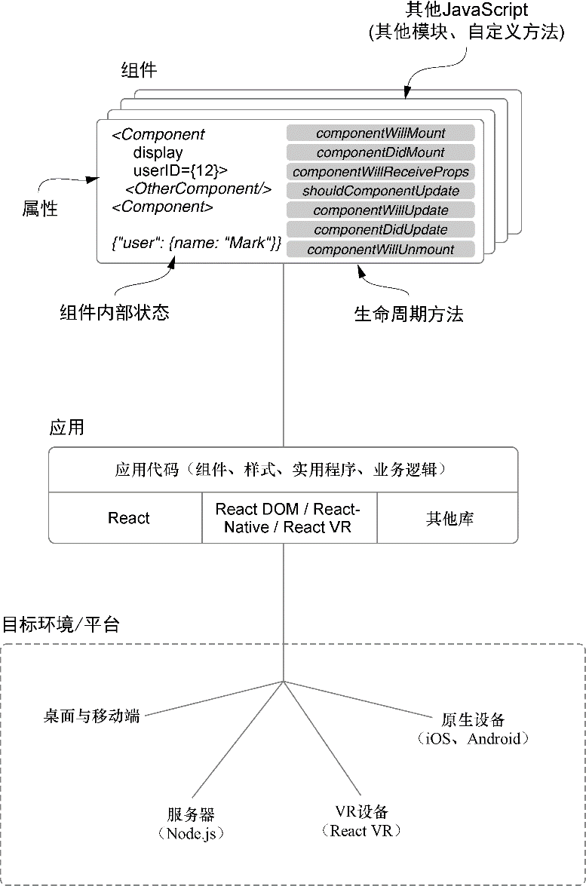

### 1.1　初识React

React是一个用于构建跨平台用户界面的JavaScript库。React给予开发者强大的思维模型并帮助开发者以声明式和组件驱动的方式构建用户界面。这是React最宽泛和最简短的定义，我们将在本书中详细解释这些观点。

在广阔的Web工程领域中，React位于何处？React经常在Vue、Preact、Angular、Ember、Webpack、Redux以及其他知名JavaScript库和框架的相同领域中被谈及。React通常是前端应用的主要部分并且与我们刚刚提到的其他库和框架拥有类似的特性。事实上，相比以往，许多流行的前端技术现在都与React莫名地类似。曾几何时，React的做法是新颖的，而其他技术自那时就被React的组件驱动、声明式做法所影响。React持续保持“重新思考已建立的最佳实践”的精神，其主要目标是为开发人员提供一种富有表现力的思维模型和一种高性能的技术来构建UI应用。

是什么使得React的思维模型如此强大？这是因为它利用了计算机科学和软件工程技术的深层领域。React的思维模型广泛使用了函数式和面向对象编程的概念，并重点将组件作为构建的主要单元。React应用中，开发人员可以用组件创建用户界面。React的渲染系统管理着这些组件并保持着应用视图的同步。组件通常对应着用户界面的一个部分，如日期选择器、页头、导航等，但它们也可以负责客户端路由、数据格式化、样式以及客户端应用的其他职能。

React中的组件应该易于理解并很容易与其他React组件集成；它们遵循可预测的生命周期，能够维护自己的内部状态，并与“常规Javascript”兼容。我们将在本书的后续部分深入探讨这些理念，但目前我们可以先从较高层次来看看它们。图1-1给出了React应用的主要“成分”的概览。

<b class="my_markdown">图1-1　React能够用组件创建用户界面。组件维护了自身的状态，使用“vanilla”JavaScript[1]编写与
 运行，并从React继承了许多有用的接口。大部分React应用是为基于浏览器的环境编写的，
 但也可以用于iOS和Android这样的原生环境。关于React Native的更多信息，查阅
 Nader Dabit的React Native in Action，也可以从Manning出版社网站获取</b>

让我们大致了解一下每个部分。

+ 组件——封装的功能单元，它是React的主要单元。它们利用数据（属性和状态）将UI渲染为输出。我们将在第2章及之后的各章中探讨React组件处理数据的方式。某些类型的React组件也提供了一组可以“挂载”的生命周期方法。渲染过程（基于数据输出和更新UI）在React中是可预见的并且组件可以使用React的API“挂载”到其中。
+ React库——React使用一组核心库。React库的核心与 `react-dom` 和 `react-native` 紧密配合，其侧重于组件规范和定义。它让开发者能够构建一棵浏览器或其他平台的渲染器所能使用的组件树。 `react-dom` 就是这样一个渲染器，它针对的是浏览器环境和服务器端渲染。React Native库专注于原生平台，它能够为iOS、Android和其他平台创建React应用。
+ 第三方库——React并不自带数据建模、HTTP调用、样式库或其他前端应用的常见工具。这使开发人员可以在自己的应用中自由地使用其他代码、模块或者其他中意的工具。尽管这些常见技术并没有与React捆绑在一起，但围绕React的更广泛的生态系统中却充满了极为有用的库。本书中，我们将使用其中一些库，并将在第10章和第11章研究Redux—— 一个状态管理库。
+ 运行React应用——React应用运行在开发人员为之构建应用的平台上。本书关注的是Web平台并构建了一个基于浏览器和服务器的应用，而其他诸如React Native和React VR这样的项目则创造了应用在其他平台上运行的可能性。

本书中我们会花大量的时间来探索React的方方面面，但开始之前可能会有一些问题。React真的有所帮助吗？还有谁在使用React？权衡使用或不使用React的依据有哪些？在采用一项新技术之前，这些都是希望得到回答的重要问题。

