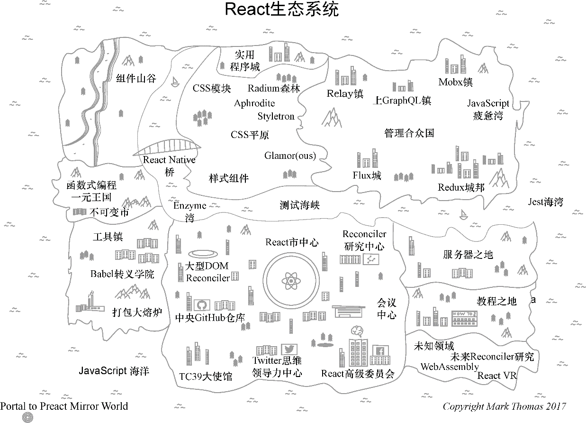

### 1.1.3　谁在使用React

当涉及开源软件时，谁使用它（以及谁不使用它）不只是关乎流行的问题。它影响使用该技术的体验（包括支持、文档和安全修复的可用性）、社区的创新水平，以及某个工具的潜在生命周期。那些有着活跃社区、健壮生态以及各种各样的贡献者经验和背景的工具，使用起来通常会更有趣、更容易，总体上也更顺利。

React最初是一个小项目但现在广受欢迎并已经拥有了活跃的社区。没有社区是完美的，React社区也不例外，但就开源社区而言，它具有许多成功的要素。此外，React社区还包含其他较小的开源社区的子集。这令人生畏，因为React生态系统看起来非常庞大，但它也使社区更加健壮和多样。图1-2展示了一张React生态系统的地图。在本书的整个过程中，我提到了各种各样的库和项目，如果想要更多地了解React生态系统，我整理了一份指南放在我的博客上。我将持续更新它并确保它随生态系统演进。

<b class="my_markdown">图1-2　React生态系统的地图是丰富多彩的，甚至比我在这里表示的还要多</b>

虽然开源（项目）可能是开发人员与React互动的主要方式，但你可能每天都在使用React开发的应用。许多公司以令人兴奋的不同方式使用React，下面是使用React来为其产品助力的一些公司：

+ Facebook；
+ Netflix；
+ New Relic；
+ Uber；
+ Wealthfront；
+ Heroku；
+ PayPal；
+ BBC；
+ Microsoft；
+ NFL；
+ Asana；
+ ESPN；
+ Walmart；
+ Venmo；
+ Codecademy；
+ Atlassian；
+ Asana；
+ Airbnb；
+ Khan Academy；
+ FloQast；
+ 还有更多！

这些公司不会盲目地追随JavaScript社区的趋势。他们有特殊的工程要求——影响到大量用户并且必须在严格的期限内交付产品。有人说，“我听说React不错；我们应该React化一切”，这种说法并不能打动经理们和其他的工程师们。公司和开发人员想要好工具来帮助他们更好地思考和快速行动，以便他们能够构建高强度、可伸缩和可靠的应用。

