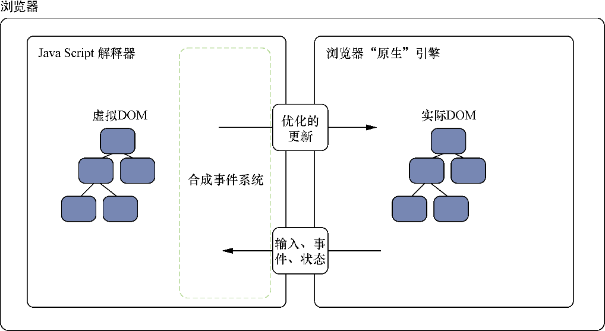

### 1.3　虚拟DOM

我们已经讨论了一些React的高级特性。我认为React可以帮助研发团队更好地创建用户界面，并且这得益于React提供的思维模型和API。所有这一切背后隐藏着什么？React的主旨是推动简化复杂的任务并把不必要的复杂性从开发人员身上抽离出来。React试图将性能做得恰到好处，从而让研发人员腾出时间思考应用的其他方面。它这么做的主要方式之一就是鼓励开发人员使用声明式编程而不是命令式编程。开发人员要声明组件在不同状态下的行为和外观，而React的内部机制处理管理更新、更新UI以反映更改等的复杂性。

驱动这些的主要技术之一就是虚拟DOM。这种虚拟DOM是模仿或镜像存在于浏览器中的文档对象模型的数据结构或数据结构的集合。我之所以说“这种虚拟DOM”，是因为其他像Ember这样的框架采用了它们自己的类似技术的实现。通常，虚拟DOM会作为应用程序代码和浏览器DOM之间的中间层。虚拟DOM向开发人员隐藏了变更检测与管理的复杂性并将其转移到专门的抽象层。在接下来的小节中，我们将从更高层次来了解它是如何在React中起作用的。图1-3展示了DOM和虚拟DOM之间的关系，我们稍后将对此进行讨论。

<b class="my_markdown">图1-3　DOM和虚拟DOM。React的虚拟DOM处理数据的变更检测并将浏览器事件转换为React
 组件可以理解和响应的事件。React的虚拟DOM还为性能专门优化了对DOM的更新操作</b>

