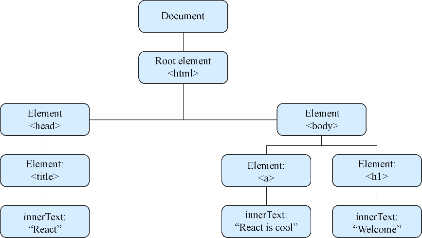

### 1.3.1　DOM

确保我们理解React的虚拟DOM的最佳途径就是首先检查我们对DOM的理解。如果觉得自己对DOM已经了然于心，可以选择跳过这部分。但如果不是，让我们从一个重要的问题开始：什么是DOM？DOM或文档对象模型是一个允许JavaScript程序与不同类型的文档（HTML、XML和SVG）进行交互的编程接口。它有标准驱动的规范，这意味着公共工作组已经建立了它应该具有的标准特性集以及行为方式。虽然存在其他实现，但是DOM几乎已经是Chrome、Firefox和Edge等Web浏览器的代名词了。

DOM提供了访问、存储和操纵文档不同部分的结构化方式。从较高层面来讲，DOM是一种反映了XML文档层次结构的树形结构。这个树结构由子树组成，子树由节点组成。这些（节点）是组成Web页面和应用的 `div` 和其他元素。

人们之前可能使用过DOM API——但他们没有意识到自己正在使用它。每当使用JavaScript中的方法访问、修改或者存储一些HTML文档相关的信息时，几乎可以肯定，人们就是在使用DOM或DOM相关的API。这意味着，你在JavaScript中使用的方法不全是JavaScript语言本身的一部分（ `document.findElemenyById` 、 `querySelectorAll` 、 `alert` 等）。它们是更大的Web API集合（浏览器中的DOM和其他API）的一部分，这些API让人们能够与文档交互。图1-4展示了可能在Web页面中看到的DOM树结构的简化版本。

<b class="my_markdown">图1-4　这是DOM树结构的简化版本，使用人们熟悉的元素。暴露给
 JavaScript的DOM API允许对树中的这些元素执行操作</b>

用来更新或查询Web页面的常见方法或属性有 `getElementById` 、 `parent.appendChild` 、 `querySelectorAll` 、 `innerHTML` 等。这些接口都是由宿主环境（这里指的是浏览器）提供的并允许JavaScript与DOM交互。没有这些能力，我们就没有那么有趣的Web应用可用了，也可能没有关于React的书可写了。

与DOM交互通常很简单，但在大型Web应用中可能会变得复杂。幸运的是，当使用React构建应用时我们通常不需要直接与DOM交互——我们基本上把它都交给了React。有些场景下我们可能希望绕过虚拟DOM直接与DOM交互，我们将在后面的几章对此进行讨论。

