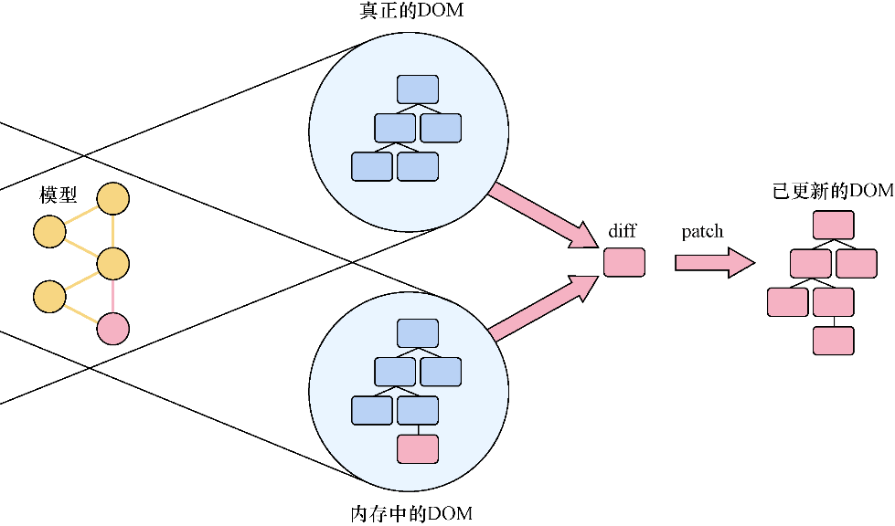

### 1.3.3　更新与差异比对

虚拟DOM是如何工作的？React的虚拟DOM与另一个软件世界有一些共同点——3D游戏。3D游戏有时会使用一个渲染过程，其工作原理大致如下：从游戏服务器获取信息，将信息发送到游戏世界（用户看到的视觉表现），确定需要对虚拟世界进行哪些更改，最后让显卡决定所需的最小更改。这种方法的一个优点是，只需要一些资源来处理增量更新，这种更新方式通常比全部更新快得多。

这是对3D游戏渲染和更新方式的粗略描述，当审视React执行更新的方式时，这个基本思想为我们提供了一个很好的参考。DOM变更做得不好的话代价可能会很大，所以React试图在更新UI方面更有效率并采用了类似3D游戏的方法。

如图1-5所示，React在内存中创建并维护了一个虚拟DOM，并且一个像React-DOM这样的渲染器基于更改对浏览器DOM进行更新。React可以执行智能更新并且只更新已更改的部分，因为它可以使用启发式对比来计算内存DOM的哪些部分需要更新到DOM。理论上讲，这比“脏检查”或其他更暴力的方法更加简洁优雅，但主要的实践意义是，开发者可以少考虑很多复杂的状态追踪。

<b class="my_markdown">图1-5　React的对比和更新流程。当改变发生时，React确定实际DOM和内存DOM的差异，然后对浏览器DOM执行高效更新。这个过程通常被称为diff（什么改变了）和patch（只更新改变的东西）过程</b>

