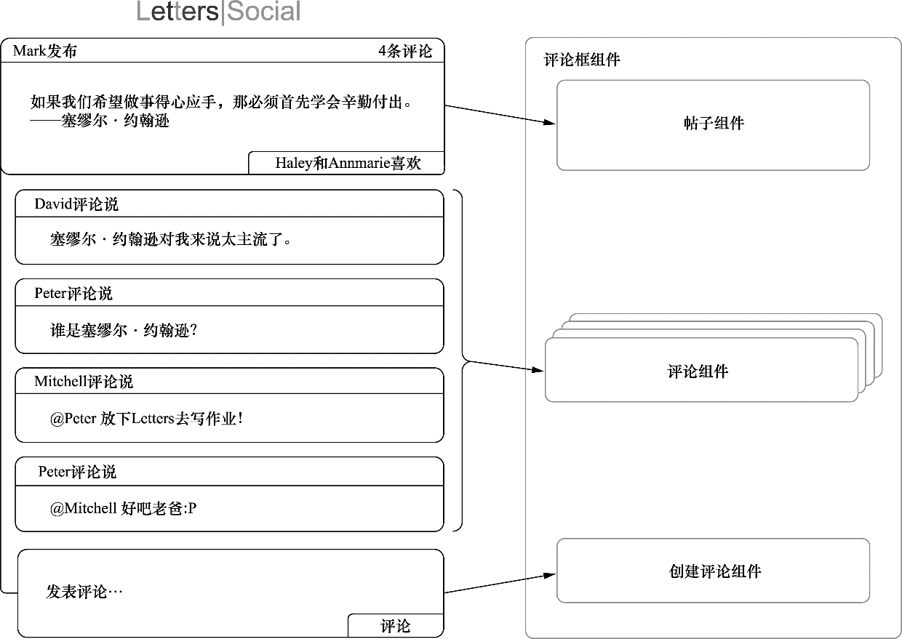

### 1.4.1　组件概览

什么是组件？这是一个更大的话题。人们可能已经很熟悉组件的概念了，并且可能经常看到它们，即使他们可能没有意识到这一点。在设计和构建用户界面时，使用组件作为思维和可视化工具能够得到更好、更直观的应用设计与使用。可以将任意东西作为组件，尽管并不是所有东西作为组件都有意义。举个例子，如果认定整个界面是一个组件，并且没有子组件或进一步细分，那么你可能并没有帮到自己。相反，将界面的不同部分分解成可以组合、复用和易于重组的部分是很有帮助的。

为了开始以组件的方式思考，我们将查看一个示例界面并将其分解为不同的组成部分。图1-6展示了一个将在后续部分使用的示例界面。用户界面通常包含一些能够在界面的其他部分复用的元素，即使它们没有被复用，它们至少是独特的。这些不同元素——界面的独特元素——可以被认为是组件。图1-6中左边的界面被分解为右边的组件。

<b class="my_markdown">图1-6　一个界面被拆解为组件的例子。每一个不同部分都可以被认为是一个组件。
 具有相同性质的重复项可以被认为是一个组件在不同数据上得到复用</b>

**练习1-1　组件思维**

访问一个喜欢或常去的网站（如GitHub）并将其界面拆解成组件。当这样做的时候，你可能会发现自己把事物拆解成了不同的部分。那什么时候停止拆解呢？一个独立的字母应该作为一个组件吗？组件什么时候才算小呢？什么时候要将一组元素作为一个组件？

