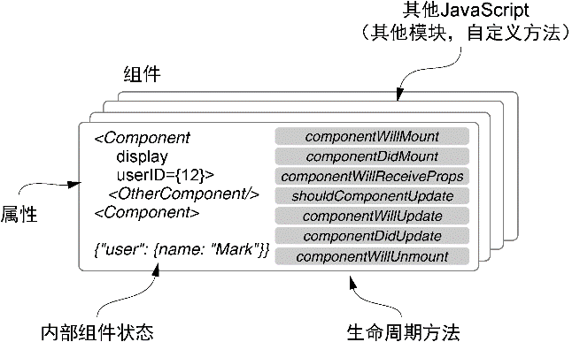
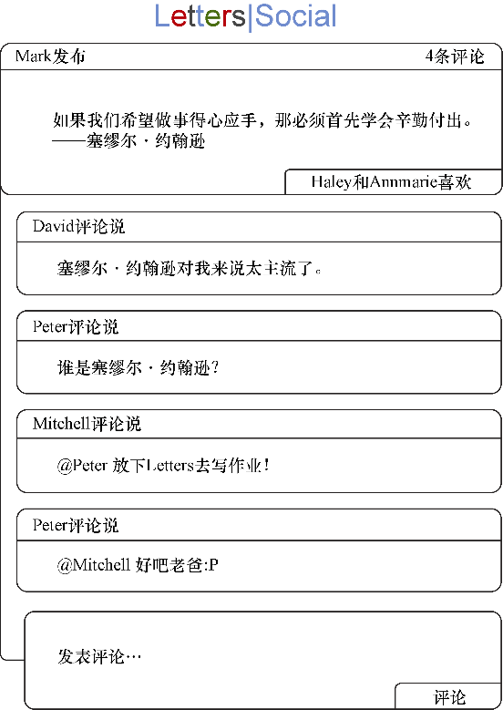
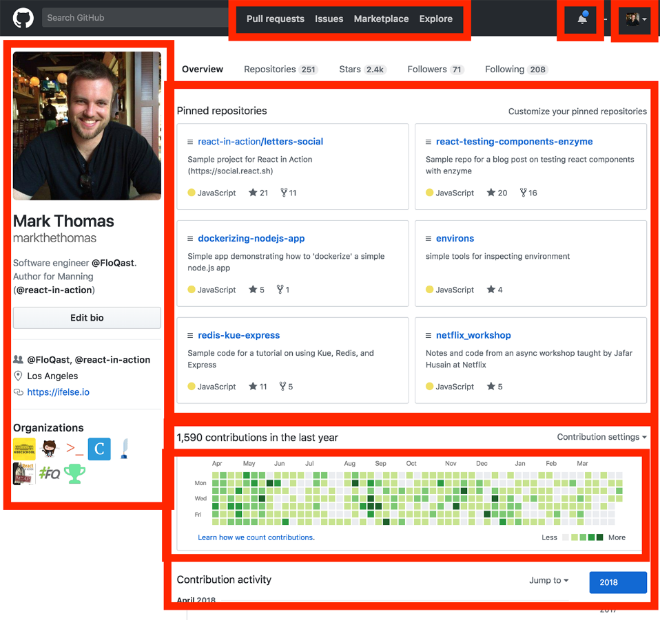

### 2.1　React组件介绍

组件是用React编写客户端应用的基本单元。使用者肯定会创建很多组件！在本章中，我们将引导亲自动手用组件构建一个简单的评论框并走马观花地过一下React。但首先，让我们花点时间来探索一下“组件化思维”，看看它将如何造就评论框。在本书的大部分内容中，我们通常会直接深入代码中，而不会花太多时间对事情进行规划，但就第一次涉足React而言，我们将做一些规划来确保我们的思维方式是对的。看一下图2-2。

<b class="my_markdown">图2-2　React组件概览。我们将在本书的
 其余部分探索这些关键部分</b>

本书中，我们将假装自己是一个叫作“Letters”的虚构创业公司的雇员。我们将创建下一代社交网络（用户可以在其中发帖子、评论、点赞——真正史无前例的创新）。本章中，我们将探索作为公司潜在技术选择的React。我们的任务是创建一组简单的组件来感受一下这项技术。我们有一些设计团队给的非常粗略的原型，但仅此而已。图2-3展示了将要创建的东西的一个优美版本。

<b class="my_markdown">图2-3　粗略的评论框原型。我们将创建一个UI，用户可以在其中给帖子添加评论并查看以前的评论</b>

我们将如何开始创建这个页面呢？让我们先了解一下应用所需要的数据，然后看看如何将其转换为组件。如何将原型转换为组件？我们完全可以在对React一无所知的情况下一头扎下去，并开始尝试创建组件，但如果不了解它们的工作机制或者它们的用途，最终可能会创建出一团糟或不合乎React的东西。我们将在接下来的几节中做一些规划，以便对如何构造和设计评论框有更深的理解。

**练习2-1　界面拆解回顾**

继续之前，花些时间回顾一下上一章的练习。我们查看了一个Web界面并花时间自己将其拆解开来。现在，花点时间重新查看一下那个界面，看看在对React的组件有了更多了解后，是否会有不同的做法。你会采取不同的分组吗？下面用一个标记过的GitHub用户档案界面来唤起我们的回忆。

