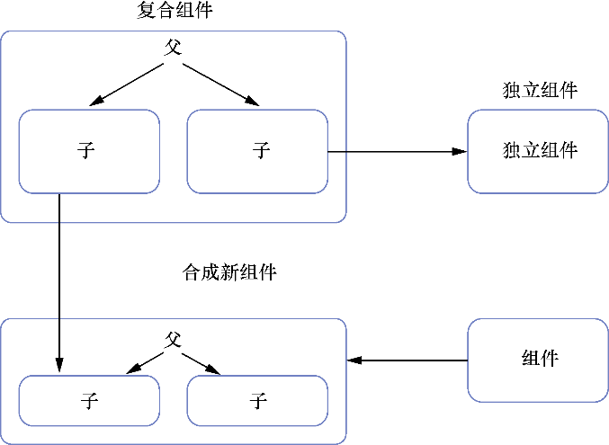

### 2.1.2　多组件：组合关系和父子关系

我们已经有需要的数据和原型，但要如何着手打造使用这些数据的组件呢？例如，我们需要知道组件如何与其他组件组织到一起。React的组件被组织成一个树形结构。React的组件像DOM元素一样，也可以嵌套而且能够包含其他组件。它们也可以出现在其他组件“旁边”，这表示它们可以与其他组件出现在相同的层级上（见图2-4）。

<b class="my_markdown">图2-4　组件可以拥有不同类型的关系（父与子），既可以用来创建其他组件，也可以独立存在。
 因为它们独立且移动时不带任何负担，所以它们常常易于移动。由此，它们被认为是可组合的</b>

这带来了一个重要问题：组件有哪些种类的关系。人们可能认为使用组件能够创建相当多不同种类的关系，从某种意义上说，这是对的。但组件能够以灵活的方式被使用。因为组件独立且常常不带任何“负担”，所以它们被认为是可组合的。

可组合的组件通常易于移动并且能够通过复用来创造其他组件。我们可以把它们想象成乐高积木。每个乐高积木都是独立自主的，所以它能够很容易地移动——没必要为了一块积木而携带一整组积木——它很容易与其他组件相适应。虽然可移植性并非终极目标，但它常常是精心设计的React组件的特色。

因为组件是可组合的，所以可以在应用的许多地方使用。无论在哪里使用组件，都可能形成某种特定的关系：父与子。如果一个组件包含另一个组件，则它被认为是父组件。一个组件在另一个组件中，则它被认为是子组件。同一层次上的组件不具有任何直接关系，即便它们可能就在彼此旁边。组件只“关注”它们的父母和孩子。

图2-4展示了组件如何以父子方式彼此关联以及如何组合在一起创建新组件。注意到，尽管有直接的父子关系，但两个兄弟组件之间却缺乏直接关系，我会在探索React的数据流时再涵盖这方面的更多内容。

