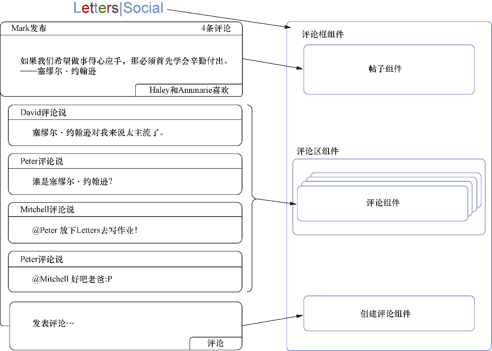

### 2.1.3　建立组件关系

我们了解了界面的数据和视觉外观以及组件形成的父子关系。现在，我们可以开始定义自己的组件层次结构，这是应用目前所学东西的过程。我们将确定组件的内容以及它的位置。建立组件关系的过程对每个团队或项目而言并非千篇一律。组件关系也可能随时间而变化，所以不要期望第一次建立就完美。更容易的UI迭代恰恰是React的使用让人愉快的部分原因。

在我们继续之前先花一两分钟尝试将原型分解为组件。虽然到目前为止已经做过几次分解，但只有练习用组件的方式思考才能让使用React更为容易。当练习时，谨记如下事项。

+ 确保组件以合理的方式组织到一起。组件应该围绕相关联的功能进行组织。如果几乎无法在应用中移动组件，那么可能正在创建一个过于死板的层次结构。虽然情况并非总是如此，但最好注意一点儿。
+ 如果发现有一个界面元素重复出现多次，那么这个界面元素通常是成为组件的好选择。
+ 如果没有第一次就把所有事情都搞好，这没什么。通常要迭代地改进代码。最初的计划并不会消除未来的变更，但会设置合适的开始方向。

记住这些指导方针，可以查看现有数据和原型并开始把它们分解为一些组件。图2-5展示了一种将界面分解为组件的方式。

<b class="my_markdown">图2-5　可以将界面分解为几个组件。注意，虽然随着应用的增长而将更多部分分解为组件是合情合理的，但是没必要为界面的每一个元素都创建组件。再者，注意相同的评论组件被用于一个帖子的每个
 评论上。还要注意到，我为了可读性而将这些画在了边上，但有些人可能会直接画在原型上</b>

使用React可以灵活地设计应用。虽然我们只给出了4个组件，但你可以用很多方法来分解这些组件。React在组件之间强制建立起父子关系，但除此之外，人们可以用最适合自己和自己团队的方法自由地定义层次结构。例如，有些情况下，人们会把UI的一小部分分解为许多不同组件。UI的规模与组成它的组件是多是少并没有直接关系。

既然我们做了一些初步规划，就可以投身进去开始创建评论框UI了。在接下来的一节中，我们将开始创建React组件。用不着任何像JSX这样的语法助手。相反，我们将着重于“原生的”React，但在寻求使用这些助手之前我们要先了解该技术的核心机制。

人们可能会因为不得不放弃使用那些常规React开发中所用的辅助工具而倍感沮丧。而我对此却感到高兴，因为这表示使用者对将要使用的这些抽象更为真切地欣赏和理解。虽然情况并非总是如此，但依我的经验看来，从一项新技术的底层元素起步通常让人能够更好地长期使用它。当然，我们不需要用汇编代码写JavaScript程序，但我们也不想在对一项技术的核心机制一知半解的情况下使用该技术。

