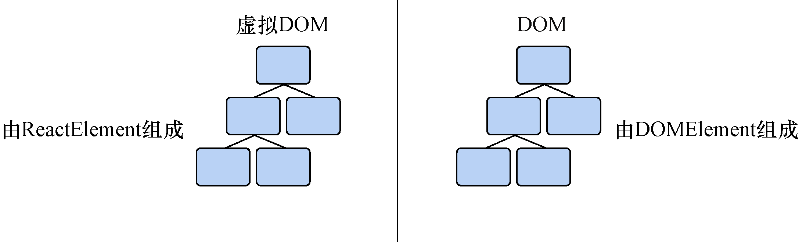

### 2.2.1　创建React元素

到目前为止，代码除了下载React库和查找 `id` 为 `root` 的DOM元素并没有做什么事情。如果要实现一些实质性的东西，需要使用 `React DOM` 。我们需要调用 `React DOM` 的 `render` 方法来让React创建和管理组件。要使用需要渲染的组件和容器（就是之前变量保存的DOM元素）来调用这个方法。 `ReactDOM.render` 的签名看起来像这样：

```javascript
ReactDOM.render(
  ReactElement element,
  DOMElement container,
  [function callback]
) -> ReactComponent
```

`React DOM` 需要一个 `ReactElement` 类型的元素和一个DOM元素。我们已经创建了一个能够使用的有效DOM元素，现在需要创建一个React元素。但React元素是什么？

> **定义　** React元素是React中轻量、无状态、不可变的基础类型。React元素有 `ReactComponent-Element` 和 `ReactDOMElement` 两种类型。 `ReactDOMElement` 是DOM元素的虚拟表示。 `ReactComponentElement` 引用了对应着React组件的一个函数或类。

元素是描述符，我们用它来告诉React我们想要在屏幕上看到什么，它是React中的核心概念。大多数组件是React元素的集合。它们会围绕UI的一部分创建一个“边界”，以便能够将功能、标记和样式组织到一起。但就React元素是DOM元素的虚拟表示而言，这意味着什么呢？这意味着，React元素之于React如同DOM元素之于DOM——React元素是构成UI的基础类型。当创建普通HTML标记时，会使用各种各样的元素类型（ `div` 、 `span` 、 `section` 、 `p` 、 `img` 等）来包含和组织信息。在React中，可以使用React元素——它将想渲染的React组件或常规DOM元素告诉React——来组成和构建UI。

也许DOM元素和React元素之间的相似性没有立即点化你。没有问题。还记得React要如何通过创造一个更好用的思维模型来帮助使用者？DOM元素和React元素之间的相似性是达成此目的的一种方法。这意味着使用者得到了一种可用的熟悉的思维结构：一种与常规DOM元素相似的元素的树形结构。图2-6可视化了React元素与DOM元素之间的一些相似之处。


<center class="my_markdown"><b class="my_markdown">图2-6　虚拟和“实际”DOM有着相似的树状结构，这使得使用者可以很容易地用
 相似的方式思考React中的组件结构和整个应用的结构。DOM由DOMElement
 （HTMLElement和SVGElement）组成，而React的虚拟DOM由React的元素组成</b></center>

另一种思考React元素的方式是将其当作提供给React使用的一组基本指令，就像DOM元素的蓝图（blueprint）一样。React元素是 `React DOM` 接收并用来更新DOM的东西。图2-7展示了React元素在React应用的整个过程中被使用的情况。


<center class="my_markdown"><b class="my_markdown">图2-7　React使用React元素来创建虚拟DOM，React DOM管理和使用虚拟DOM来协调和
 更新实际DOM。它们是React用来创建和管理元素的简单蓝图</b></center>

现在对React元素的基本知识有了更多了解，但它们是如何被创建出来的以及创建它们需要什么？ `React.createElement` 被用来创建React元素——想到了吧！让我们看看它的函数签名，了解应该如何使用它：

```javascript
React.createElement(
  String/ReactClass type,
  [object props],
  [children...]
) -> React Element
```

`React.createElement` 接收字符串或组件（要么是扩展了 `React.Component` 的类，要么是一个函数）、属性（ `props` ）对象和子元素集合（ `children` ）并返回一个React元素。记住，React元素是你想让React渲染的东西的轻量级表示。它可以表示一个DOM元素或者另一个React组件。

让我们更仔细地看一下这些基本指令。

+ `type` ——可以传入一个表示要创建的HTML元素标签名的字符串（ `"div"` 、 `"span"` 、 `"a"` 等）或一个React类，我们很快就会看到。把这个参数当作React在问，“我要创建什么类型的东西？”
+ `props` ——properties（属性）的缩写。 `props` 对象提供了一种方法，指定HTML元素上会定义哪些属性（如果是在 `ReactDOMElement` 的上下文中）或组件类的实例可以使用哪些属性。
+ `children` …——还记得我是怎么说React组件是可组合的吗？这就是能够进行组合的所在。 `children` …是 `type` 和 `props` 之后传入的所有参数，它让使用者能够进行嵌套、排序，甚至进一步嵌套其他React元素。如在代码清单2-3中所见，能够通过在 `children` …内部嵌套调用 `React.createElement` 来嵌套React元素。

`React.createElement` 问“我在创建什么？”“我怎么配置它？”“它包含什么？”。代码清单2-3展示了 `React.createElement` 的使用方法。

代码清单2-3　使用React.createElement

```javascript
...
   import React, { Component } from 'react';  ⇽--- 引入React和React DOM以供使用
  import { render } 'react-dom';
    const node = document.getElementById('root');
   const root =  ⇽--- React.createElement返回单个React元素，而这正是存储在root中供以后使用的东西
      React.createElement('div', {}, //  ⇽--- 空格更好地展示了嵌套，但切勿搞混是如何在各自的children…参数中嵌套几个React.createElement调用的
        React.createElement('h1', {}, "Hello, world!", //
          React.createElement('a', {href: 'mailto:mark@ifelse.io'},  ⇽--- 创建一个链接——注意设置的mailto属性，就像在常规HTML中所做的那样
            React.createElement('h1', {}, "React In Action"),
            React.createElement('em', {}, "...and now it really is!")  ⇽--- 内部文本也可以传给children…
         )
        )
      );
  render(root, node); //  ⇽--- 调用我们之前讨论过的render方法
...

```

代码清单2-3的在线代码位于https://codesandbox.io/s/qxx7z86q4w。

