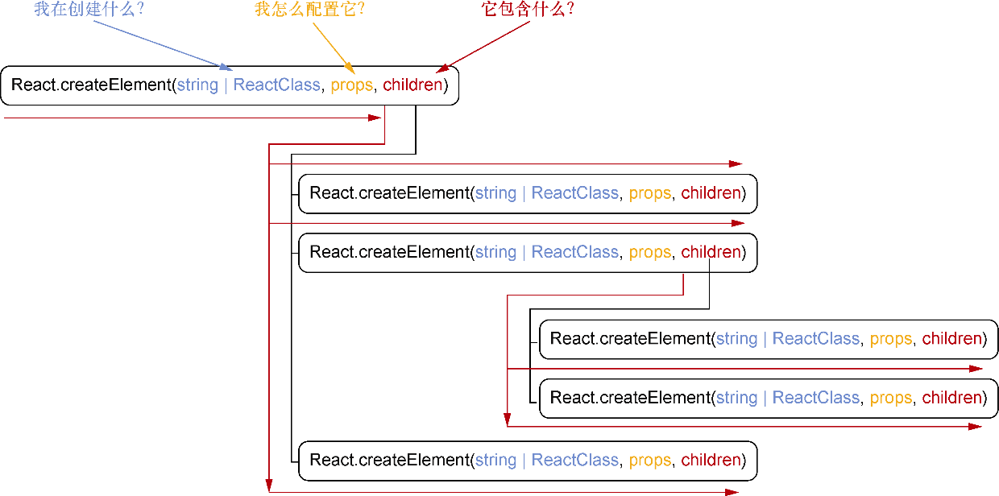

### 2.2.2　渲染首个组件

如图2-8所示，现在应该能够看到空白页之外的东西。我们刚刚创建了第一个React组件！使用浏览器的开发者工具，尝试打开这个页面并查看HTML，应该会看到与使用React所创建的元素相对应的HTML元素。注意，传入的属性也已经成功就位，可以点击链接，给我发封邮件，告诉我你是多么热爱学习React。

<b class="my_markdown">图2-8　第一个组件。它虽不大，但我们已经成功使用React创建了一个组件</b>

这太棒了，不过大家也许想知道React是怎么把这么多 `React.createElement` 转换成可以在屏幕上看到的东西的。React使用我们提供的React元素来创建 `React DOM` 管理浏览器DOM时所使用的虚拟DOM。还记得图2-6中虚拟DOM和真实DOM有相似的结构吗？好吧，在React能够发挥作用之前，它需要从React元素中形成自己的虚拟DOM树结构。

要做到这一点，React会递归地对每个 `React.createElement` 调用的全部 `children` …属性进行求值，并将结果传递给父元素。可以把React的这个做法想象成一个小孩反复在问“X是什么？”，直到他理解了X的每个小细节。图2-9展示了React对嵌套的React元素进行求值的方法。沿箭头向下，而后向右来查看React是如何检查每个React元素的 `children` …直到它能够形成一棵完整的树。

<b class="my_markdown">图2-9　React会递归地对一系列React元素进行求值来确定它应该如何为组件形成虚拟DOM树。
 它还会检查 `children` …中的更多React元素来进行求值。React会遍历所有可能路径，就像一个
 孩子在问，“X是什么？”，直到他们了解了所有事情。可以沿箭头向下而后向右来了解
 React对嵌套React元素求值的方式以及每个参数在问什么</b>

现在我们已经创建了第一个组件，大家也许会有一些问题，甚至一些顾虑。即便有一些格式化的帮助，很明显，浏览只嵌套几层的组件也是困难重重。我们将会探索更好的方法来编写组件，所以不用担心——不会数百次地嵌套 `React.createElement` 。现在使用嵌套可以更好地理解 `React.createElement` 做了什么，并且在开始大量使用 `React.createElement` 时，使用嵌套可能有助于你欣赏JSX。

大家也可能会担心创建的东西看起来太简单了。到目前为止，React看上去就像是一个冗长的JavaScript模板系统。但React能够做得更多：开始学习组件。

**练习2-2　React元素**

在开始学习组件之前，检验一下你对React元素的理解。在纸上或者在脑海中，列出React元素的一些特性。继续阅读之前，用下面的React元素的一些特性来唤醒记忆。

+ React元素接收一个字符串来创建一种DOM元素（ `div` 、 `a` 、 `p` 等）。
+ 可以通过 `props` 对象为React元素提供配置。这类似于DOM元素的属性（如 `` ）。
+ React元素是可嵌套的，可以将其他React元素作为某个元素的子元素。
+ React使用React元素创建虚拟DOM。当React更新浏览器DOM时，React DOM会使用虚拟DOM。
+ React元素是React中构成组件的东西。

