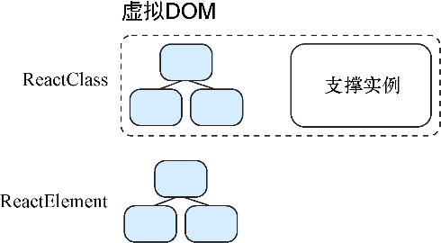

### 2.2.5　render方法

我们开始探索前面提到的用带有 `render` 方法的React类创建组件。这是在React应用中最常看到的方法之一，并且几乎任何向屏幕显示内容的组件都带有 `render` 方法。我们最终会探索那些不直接显示任何东西而是修改或增强其他组件的组件（有时被称为高阶组件）。

`render` 方法需要只返回一个React元素。从这一点看来， `render` 方法与React元素的创建方法相似——它们可以嵌套但最高层只有一个节点。然而，与React元素不同的是，React类的 `render` 方法可以访问内嵌数据（持久化的内部组件状态），以及组件方法和继承自 `React.Component` 抽象基类的其他方法（我将会探讨所有这些内容）。我所说的持久化状态对整个组件都是可用的，因为React为这种类型的组件创建了一个“支撑实例”。这也是你会听到将这种类型的组件称为有状态组件的原因。

这一切意味着React会为React类的实例（不是蓝图本身）创建并追踪一个特殊的数据对象，这个对象随时间保持存在并可以通过特定的React函数进行更新。我会在后续章节更深入地探讨这些内容，由图2-10可知，React类有支撑实例而React元素没有。

<b class="my_markdown">图2-10　React在内存中为按React组件类方式创建的组件创建了支撑实例。正如所见，React组件
 类得到了一个支撑实例，而React元素和非React类组件却没有。记住，React元素是DOM的
 镜像而组件是将它们组织在一起的方法。支撑实例是一种为特定组件提供数据存储和访问的
 方法。存储在该实例中的数据会通过特定的API方法被提供给组件的 `render` 方法。
 这意味着使用者可以访问能够改变和随时间持久化的数据</b>

当使用React类创建组件时，也可以访问属性——能够将该数据传入组件并依次传递给子组件。也许还记得这个 `props` 数据是传递给 `React.createElement` 的参数。和之前一样，你可以在创建组件时用它指定组件的属性。在组件内部不能修改 `props` ，但我们很快会发现更新React组件内数据的方法。

在下一节的代码清单2-5中我们会看到实际的React类组件，以及要如何创建更多嵌套的React元素并使用 `this.props` 传递自定义数据。当看到与React类一起使用的属性时，这感觉就像在创建类似 `Jedi` 的自定义HTML元素并为其提供“name”这样的自定义属性：< `Jedi name="Obi Wan"/` >。我会在后续章节中更深入地探讨 `this` 这个JavaScript关键字，但注意在这个例子中， `this` 这个被保留的JavaScript关键字指向的是该组件的实例。

