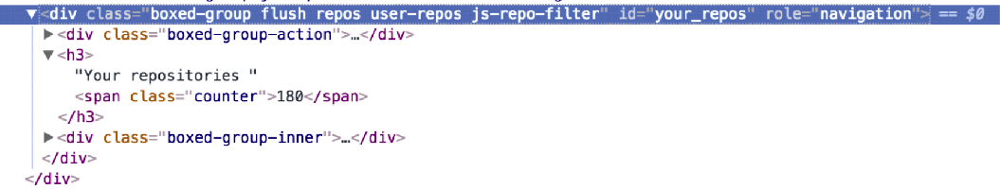

### 2.2.6　通过PropTypes校验属性

React类组件可以自由使用自定义属性，这听上去真是棒极了。这就像能够创建自定义HTML元素，但却有更多功能。记住，能力越大责任越大。我们需要某种方法来验证所使用的属性以便能够防止缺陷并规划组件使用的数据种类。要做到这些，可以使用来自React命名空间 `PropTypes` 的验证器。这组 `PropTypes` 验证器过去包含在React核心库中，但之后在React 15.5版中被分离出去并被废弃了。要使用 `PropTypes` ，需要安装 `prop-types` 软件包，这个软件包仍是React工具链的一部分但不再包含在核心库中，它将被包含在应用源代码中以及本章一直使用的CodeSandbox示例中。

`prop-types` 库提供了一组校验器，它们可以指定组件需要或期望什么样的属性。例如，如果要构建一个ProfilePicture组件，但没有图片（或者用于处理没有图片时的逻辑）它就没有什么用处。可以用 `PropTypes` 来指定ProfilePicture组件需要用哪些属性以及这些属性是什么样的。

可以把 `PropTypes` 看作提供了一种可以被其他开发者和未来的使用者实现或打破的契约。并非必须使用 `PropTypes` 才能让React工作，但应该用它来防止故障并使调试变得简单。使用 `PropTypes` 的另一个好处是，如果先指定期望什么属性，就有机会通盘思考组件需要什么才能运作。

使用 `PropTypes` 时，需要通过类的静态属性或通过类定义后的简单属性赋值来把 `propTypes` 属性添加到 `React.Component` 类。注意，这个是定义在类上的小写属性而不是来自 `React` 对象的属性，很容易将它们混淆。代码清单2-4展示了如何使用 `PropTypes` ，以及如何从React类组件返回React元素。这个代码清单把几件事集合在一起：创建一个可以传给 `createElement` 的 `React` 类，添加 `render` 方法，指定 `propTypes` 。

代码清单2-4　使用PropTypes和render方法

```javascript
import React, { Component } from "react";  ⇽--- 引入React，React DOM和prop-types
import { render } from "react-dom";
import PropTypes from "prop-types";
const node = document.getElementById('root');
class Post extends Component {  ⇽--- 创建React类作为Post组件。这个例子中，只是指定了propTypes和render方法
    render() {
        return React.createElement(
            'div',
            {
                className: 'post'  ⇽--- 创建一个class为'post'的div元素
            },
            React.createElement(
                'h2',
                {
                    className: 'postAuthor',
                    id: this.props.id
                },
                this.props.user,  ⇽--- JavaScript中，this的指向有时会令人困惑——在这里，this指的是组件的实例，而不是React类的蓝图
                React.createElement(
                    'span',
                    {
                       className: 'postBody'  ⇽--- 用className而不是class来指定DOM元素的CSS类名
                    },
                    this.props.content  ⇽--- 同样，content属性是创建的span元素的内部内容
                )
            )
       );
    }
}
Post.propTypes = {
   user: PropTypes.string.isRequired,  ⇽--- 属性可能是可选的或必需的、有类型，甚至必须要有一定的“形状”（例如，具有某些属性的对象）
    content: PropTypes.string.isRequired,
    id: PropTypes.number.isRequired
};
const App = React.createElement(Post, {
   id: 1,  ⇽--- 将Post的React类与一些属性一起传递给React.createElement ， 创建一些React DOM能够渲染的东西——尝试更改数据以查看组件的呈现方式
    content: ' said: This is a post!',
    user: 'mark'
});
render(App, node);
...
```

代码清单2-4的在线代码位于https://codesandbox.io/s/3yj462omrq。

应该看到一些文字出现：“mark said: This is a post!”如果没有提供任何必要的属性，会在开发者控制台中看到警告。未能提供某些属性可能会破坏应用，因为组件需要这些属性来工作，但验证步骤不会。换言之，如果忘记给应用提供一些重要数据，应用可能会出问题，但使用 `PropTypes` 验证不会——它只是让使用者知道忘记了那个属性。由于 `PropTypes` 只在开发模式中进行类型评估，运行在生产环境的应用不会耗费额外的精力做 `PropTypes` 的工作。

现在创建了一个组件并传入了一些数据，可以尝试嵌套组件。我之前已经提到这种可能性，这正是让React的使用成为一种乐趣并且使React非常强大的部分原因：能够由其他组件创建组件。代码清单2-5说明了这一点并展示了 `children` 属性的特殊用法。我会在后续章节使用路由和高阶组件时对此进行详细介绍。当使用 `this.props.children` 属性时，它就像让嵌套数据通过的插座。在这个例子中，我们会创建一个Comment组件、将其作为参数传递并实现嵌套。

代码清单2-5　添加嵌套组件

```javascript
//...
      this.props.user,
      React.createElement(
        "span",
        {
            className: "postBody"
        },
         this.props.content
       ),
       this.props.children  ⇽--- 把this.props.children添加到Post组件，以便它可以渲染children
//...
class Comment extends Component {  ⇽--- 创建Comment组件，与创建Post组件类似
    render() {
        return React.createElement(
            'div',
            {
                className: 'comment'
            },
            React.createElement(
                'h2',
                {
                    className: 'commentAuthor'
                },
                this.props.user,
                React.createElement(
                    'span',
                    {
                        className: 'commentContent'
                    },
                    this.props.content
                )
            )
        );
    }
}
Comment.propTypes = {  ⇽--- 声明propTypes
    id: PropTypes.number.isRequired,
    content: PropTypes.string.isRequired,
    user: PropTypes.string.isRequired
};
const App = React.createElement(
    Post,
    {
        id: 1,
        content: ' said: This is a post!',
        user: 'mark'
    },
    React.createElement(Comment, {  ⇽--- 将Comment组件嵌套到Post组件中
        id: 2,
        user: 'bob',
        content: ' commented: wow! how cool!'
    })
);
ReactDOM.render(App, node);
```

代码清单2-5的在线代码位于https://codesandbox.io/s/k2vn448pn3。

现在创建了一个嵌套组件，应该能够在浏览器中看到更多东西。接下来，我们将看看要如何用之前提及的（随React类一起的）内嵌状态来创建动态组件。


**练习2-3　对一个组件树进行逆向工程**

继续之前，通过对GitHub这样的网站的一个组件树进行逆向工程来检验你对组件的理解。打开开发者工具，挑选一个嵌套不太深的DOM元素，从它开始重建React类。考虑下面的DOM元素：



如何用React构造一个类似的组件结构？（无须添加每个CSS类名。）


