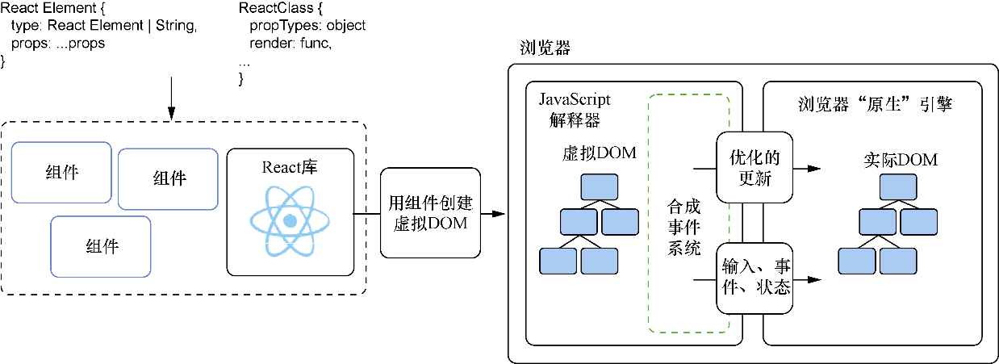

### 2.3　组件的一生

本节将增强Post和Comment组件，以使它们具有交互性。早先，我们发现作为React类创建的组件拥有某些特定的方法来通过“支撑实例”保存和访问数据。为了理解这是怎么回事，让我们回顾一下React的工作方式的整体情况。图2-11概括了目前所学到的东西。通过由React元素（映射到DOM的元素）组成的React类能够创建组件。我称为React类的东西是 `React. createElement` 能够使用的 `React.Component` 的子类。

<b class="my_markdown">图2-11　放大React的渲染过程。React使用React类和React元素创建内存中控制实际DOM的
 虚拟DOM。它还创建了一个“综合”事件系统，以便仍可以对来自浏览器的
 事件做出反应（如点击、滚动和其他用户引起的事件）</b>

由React类创建的组件拥有存储数据的支撑实例，并且需要有一个只返回单个React元素的 `render` 方法。React将获取React元素并由这些React元素创建内存中的虚拟DOM，而它会负责管理和更新DOM。

我们已经为React类添加了 `render` 方法和一些 `PropTypes` 校验。但要创建动态组件，需要的远不止这些。React类可以拥有某些特殊方法，当React管理虚拟DOM时，它们会以一定的顺序被调用。用来返回React元素的 `render` 方法只是其中一个方法。

除了保留的生命周期方法，使用者可以添加自己的方法。React让使用者可以自由和灵活地将需要的任何方法添加到组件中。几乎任何有效的JavaScript都能用于React。如果翻回去看第1章中的图1-1，会注意到占React组件大部分的是生命周期方法、特定属性和自定义代码。还有什么？

