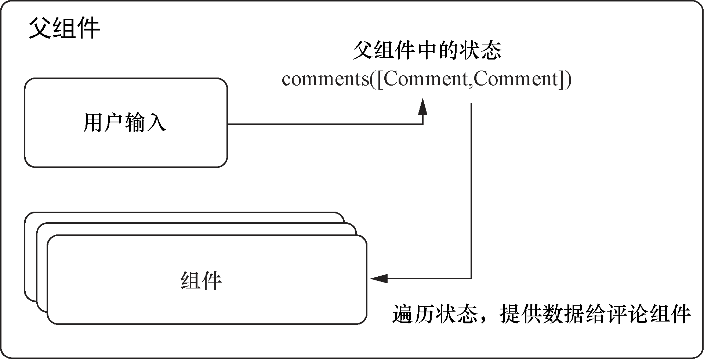

### 2.3.2　设定初始状态

应该在什么时候使用状态？要如何开始使用状态？目前，简单的答案是，在想要改变存储在组件中的数据时使用。我说过属性是不可变的（不可修改的），所以，如果需要改变数据的话，就需要可变状态。在React中，需要变化的数据常常来自于用户输入（通常是文本、文件、切换选项等）或者是用户输入的结果，但也可能是许多其他东西。为了跟踪用户与表单元素的交互，需要提供初始状态，而后随时间改变该状态。可以使用组件的构造函数来为组件设置初始状态——一个构筑于之前代码清单的想法和概念之上的评论框组件。它让用户用一个简单的表单给帖子添加评论。代码清单2-6展示了如何搭建组件并设置初始状态。

代码清单2-6　设置初始状态

```javascript
//...
class CreateComment extends Component {
    constructor(props) {
        super(props);     ⇽--- 在类构造函数中调用super并将初始state对象赋值给类实例的state属性——要注意的是，除在组件类的构造函数中之外，一般不会像这样对state赋值
        this.state = {
            content: '',  ⇽--- 在类构造函数中调用super并将初始state对象赋值给类实例的state属性——要注意的是，除在组件类的构造函数中之外，一般不会像这样对state赋值
            user: ''
        };
    }
    render() {
        return React.createElement(
            'form',
            {  ⇽--- 将组件创建为React类，其为用户提供了一些输入字段——我会在后续章节中更详细地讨论表单
                className: 'createComment'
            },
            React.createElement('input', {
                type: 'text',  ⇽--- 将组件创建为React类，其为用户提供了一些输入字段——我会在后续章节中更详细地讨论表单
                placeholder: 'Your name',
                value: this.state.user
            }),
            React.createElement('input', {
                type: 'text',
                placeholder: 'Thoughts?'  ⇽--- 将组件创建为React类，其为用户提供了一些输入字段——我会在后续章节中更详细地讨论表单
            }),
            React.createElement('input', {
                type: 'submit',
                value: 'Post'
            })
        );
    }
}
CreateComment.propTypes = {
    content: React.PropTypes.string
};
//...
const App = React.createElement(
    Post,
    {
        id: 1,
        content: ' said: This is a post!',
        user: 'mark'
    },
    React.createElement(Comment, {
        id: 2,
        user: 'bob',
        content: ' commented: wow! how cool!'
    }),
    React.createElement(CreateComment)  ⇽--- 将CreateComment添加到App组件中
);
```

代码清单2-6的在线代码位于https://codesandbox.io/s/p5r3kwqx5q。

需要使用一个专门的方法来更新组件类的构造函数中初始化的状态。不能像在非React情况下那样直接覆盖 `this.state` ，因为React需要追踪状态并确保虚拟DOM和实际DOM保持同步。需要使用 `this.setState` 来更新React类组件中的状态。来看一下它的基本用法。 `this.setState` 接收一个用来更新状态的更新器函数，而且 `this.setState` 不返回任何东西：

```javascript
setState(
   function(prevState, props) -> nextState,
   callback
)-> void
```

`this.setState` 接收一个返回对象的更新器函数，该对象会与状态进行浅合并。例如，一开始将属性 `username` 设置为空字符串，可以使用 `this.setState` 为组件状态设置新的 `username` 值。React会接收这个值并用新值更新支撑实例和DOM。

JavaScript中的更新或重新赋值与使用 `setState` 之间的一个关键区别是，React能够根据状态变化选择批量更新以便使效率最大化。这意味着，当调用 `setState` 进行状态更新时，它无须立即执行。可以更多地将其当作一个确认——React将以最高效的方法基于新状态更新DOM，尽可能快。

什么会引起React进行更新？JavaScript是事件驱动的，所以它可能会响应某种用户输入（至少在浏览器中），可能是一次点击、按键或者许多浏览器支持的其他事件。事件与React如何协同工作？React实现了一个合成事件系统作为虚拟DOM的一部分，它会将浏览器中的事件转换为React应用的事件。可以设置响应浏览器事件的事件处理器，就像通常用JavaScript做的那样。一个区别是React的事件处理器是设置在React元素或组件自身之上的（而不是用addEventListener）。可以用来自这些事件（输入框的文本、单选按钮的值或事件的目标）的数据更新组件的状态。

代码清单2-7展示了如何将已经学到的有关设置初始state和设置事件处理器的知识付诸实践。React能够监听浏览器中很多不同事件，涵盖了几乎每种可能的用户交互（点击、按键、表单、滚动等）。这里我们最关心的是两个主要事件：当表单输入值改变的时候，以及当表单被提交的时候。通过监听这些事件，能够接收并使用数据来创建新评论。

代码清单2-7　设置事件处理器

```javascript
...
class CreateComment extends Component {
    constructor(props) {
        super(props);
        this.state = {
            content: '',
            user: ''
        };
        this.handleUserChange = this.handleUserChange.bind(this);  ⇽--- 由于使用类创建的组件无法自动绑定组件的方法，因此需要在构造函数中将它们绑定到this上
        this.handleTextChange = this.handleTextChange.bind(this);
        this.handleSubmit = this.handleSubmit.bind(this);
    }
    handleUserChange(event) {  ⇽--- 指定事件处理器来处理作者字段的更改——用event.target.value 获取输入元素的值并用this.setState更新组件的状态
        const val = event.target.value;
        this.setState(() => ({
            user: val
        }));
    }
    handleTextChange(event) {  ⇽--- 用类似函数为评论内容创建事件处理器
        const val = event.target.value;
        this.setState(() => ({
            content: val
        }));
    }
    handleSubmit(event) {  ⇽--- 表单提交事件的事件处理器
        event.preventDefault();
        this.setState(() => ({  ⇽--- 提交后重置输入字段以便用户能够提交进一步的评论
             user: '',
             content: ''
        }));
    }
    render() {
        return React.createElement(
            'form',
            {
                className: 'createComment',
                onSubmit: this.handleSubmit
            },
            React.createElement('input', {
                type: 'text',
                placeholder: 'Your name',
                value: this.state.user,
                onChange: this.handleUserChange
            }),
            React.createElement('input', {
                type: 'text',
                placeholder: 'Thoughts?',
                value: this.state.content,
                onChange: this.handleTextChange
            }),
            React.createElement('input', {
                type: 'submit',
                value: 'Post'
            })
        );
    }
}
CreateComment.propTypes = {
    onCommentSubmit: PropTypes.func.isRequired,
    content: PropTypes.string
};
...
```

代码清单2-7的在线代码位于https://codesandbox.io/s/x9mxo31pxp。

有注意到是如何在组件类的构造函数中使用 `.bind` 的吗？在之前版本的React中，React会自动将方法绑定到组件实例上。但切换到JavaScript类之后，需要自己绑定方法。如果定义了一个组件方法而它却不工作，你需要确定已经正确地绑定了方法——最初开始使用React时，很容易忘记。

接下来，尝试去掉 `onChange` 事件处理器，看看是否能够在表单输入框中输入任何东西。答案是不能，因为React要确保DOM与虚拟DOM保持一致，如果虚拟DOM没有更新，就不会让DOM发生变化。如果现在不完全明白，不用担心，第5章和第6章将更全面地讨论表单。

既然有办法监听事件并修改组件状态，就有办法用单向数据流创建新组件。在React中，数据自顶向下流动，作为从父组件到子组件的输入。当创建复合组件时，可以通过属性向子组件传递信息并在子组件中使用这些信息。这表示可以将来自 `CreateComment` 组件的数据存储在父组件中并从那里将数据传递给子组件。但要如何将从一个子组件的新评论中获取的数据（用户输入到表单的文本）送回父组件和子组件？图2-12展示了此类数据流的例子。


<center class="my_markdown"><b class="my_markdown">图2-12　要添加帖子，需要从输入字段获取数据并以某种方式传给父组件，
 然后更新后的数据将被用来渲染帖子</b></center>

要如何实现？我们还没有考虑通过属性传递的一种数据，那就是函数。因为JavaScript中函数可以作为参数传递给其他函数，所以可以利用这一点。可以在父组件中定义一个方法并将其作为属性传递给子组件。如此一来，子组件就能够将数据发送回父组件而无须了解父组件如何处理数据。如果需要随数据的变化而进行调整，无须对 `CreateComment` 组件做任何事情。要执行作为属性传递的函数，子组件只需要调用方法并将数据传给它。代码清单2-8展示了如何将函数用作属性。

代码清单2-8　将函数用作属性

```javascript
//...
class CreateComment extends Component {
    constructor(props) {
        super(props);
        this.state = {
            content: '',
            user: ''
        };
        this.handleUserChange = this.handleUserChange.bind(this);
        this.handleTextChange = this.handleTextChange.bind(this);
        this.handleSubmit = this.handleSubmit.bind(this);
    }
    handleUserChange(event) {
        this.setState(() => ({
            user: event.target.value
        }));
    }
    handleTextChange(event) {
        this.setState(() => ({
            content: event.target.value
        }));
    }
    handleSubmit(event) {
        event.preventDefault();  ⇽--- 调用由父组件作为属性传入的onCommentSubmit函数——传入来自表单的数据并重置表单以便用户知道其操作已成功
        this.props.onCommentSubmit({
            user: this.state.user.trim(),
            content: this.state.content.trim()
        });
        this.setState(() => ({
            user: '',
            text: ''
        }));
    }
    render() {
        return React.createElement(
            'form',
            {
                className: 'createComment',
                onSubmit: this.handleSubmit  ⇽--- 不要忘记将已设置的方法绑定到onSubmit事件——如果没有绑定，正确的事件与方法之间就不会有任何联系
            },
            React.createElement('input', {
                type: 'text',
                placeholder: 'Your name',
                value: this.state.user,
                onChange: this.handleUserChange
            }),
            React.createElement('input', {
                type: 'text',
                placeholder: 'Thoughts?',
                value: this.state.content,
                onChange: this.handleTextChange
            }),
            React.createElement('input', {
                type: 'submit',
                value: 'Post'
            })
        );
    }
}
//...
```

代码清单2-8的在线代码位于https://codesandbox.io/s/p3mk26v3lx。

现在组件能够将新评论数据传递给父组件，需要包含一些模拟数据以便能够开始评论。后续章节中，将使用Fetch API和一个Rest风格的 JSON API，但现在使用自己创建的假数据就可以。代码清单2-9展示了如何模拟带有评论的帖子的基本数据。

代码清单2-9　模拟API数据

```javascript
...
const data = {  ⇽--- 为CommentBox组件设置模拟数据
    post: {
        id: 123,
        content:
            'What we hope ever to do with ease, we must first learn to do
            with diligence. — Samuel Johnson',
        user: 'Mark Thomas',
    },
    comments: [
        {
            id: 0,  ⇽--- 将把这些评论对象作为已有的评论
            user: 'David',
            content: 'such. win.',
        },
        {
            id: 1,  ⇽--- 将把这些评论对象作为已有的评论
            user: 'Haley',
            content: 'Love it.',
        },
        {
            id: 2,  ⇽--- 将把这些评论对象作为已有的评论
            user: 'Peter',
            content: 'Who was Samuel Johnson?',
        },
        {
            id: 3,  ⇽--- 将把这些评论对象作为已有的评论
            user: 'Mitchell',
            content: '@Peter get off Letters and do your homework',
        },
        {
            id: 4,  ⇽--- 将把这些评论对象作为已有的评论
            user: 'Peter',
            content: '@mitchell ok :P',
        },
    ],
};
...
```

接下来，需要一种方法来展示所有的评论，这对于React很容易。我们已经有展示评论的组件。既然操作React组件所需的只是普通的JavaScript，可以使用 `.map()` 函数返回一个React元素的新数组。不能使用内联的 `.forEach()` ，因为它不返回数组，而这会让 `React.createElement()` 无事可做。然而，可以用 `forEach` 创建一个数组，而后把这个数组传进去。

除了对现有评论进行循环迭代，还需要定义一个可以传递给CreateComment组件的方法。它需要通过接收子组件的数据来修改其状态中的评论列表。提交方法和状态需要加入新的父组件：CommentBox。代码清单2-10展示了如何创建组件并设置这些方法。

代码清单2-10　处理评论提交和元素的循环迭代

```javascript
...
class CommentBox extends Component {
    constructor(props) {
        super(props);
        this.state = {
            comments: this.props.comments  ⇽--- 从最高层将评论数据传给CommentBox
        };
        this.handleCommentSubmit = this.handleCommentSubmit.bind(this);
    }
    handleCommentSubmit(comment) {
        const comments = this.state.comments;  ⇽--- 不要直接修改状态——相反，创建一个副本
        // note that we didn't directly modify state
        comment.id = Date.now();  ⇽--- 不要直接修改状态——相反，创建一个副本
        const newComments = comments.concat([comment]);
        this.setState({
            comments: newComments  ⇽--- 不要直接修改状态——相反，创建一个副本
        });
    }
    render() {
        return React.createElement(
            'div',
            {
                className: 'commentBox'
            },
            React.createElement(Post, {
                id: this.props.post.id,  ⇽--- 如先前，从最高层传入数据变量来访问帖子（post）数据
                content: this.props.post.content,
                user: this.props.post.user
            }),
            this.state.comments.map(function(comment) {  ⇽--- 遍历this.state.comments中的评论并为每个评论返回一个React元素
                return React.createElement(Comment, {
                    key: comment.id,
                    id: comment.id,
                    content: comment.content,
                    user: comment.user
                });
            }),
            React.createElement(CreateComment, {
                onCommentSubmit: this.handleCommentSubmit  ⇽--- 把父组件的handleCommentSubmit方法提供给CreateComment组件使用
           })
        );
    }
}
CommentBox.propTypes = {
    post: PropTypes.object,
    comments: PropTypes.arrayOf(PropTypes.object)
};
const App = React.createElement(CreateComment);
ReactDOM.render(  ⇽--- 将模拟数据作为属性传给CommentBox组件
    React.createElement(CommentBox, {
        comments: data.comments,  ⇽--- 将模拟数据作为属性传给CommentBox组件
        post: data.post
    }),
    node
);
...
```

代码清单2-10的在线代码位于https://codesandbox.io/s/z6o64oljn4。

至此，我们有了一个不好看、未经测试但可以工作的组件，它可以对属性进行验证、更新状态并能够添加新评论。它看起来不怎么样，所以我将完善它作为一个挑战留给读者去完成，让这个评论框配得上我们Letters这个假想公司。

