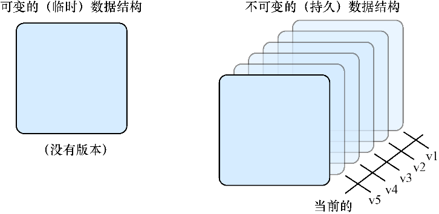
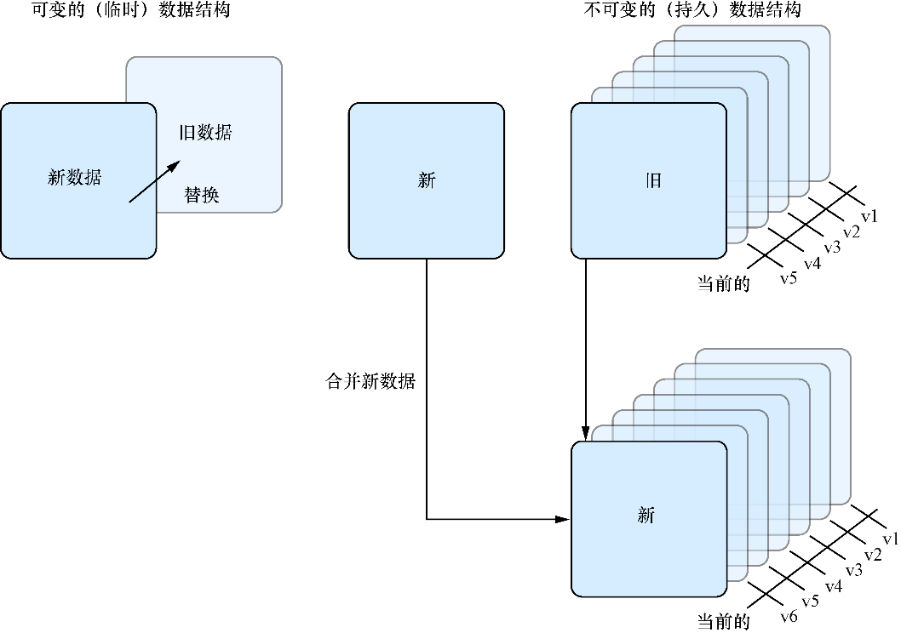

### 3.1.2　可变状态与不可变状态

在React应用中，有两种主要的方法来处理组件中的状态，即通过可以改变的状态和通过不能改变的状态。我们在这里进行了简化：应用中存在多种类型的数据和状态。可以用许多不同的方式表示数据，如二叉树、Map或Set，或者常规JavaScript对象。但与React组件中的状态进行通信和交互的方法归结为这两类，在React中，它们被称为状态（state）（可以在组件中改变的数据）和属性（props）（组件接收并且不应该被组件改变的数据）。

你可能听说过状态和属性被称为可变的与不可变的。这在一定程度上是对的，因为JavaScript并未原生地支持真正的不可变对象（Symbol也许是，但它超出本书的范围了）。在React组件中，状态通常是可变的，而属性不应该被改变。在潜心于React特定的API之前，让我们先稍微深入地探索可变性与不可变性思想。

在第2章中，当状态被称为可变的时，意思是我们可以覆盖或更新该数据（例如可以被覆盖的变量）。另一方面，不可变状态是不能被改变的。还有不可变数据结构，其只能通过受控的方式进行改变（这是React中的状态API的工作方式）。当在第10章和第11章中学习Redux时会模拟不可变数据结构。

我们可以稍微扩展一下可变的和不可变的概念，将相应的数据结构类型包括进来。

+ 不变的——一个不可变的持久数据结构，随着时间的推移可以支持多个版本，但不能直接覆盖；不可变数据结构通常是持久的。
+ 可变的——一个可变的临时数据结构，随着时间的推移只支持一个版本；可变的数据结构在其变化时可以被覆盖并且不支持其他版本。

图3-1展示了这些概念。

<b class="my_markdown">图3-1　不可变数据结构与可变数据结构中的持久性和临时性。不可变或持久的数据结构常常记录一段
 历史并且不会改变，但会对随着时间的推移发生的变化进行版本化。但是，临时数据结构通常
 不记录历史并且随着每次更新都会被抛弃</b>

另一种考虑不可变数据结构和可变的数据结构之间的区别的方法是考虑这两种数据结构各自拥有的不同能力和内存。临时数据结构只有能力保存一瞬间的数据，而持久数据结构则能够记录数据随时间的变动情况。这正是让不可变数据结构的不可变性变得更加清晰的所在：只制作状态的副本——它们没有被替换。旧状态被新状态替代，但数据却没有被替换。图3-2展示了变化是如何发生的。

<b class="my_markdown">图3-2　处理可变数据和不可变数据的变化。临时数据结构没有版本，所以当更改它们时，所有以前的
 状态都消失了。它们可以说是活在当下，而不可变数据结构能够随时间的推移而持续存在</b>

> **提示　** 考虑不可变性与可变性的另一种方法是考虑“保存”和“另存为”之间的区别。许多电脑程序能够保存文件的当前状况或者用不同的名字保存当前文件的副本。不可变数据类似于在保存它时保存了一个副本，而可变数据则能够就地覆盖。

尽管JavaScript本身不支持真正的不可变数据结构，React用可变的方式暴露组件的状态（通过 `setState` 进行改变）并将属性作为只读的。通常不可变性和不可变数据结构还有更多知识，但是我们对此的关注无须超过我们对它们已有的了解。如果仍想了解更多，有学术研究在关注这类问题。通过Immutable JS这样的库也能在JavaScript应用中广泛地使用不可变数据结构，但在React中我们只需应对属性API和状态API。

