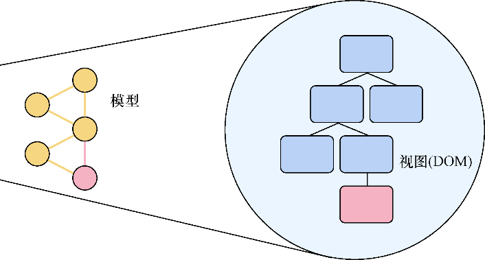
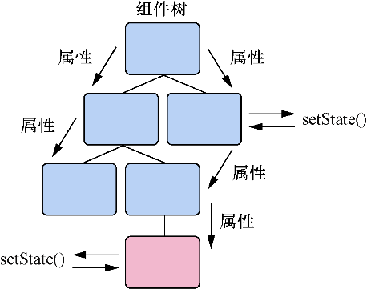

### 3.4　单向数据流

如果之前使用框架开发过Web应用，可能已经熟悉术语双向数据绑定（two-way data binding）。数据绑定是建立应用UI与其他数据之间联系的过程。在实践中，这常常表现为连接模型这样的应用数据（如用户）和用户界面的库或框架并会保持两者同步。它们彼此同步因此被绑定在一起。React中一个更有帮助的思考方法是将其作为投影：UI是投射到视图中的数据，当数据变化时，视图随之变化，如图3-3所示。

<b class="my_markdown">图3-3　数据绑定通常指的是在应用数据与视图（该数据的展示）之间建立连接的过程。
 另一种思考方式是将其作为数据向用户能够看到的东西（如视图）的投射</b>

数据流是另一种思考数据绑定的方法：数据如何流经应用的不同部分？本质上，人们会问：“什么能够更新什么，从哪里更新，以及如何更新？”如果想用好工具，那么理解正在使用的工具如何塑造、维护和移动数据是无比重要的。不同的库和框架会采用不同的数据流方法（React对如何处理数据流并没有不同的想法）。

React中，数据流是单向的。这意味着实体间的流动并非水平的——这种情况下彼此可以相互更新，而是建立了一个层次结构。可以通过组件传递数据，但如果不传递属性，就不能触及和修改其他组件的状态或属性，也无法修改父组件中的数据。

但可以通过回调函数将数据传回层次结构的上层。当父组件接收到来自子组件的回调函数时，它可以修改其数据并将修改的数据传递给子组件。即便是对于有回调函数的情况，数据总体上仍是向下流动的并仍由向下传递该数据的父组件决定。这就是为什么我们称React中的数据流是单向的，如图3-4所示。

<b class="my_markdown">图3-4　数据在React中是按一个方向流动的。属性由父组件传递给子组件（从所有者到拥有者），
 并且子组件不能编辑父组件的状态或属性。每个拥有支撑实例的组件都能修改它自己的
 状态但无法修改超出其自身的东西，除了设置其子组件的属性</b>

单向数据流在构建UI时特别有用，因为它让思考数据在应用中流动的方式变得更简单。得益于组件的层次结构以及将属性与状态局限于组件的方式，预测数据如何在应用中移动通常更容易。

某种程度上避免这个层次结构听上去似乎不错，而且可以从应用的任何部分随意修改想要修改的东西，但实际上这往往会导致难以琢磨的应用并且可能造成困难的调试情况。后续章节将探索Flux和Redux这样的架构模式，它允许维护单向数据流范式的同时协调跨组件或跨应用的行动。

