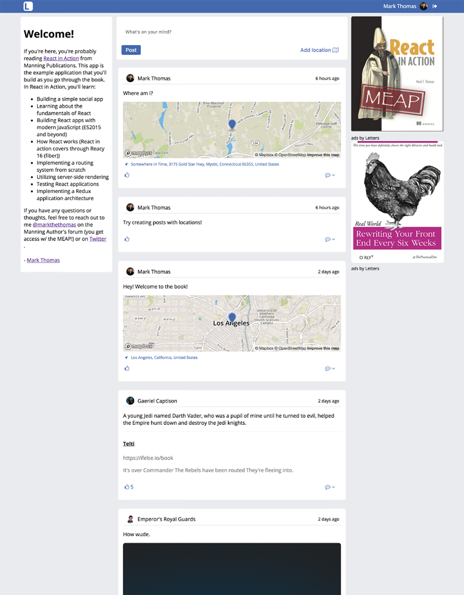

### 4.1　搭建Letters Social仓库

我们将在本章开始构建Letters Social应用。我们假装自己是一家专注于创建下一个伟大社交网络应用的初创公司。我们的公司Letters（公司巧妙地命名是为了与Alphabet这样的Web巨头区分开来）致力于社交。读者将跟随本书使用React来构建这个应用。到本书结束时，Letters Social将用到服务器端渲染、Redux以及React。如图4-1所示，这个应用支持的一些功能需要在这里提一下，以便读者了解跟随本书所要构建的内容：

+ 创建带有文本的帖子；
+ 使用Mapbox给帖子添加位置信息；
+ 给帖子点赞和评论；
+ 通过GitHub和Firebase提供OAuth身份验证；
+ 在信息流中展示帖子；
+ 使用基本的分页。

<b class="my_markdown">图4-1　Letters Social，这是本书构建的React应用。可以在本书的GitHub上查看
 这一应用的源代码并在https://social.react.sh上尝试这一应用</b>

我们会在本章以及后续几章逐一实现这些功能。为了让事情更容易些，我为第4章到第12章创建了Git分支。每章（某些情况下是每两章）的分支是到该章结束的代码。例如，如果检出第5章和第6章的Git分支，就拥有到这两章结束的代码。这样读者就可以根据自己的喜好提前学习，而且可以从任意一章开始。例如，如果想要学习第9章（介绍React应用程序的测试），可以检出第7章和第8章的代码并从那里开始学习。我尽力让代码检出更容易些，读者可以根据自己的喜好使用Git仓库和分支。请随意发起问题的pull request或者fork它作为给应用增加新功能的起点。

读者也可以在http://docs.react.sh上阅读有关这些源代码文件的基本文档，它不是很详尽，但如果想感受一下代码并且喜欢JSDoc风格的文档，这些文档是不错的选择。仓库的README也列出了一些有用的资源。如果有问题（或者只是因为喜欢这本书）可随时直接联系我。可以通过README来提问题。

