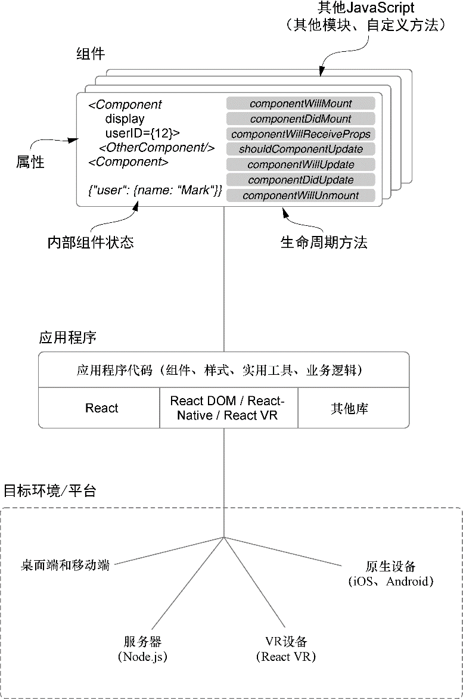

### 4.2.1　生命周期方法概览

在第2章中，已经了解了在组件中创建和分配函数作为事件（点击、表单提交等）的处理程序。这非常有用，因为使用者可以创建响应用户事件的动态组件（任何现代Web应用程序的关键特性）。但如果使用者想要更多东西呢？仅有这个特性，看起来我们仍然在使用常规的旧式HTML和JavaScript。例如，想从API获得用户数据或者读取cookie供以后使用，所有这些都无须等待用户发起事件。这些是Web应用程序中需要处理的例行工作——某些情况下会希望它自动执行，那么这些事情会在哪里发生呢？答案是生命周期方法。

> **定义　** 生命周期方法是附属于React类组件的特殊方法，其在组件生命周期的特定时间点被执行。生命周期是一种思考组件的方式。拥有生命周期的组件隐喻着其有“生命”——它至少有起始、中间和结束。这种思维模型让思考组件更简单并就组件在其生命周期所处位置提供了上下文。生命周期方法不是React独有的，许多UI技术由于生命周期方法的直观和有用而采用它们。React组件生命的主要部分是挂载、更新和卸载。图4-2展示了组件生命周期的概览及渲染过程（React如何随时间管理组件）。

<b class="my_markdown">图4-2　React概览。React会渲染（创建、管理）组件并使用组件创建用户界面</b>

之前几章中提到过生命周期方法，现在是时候真正深入，了解它们是什么以及如何使用它们。作为开始，再次从较高层次思考一下React。看看图4-2的顶部来唤起记忆。我们已经讨论过React的状态、通过React.createElement和JSX创建React组件，但我们仍需要深入了解生命周期方法。

让我们慢慢回忆以前的几章并回顾一些概念。什么是渲染？渲染的一个定义是“使成为或变为；创建。”就我们的目的而言，我们可以将渲染看作React创建和管理用户界面所做的工作，就是让应用程序展现到屏幕上的工作。正是React获取组件并把它们变成用户界面。

我们可以使用本章所学的生命周期方法来挂载到这个过程。这些方法使我们能够灵活地在组件生命周期的适当时刻做我们所需的工作。但这些方法仅适用于那些通过继承 `React.Component` 抽象基类的类所创建的组件。

第3章末尾所讨论的无状态函数组件没有可用的生命周期方法。由于没有支撑实例，也不能在它们内部使用 `this.setState` 。React没有追踪它们的任何内部状态，它们仍然可以由父组件通过属性更新它们的数据，但无法访问生命周期方法。这可能看起来像是一个障碍，或者像是它们不那么强大，但很多情况下它们就是所需要的。

