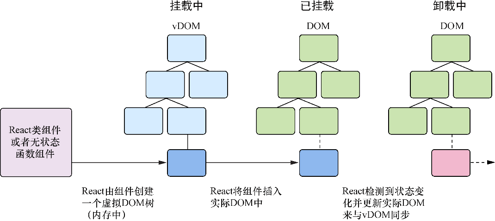
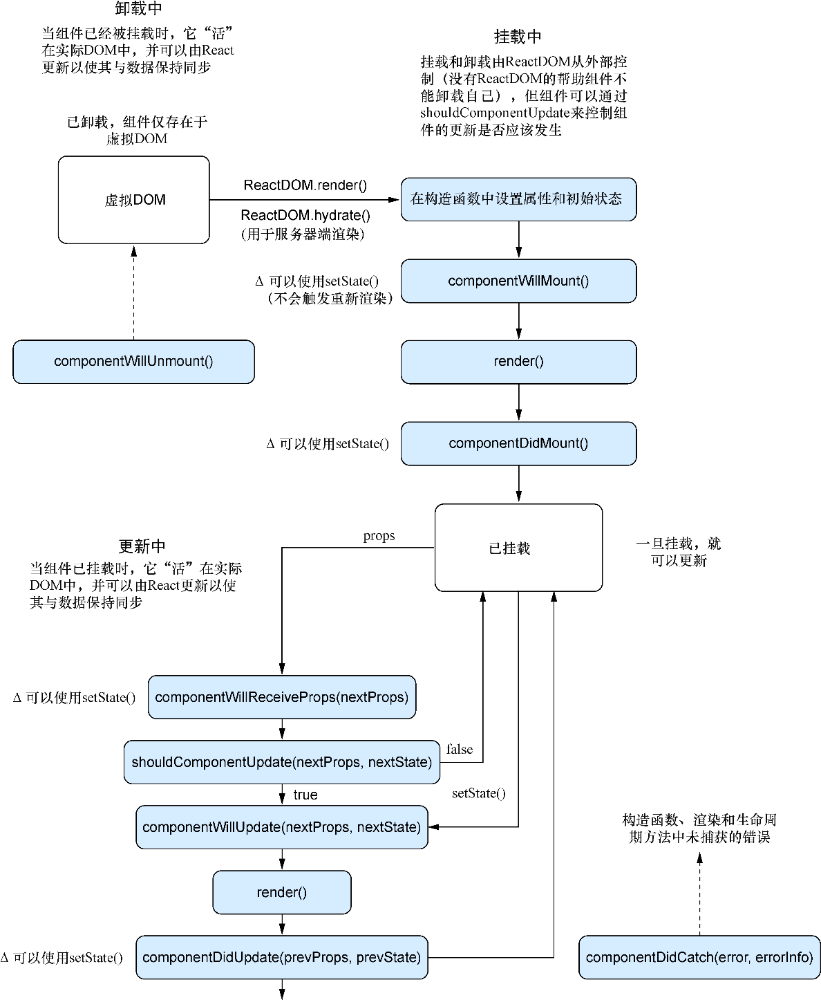

### 4.2.2　生命周期方法的类型

本节会了解React在不同组中提供的不同生命周期方法并讨论每个方法做什么。可以将生命周期方法分成两个主要的组：

+ “将执行”（Will）方法——在一些事情发生前被调用；
+ “已完成”（Did）方法——在一些事情发生后被调用。

也有其他一些方法不属于这两类，它们与初始化和错误处理相关，还有一个与更新相关。然而，大部分方法是“将执行”类型和“已完成”类型。

我们可以根据它们与生命周期的哪部分相关而进一步将它们分成几个类型（见图4-3）。组件的生命周期有4个主要部分且每部分有相应的生命周期方法：

+ 初始化——组件类被实例化的时候；
+ 挂载中——组件被插入DOM的时候；
+ 更新中——通过状态或属性用新数据更新组件的时候；
+ 卸载中——组件从DOM中移除的时候。


<center class="my_markdown"><b class="my_markdown">图4-3　渲染过程和组件生命周期的概览。这就是React用来管理组件的过程。组件生命的三个
 主要部分是当组件挂载中、已挂载及卸载中的时候。当组件被插入DOM时，其处于挂载中，
 一旦插入则组件处于已挂载，而当组件被移除时，组件处于卸载中</b></center>

在组件初始化过程中以及组件挂载、更新和卸载的前后都会调用生命周期方法。这些方法并没有那么多，特别是与其他库或框架相比，但学习React的时候却很容易将它们搞混。将它们组成有意义的认识上的分组，将有助于掌控渲染过程的不同部分。图4-4展示了React中渲染过程的概览，我们将在本章更细致地了解它。


<center class="my_markdown"><b class="my_markdown">图4-4　React组件生命周期的概览。 `ReactDOM` 渲染组件，而当React管理组件时会调用某些生命周期方法</b></center>

记住，从生命周期的角度考虑，用户界面和组件并非React或JavaScript技术特有的，其他技术已经采用了这个想法并取得了巨大的成功，有时甚至是在受到React的启发后。但这些特定的生命周期方法是React独有的。为了探索这些方法，我们将创建两个简单组件（一个父组件和一个子组件）它们将实现我们要了解的所有生命周期方法。你可以前往https://codesandbox.io/s/2vxn9251xy了解如何添加这些组件。仍然可以从CodeSandbox下载代码并使用浏览器的开发者工具来查看控制台。代码清单4-1展示了这些组件的基本设置。

代码清单4-1　探索生命周期方法

```javascript
import PropTypes from 'prop-types';
import React, { Component } from 'react';
import { render } from 'react-dom';
class ChildComponent extends Component {  ⇽--- 声明子组件
   static propTypes = {
        name: PropTypes.string  ⇽--- 将propTypes设置为类的静态属性
    };
    static defaultProps = (function() {  ⇽--- 设置默认属性，通常会将其设置为对象而非函数，但这里使用立即执行函数来注入console.log语句
        console.log('ChildComponent : defaultProps');
        return {};
    })();
  constructor(props) {
        super(props);
        console.log('ChildComponent: state');
  }
  render() {
    console.log('ChildComponent: render');
    return (
      <div>
        Name: {this.props.name}
      </div>
    );
  }
};
class ParentComponent extends Component {  ⇽--- 创建父组件
 constructor() {
     super(props);
     this.state = {  ⇽--- 在构造函数中绑定onInputChange方法以便可以在render中引用该方法并且让它指向类实例而非定义
        name: ''
     }
     this.onInputChange = this.onInputChange.bind(this);  ⇽--- 在构造函数中绑定onInputChange方法以便可以在render中引用该方法并且让它指向类实例而非定义
 }
  onInputChange(e) {
    this.setState({ text: e.target.value });  ⇽--- 用表单输入数据更新状态
  }
  render() {
    console.log('ParentComponent: render');
    return [
            <h2 key="h2">Learn about rendering and lifecycle methods!</h2>,
            <input key="input" value={this.state.text}
     onChange={this.onInputChange} />,
            <ChildComponent key="ChildComponent" name={this.state.text} />  ⇽--- 在父组件中渲染子组件
        ];
  }
};
render(
  <ParentComponent />,  ⇽--- 用React DOM渲染父组件
  document.getElementById('container')
);
```

无须让组件做太多工作就可以探索生命周期方法的工作机制。这里设置了父组件和子组件。父组件监听输入框的变化并通过状态为子组件提供新属性。

