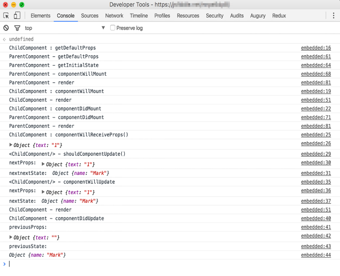

### 4.2.3　初始方法和“将执行”方法

要探索的第一组生命周期相关的属性是组件的初始属性。这包括两个已知属性： `defaultProps` 和 `state` （初始）。这些属性帮助给组件提供初始数据。让我们在继续之前先快速重温一下以下内容。

+ `defaultProps` ——一个为组件提供默认属性的静态属性。如果父组件没有设置该属性，那么在任何组件被挂载前可以访问 `this.props` 上的设置，但不能依赖 `this.props` 或 `this.state` ，因为 `defaultProps` 是一个静态属性，它是通过类而非实例访问的。
+ `state` （初始）——构造函数中这个属性的值会成为组件的状态的初始值集合。当需要提供内容占位、设置默认值或类似的东西时，这会特别有用。它类似于默认属性，只不过数据预期是可变的并且只有在继承 `React.Component` 的组件里才有。

尽管设置初始状态和属性并不使用React组件类的特定方法（它们使用JavaScript构造函数），但它们仍然是组件生命周期的一部分。很容易不小心忽略它们，但它们在为组件提供数据方面确实发挥了重要作用。

为了说明渲染的顺序以及即将了解的各个生命周期方法，我们将创建两个可以在其上指定生命周期方法的简单组件。我们将创建一个父组件和一个子组件，以便不仅可以看到不同方法的调用顺序，而且可以看到该调用顺序在父组件和子组件之间是如何运作的。简单起见，只需将信息输出到开发者控制台。图4-5展示了调用完成之后在开发者控制台能够看到的内容。

<b class="my_markdown">图4-5　示例组件一经展现控制台所输出的内容。生命周期方法在每个步骤都会触发记录到控制台的消息，以及这些方法可用的任何参数。可以在https://codesandbox.io/s/
 2vxn9251xy查看实际运行的生命周期方法</b>

