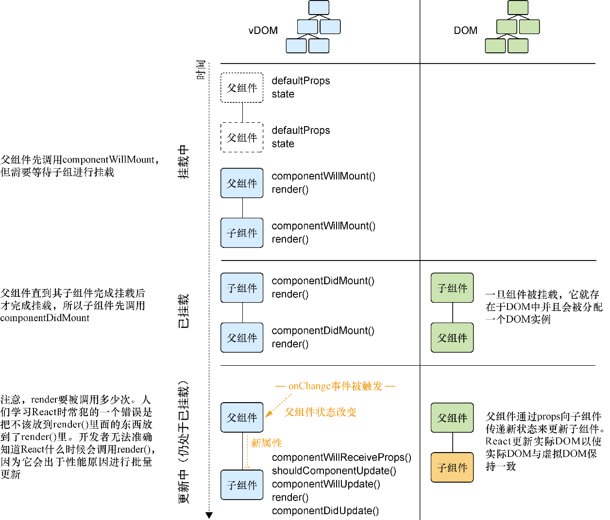
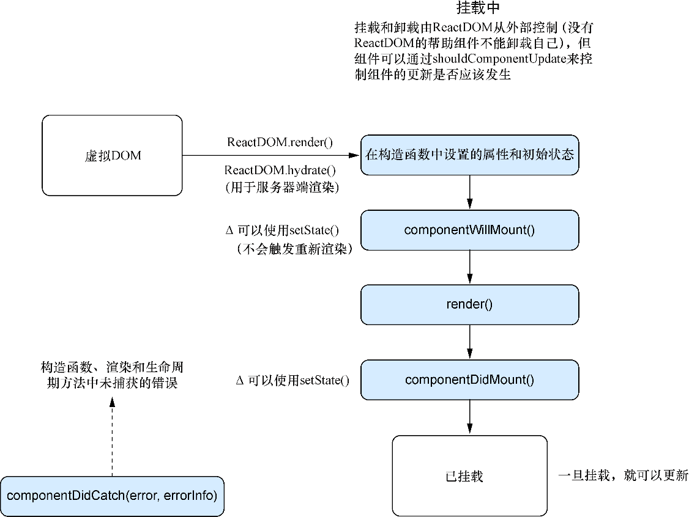

### 4.2.4　挂载组件

创建完父组件和子组件之后，让我们看看挂载。挂载是React将组件插入DOM的过程。记住，直到React在实际DOM中创建组件为止，组件只存在于虚拟DOM中。查看图4-6，大致了解父组件和子组件的挂载和渲染过程。按照定义，挂载方法“挂钩”到组件生命周期的开始和结束并且只能被触发一次，组件只有一个开始和结束。


<center class="my_markdown"><b class="my_markdown">图4-6　应用于示例父组件和子组件的渲染过程</b></center>

> **定义　** 挂载是React将组件插入实际DOM的过程。一旦完成，组件就“准备”好了，这通常是执行HTTP调用或读取cookie之类事情的好时机。此时，也能够通过ref访问DOM元素，这部分内容将在后续章节中讨论。

如果回头看一下图4-3，你将会注意到，在组件挂载前只有一个机会改变状态。可以使用 `component WillMount` 来做这件事，这将在组件挂载前提供机会设置状态或执行其他操作。这个方法中的任何状态改变都不会触发重新渲染，不像其他状态更新那样会触发之前看到的更新过程。了解哪些方法会触发重新渲染以及哪些不会触发至关重要，这有助于理解应用程序的行为以及在应用出错时进行调试。图4-7展示了我们一直在研究的概要的生命周期上下文中的挂载方法。


<center class="my_markdown"><b class="my_markdown">图4-7　在更大的生命周期过程上下文中挂载方法。随着组件被添加到DOM，
 几个特定的方法随这个过程被调用</b></center>

下一个要介绍的方法是 `componentDidMount` 。当React调用这个方法时，就有机会使用 `componentDidMount` 以及访问组件的refs。在这个方法中，可以访问组件的状态和属性以及组件准备更新的信息。这意味着这个方法是进行诸如用网络请求返回的数据更新组件状态之类工作的好地方，也是使用像jQuery和其他依赖DOM的第三方库的好地方。

由于React的工作机制，如果在其他方法里（如 `render()` ）执行处理程序或者其他函数，将会遇到无法预料和意想不到的结果。Render方法需要是纯的（对于给定的输入有一致的结果）而且通常会在组件的生命周期内被多次调用。React甚至可能会批量一起更新，所以不能保证渲染会在指定时间发生。

现在已经了解了一些与挂载相关的方法，我们将它们添加到组件里以便于能够了解组件的生命周期。代码清单4-2展示了如何将这些挂载方法添加到组件中。

代码清单4-2　挂载方法

```javascript
import PropTypes from 'prop-types';
import React, { Component } from 'react';
import { render } from 'react-dom';
class ChildComponent extends Component {
    static propTypes = {
        name: PropTypes.string
    };
    static defaultProps = (function() {
        console.log('ChildComponent : defaultProps');
        return {};
    })();
    constructor(props) {
        super(props);
        console.log('ChildComponent: state');
        this.state = {
            name: 'Mark'
        };
    }
    componentWillMount() {  ⇽--- 添加componentDidMount和componentWillMount到子组件
        console.log('ChildComponent : componentWillMount');
    }
    componentDidMount() {  ⇽--- 添加componentDidMount和componentWillMount到子组件
        console.log('ChildComponent : componentDidMount');
    }
    render() {
        if (this.state.oops) {
            throw new Error('Something went wrong');
        }
        console.log('ChildComponent: render');
        return [
            <div key="name">Name: {this.props.name}</div>
        ];
    }
}
class ParentComponent extends Component {
    static defaultProps = (function() {
        console.log('ParentComponent: defaultProps');
        return {
            true: false
        };
    })();
    constructor(props) {
        super(props);
        console.log('ParentComponent: state');
        this.state = { text: '' };
        this.onInputChange = this.onInputChange.bind(this);
    }
    componentWillMount() {  ⇽--- 添加componentDidMount和componentWillMount到父组件
        console.log('ParentComponent: componentWillMount');
    }
    componentDidMount() {  ⇽--- 添加componentDidMount和componentWillMount到父组件
        console.log('ParentComponent: componentDidMount');
    }
    onInputChange(e) {
        const text = e.target.value;
        this.setState(() => ({ text: text }));
    }
    render() {
        console.log('ParentComponent: render');
        return [
            <h2 key="h2">Learn about rendering and lifecycle methods!</h2>,
            <input key="input" value={this.state.text}
    onChange={this.onInputChange} />,
            <ChildComponent key="ChildComponent" name={this.state.text} />
        ];
    }
}
render(<ParentComponent />, document.getElementById('root'));
```


**练习4-1　深思挂载**

组件已挂载意味着什么？


