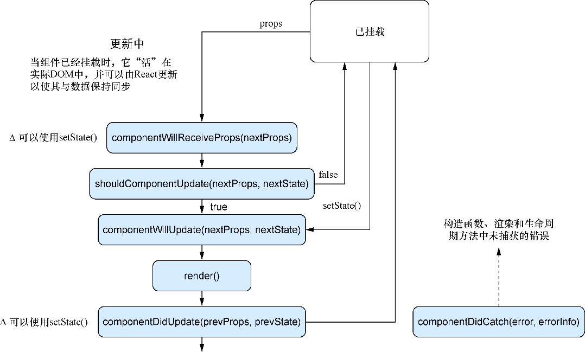

### 4.2.5　更新方法

一旦组件被挂载并位于DOM中，就要更新它。在第3章我们已经学会使用 `this.setState()` 将新数据浅合并到组件状态中，但当触发更新时发生的可不止这些。为钩挂到更新过程，React提供了几个可用的方法： `shouldComponentUpdate` 、 `componentWillUpdate` 和 `componentDidUpdate` 。图4-8展示了之前所见的整个生命周期图涉及更新的部分。


<center class="my_markdown"><b class="my_markdown">图4-8　涉及更新的生命周期方法。当更新组件时，会触发多个钩子，
 确定组件是否应该更新、如何更新以及更新何时完成</b></center>

与至此所看到的其他方法不同，使用者可以选择控制是否应该进行更新。“更新”方法与挂载相关方法的另一个不同之处是它们为属性和状态提供了参数，可以用这些来确定是应该更新，还是应该对变化做出反应。

如果由于某种原因 `shouldComponentUpdate` 返回 `false` ，那么 `render()` 会被跳过直到下次状态发生改变。这意味着可以防止组件进行不必要的更新。因为组件不会更新，所以接下来的 `componentWillUpdate` 和 `componentDidUpdate` 方法也不会被调用。

如果不另行指定， `shouldComponentUpdate` 将总是返回 `true` 。但如果谨慎地始终将状态看作是不可变的并只在 `render()` 中读取属性和状态，那么就可以用一个将旧属性和状态与其替换值进行比较的实现来覆盖 `shouldComponentUpdate` 。这可能有利于性能优化，但应该只作为应急手段。React已经采用了复杂、先进的方法来确定应该更新什么以及应该什么时候更新。

如果最终使用了 `shouldComponentUpdate` ，则应该是在那些方法由于某种原因不够用的情况下。这并不意味着应该永远不使用它，只是在刚开始使用React的时候可能并不需要使用它。与所有生命周期方法一样，它提供出来但只在必要时才能使用。代码清单4-3展示了React更新相关的生命周期方法的示例。

代码清单4-3　更新方法

```javascript
//...
class ChildComponent extends Component {
    //...
    componentWillReceiveProps(nextProps) {  ⇽--- 向子组件添加更新方法以便能查看单个组件的更新过程
        console.log('ChildComponent : componentWillReceiveProps()');
        console.log('nextProps: ', nextProps);
    }
    shouldComponentUpdate(nextProps, nextState) {  ⇽--- 向子组件添加更新方法以便能查看单个组件的更新过程
        console.log('<ChildComponent/> - shouldComponentUpdate()');
        console.log('nextProps: ', nextProps);
        console.log('nextState: ', nextState);
        return true;
    }
    componentWillUpdate(nextProps, nextState) {  ⇽--- 向子组件添加更新方法以便能查看单个组件的更新过程
        console.log('<ChildComponent/> - componentWillUpdate()');
        console.log('nextProps: ', nextProps);
        console.log('nextState: ', nextState);
    }
    componentDidUpdate(previousProps, previousState) {  ⇽--- 向子组件添加更新方法以便能查看单个组件的更新过程
        console.log('ChildComponent: componentDidUpdate()');
        console.log('previousProps: ', previousProps);
        console.log('previousState: ', previousState);
    }
    //...
    render() {
        console.log('ChildComponent: render');
        return [
            <div key="name">Name: {this.props.name}</div>
        ];
    }
}
class ParentComponent extends Component {
    //...
    onInputChange(e) {
        const text = e.target.value;
        this.setState(() => ({ text: text }));
    }
    //...
    render() {
        console.log('ParentComponent: render');
        return [
            <h2 key="h2">Learn about rendering and lifecycle methods!</h2>,
            <input key="input" value={this.state.text}
    onChange={this.onInputChange} />,
            <ChildComponent key="ChildComponent" name={this.state.text} />
        ];
    }
}
//...
```

现在已经为组件指定了更新方法，尝试再次运行并在文本框中输入内容。可以在开发人员控制台中看到级联输出（代码清单4-4展示了组件应该输出的内容）。花点时间仔细观察渲染的顺序。注意到了什么？该顺序应该与截至目前在本章中所学到的一致，此时便可以理解子组件和父组件的排序有多重要了。读者可能还记得第2章中React如何递归形成一棵树并进行渲染——它通过询问每个组件及其子组件来详尽地检查组件的每个部分。

代码清单4-4　有文本输入时的组件更新输出

```javascript
ChildComponent : defaultProps
ParentComponent : defaultProps
ParentComponent : get initial State
ParentComponent : componentWillMount
ParentComponent : render
ChildComponent : componentWillMount
ChildComponent : render
ChildComponent : componentDidMount
ParentComponent : componentDidMount
ParentComponent : render
ChildComponent : componentWillReceiveProps
Object {text: "Mark"}  ⇽--- “Mark”被合在一起从而不必为每个字母触发整个系列的更新
<ChildComponent/> : shouldComponentUpdate
nextProps: Object {text: "Mark"}
nextnextState: Object {name: "Mark"}
<ChildComponent/> : componentWillUpdate
 nextProps: Object {text: "Mark"}
 nextState: Object {name: "Mark"}
 ChildComponent : render
 ChildComponent : componentDidUpdate
 previousProps : Object {text: ""}
 previousState : Object {name: "Mark"}
 >
```

因为React知道有关组件树的所有信息，所以它可以按照恰当的顺序智能地创建组件。在代码清单4-4中，我们注意到子组件在父组件之前挂载。如果考虑挂载对于父组件意味着什么，这是有道理的：在父组件挂载被认定已为完成之前子组件必须被创建。如果子组件尚不存在，父组件就不能说是已挂载了。

另外，我们还注意到，当更新发生时，子组件接收到属性，因为父组件通过 `this.setState()` 更改了该子组件的属性。自此，更新方法按 `shouldComponentUpdate` 、 `componentWillUpdate` 、 `componentDidUpdate` 顺序运行。如果出于某些原因通过 `shouldComponentUpdate` 返回 `false` 来告诉组件不要更新，这些步骤将会被跳过。

