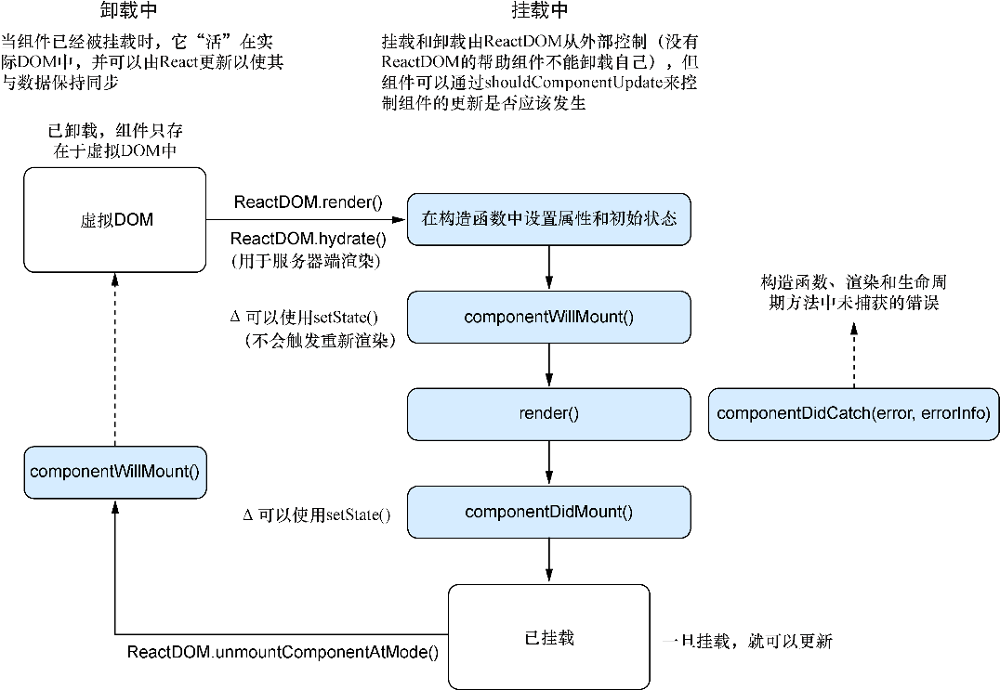

### 4.2.6　卸载方法

正如可以监听组件的挂载一样，我们也可以监听它的卸载。卸载是从DOM移除组件的过程。如果应用程序完全由React编写，路由（第8章和第9章中探索）将会随着用户在不同页面间移动时移除组件。也可以将React与其他框架和库集成使用，因此当组件卸载时需要执行某些其他操作（可能是清除定时器、切换设置等）。不管是什么，都可以在组件被移除时利用 `componentWillUnmount` 进行任何需要的清理。图4-9说明了卸载过程是如何发生的。


<center class="my_markdown"><b class="my_markdown">图4-9　React DOM负责挂载和卸载组件。挂载是将组件插入DOM中的过程，而卸载正好相反，即指
 从DOM中删除组件的过程。一旦组件被卸载，它们就不再存在于DOM中</b></center>

依据挂载的情况，你可能以为会有 `componentDidUnmount` 方法，但实际上并没有这个方法。这是因为，组件一旦被移除，它的生命就结束了，其无法再做任何事情。让我们将 `componentWillUnmount` 添加到运行的示例中，以便一览组件生命周期的全貌，如代码清单4-5所示。

代码清单4-5　卸载

```javascript
  //...
  class ChildComponent extends Component {
      //...
      componentWillUnmount() {
        console.log('ChildComponent: componentWillUnmount');  ⇽--- 将componentWillUnmount方法添加到父组件和子组件中
    }
    render() {
        console.log('ChildComponent: render');
        return [
            <div key="name">Name: {this.props.name}</div>
       ];
    }
}
class ParentComponent extends Component {
    //...
    componentWillUnmount() {
        console.log('ParentComponent: componentWillUnmount');  ⇽--- 将componentWillUnmount方法添加到父组件和子组件中
    }
    onInputChange(e) {
        const text = e.target.value;
        this.setState(() => ({ text: text }));
    }
    componentDidCatch(err, errorInfo) {
        console.log('componentDidCatch');
        console.error(err);
        console.error(errorInfo);
        this.setState(() => ({ err, errorInfo }));
    }
    render() {
        return [
            <h2 key="h2">Learn about rendering and lifecycle methods!</h2>,
            <input key="input" value={this.state.text}
     onChange={this.onInputChange} />,
            <ChildComponent key="ChildComponent" name={this.state.text} />
        ];
    }
}
//...
```

