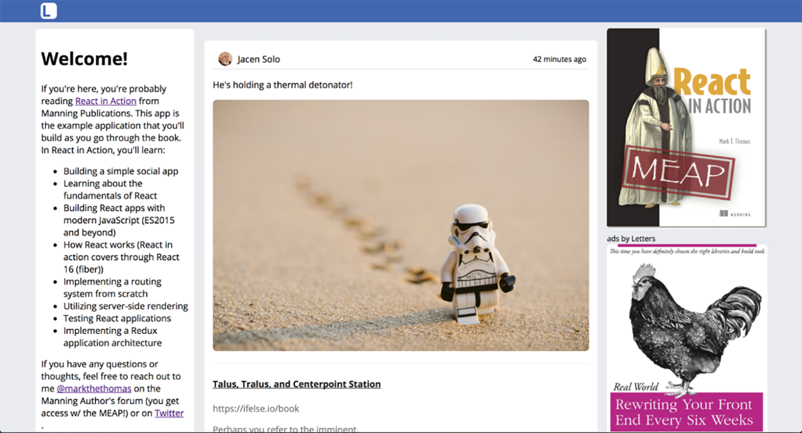

### 4.3　开始创建Letters Social

现在已经了解了React的生命周期方法以及它们能做什么，现在我们来用一下这些技能。我们将开始构建Letters Social应用程序。开始之前，确保已阅读本章的第一节，了解如何使用Letters Social的代码仓库。开始时应该在start分支上，但如果想跳至本章结束，可以检出chapter-4分支（ `git checkout chapter-4` ）。

到目前为止，我们一直使用浏览器在CodeSandbox上运行大部分代码。这对学习来说很好，但我们将切换环境，开始在本地计算机上创建文件。我们需要使用代码仓库中包含的Webpack构建流程，主要是出于以下几个原因。

+ 能够在多个文件中编写JavaScript并将这些文件输出为一个或少量已自动解决依赖和导入顺序的文件。
+ 能够处理不同类型的文件（如SCSS或字体文件）。
+ 利用像Babel之类的其他构建工具以便能够编写在旧版浏览器上运行的现代JavaScript代码。
+ 通过删除死代码并缩小它来优化JavaScript代码。

Webpack是一个功能非常强大的工具，有许多团队和公司都在使用它。正如本章前面所说，我不会在本书中介绍如何使用它。我的期望之一是本书的读者不必学习React及其相关的所有构建工具，因为一下子应对这么多东西过于复杂了，无法让学习变得简单。不过，如果你愿意学，可以更多地学习Webpack。花些时间通过Webpack官方网站了解Webpack，可以理解源代码的构建过程。

我们将通过创建一个App组件和一个作为应用入口的主index文件（ `React DOM` 的 `render` 方法被调用的地方）来开始构建Letters Social。App组件将包含一些用API获取帖子的逻辑并将渲染一些帖子组件——接下来将为帖子创建组件。代码仓库中还包含许多无须自己创建的组件。我们将在本章和后续各章中使用它们。代码清单4-7展示了入口点文件src/index.js。

代码清单4-7　主应用程序文件（src/index.js）

```javascript
import React, { Component } from 'react';  ⇽--- 导入React并从React DOM导入render方法——这个文件是主要调用React DOM的render方法的地方
import { render } from 'react-dom';
import App from './app';  ⇽--- 导入App组件的默认导出——代码清单4-9中会创建这个组件
import './shared/crash';  ⇽--- 导入一些错误报告相关的文件、一个服务worker注册器，以及样式（通过代码仓库来处理）
import './shared/service-worker';
import './shared/vendor';
import './styles/styles.scss';
render(<App />, document.getElementById('app'));  ⇽--- 在目标元素上使用主App调用render（HTML模板在src/index.js中）
```

主应用程序文件包含了一些Webpack可以导入的样式的引用以及对 `React DOM` 的 `render` 方法的主要调用。这是React应用程序“启动”的主要位置。当浏览器执行脚本时，它将渲染主应用程序，而后React将接管后续工作。没有这个调用，应用程序将不会执行。可能还记得在前面几章中，我们在主应用程序文件的底部调用过这个方法。这里没有什么不同——应用程序将由许多不同文件组成，Webpack知道如何将它们组织到一起（多亏了导入/导出语句）并在浏览器中运行。

现在应用程序有了入口点，我们来创建主App组件。可以将这个文件以src/app.js这样的形式放在src目录下。我们将勾画出App组件的基本框架，然后随着进展填充它。本章的目标是让主应用程序运行起来并显示一些帖子。下一章将开始充实更多的功能、添加创建帖子的能力以及添加发帖位置。随着探索React的不同主题，如测试、路由和应用架构（使用Redux），将继续为应用程序添加功能。代码清单4-8展示了应用程序组件的基础部分。

代码清单4-8　创建app组件（src/app.js）

```javascript
import React, { Component } from 'react';  ⇽--- 导入App组件需要的库
import PropTypes from 'prop-types';
import parseLinkHeader from 'parse-link-header';
import orderBy from 'lodash/orderBy';
import ErrorMessage from './components/error/Error';  ⇽--- 导入错误信息组件和加载组件以供使用
import Loader from './components/Loader';
import * as API from './shared/http';  ⇽--- 导入Letters的API模块，用于创建和获取帖子
import Ad from './components/ad/Ad';  ⇽--- 导入已有的广告、欢迎和导航栏组件
import Navbar from './components/nav/navbar';
import Welcome from './components/welcome/Welcome';
class App extends Component {
    constructor(props) {
       super(props);
        this.state = {  ⇽--- 设置组件的初始状态——持续跟踪帖子以及点击获取更多帖子的服务访问地址
            error: null,
            loading: false,
            posts: [],
            endpoint: `${process.env
     .ENDPOINT}/posts?_page=1&_sort=date&_order=DESC&_embed=comments&_expand=
     user&_embed=likes`  ⇽--- 设置组件的初始状态——持续跟踪帖子以及点击获取更多帖子的服务访问地址
        };
    }
    static propTypes = {
        children: PropTypes.node
    };
    render() {
        return (
            <div className="app">
                 <Navbar />
                {this.state.loading ? (  ⇽--- 如果正在加载，渲染加载组件而不是应用的主体
                    <div className="loading">
                        <Loader />  ⇽--- 如果正在加载，渲染加载组件而不是应用的主体
                    </div>
                ) : (
                    <div className="home">
                        <Welcome />  ⇽--- 渲染欢迎和广告组件
                        <div>
                            <button className="block">  ⇽--- 就是在这里添加展示帖子的组件
                                Load more posts
                            </button>
                        </div>
                        <div>
                            <Ad  ⇽--- 渲染欢迎和广告组件
                                url="https://ifelse.io/book"
                                imageUrl="/static/assets/ads/ria.png"
                            />
                            <Ad
                                url="https://ifelse.io/book"
                                imageUrl="/static/assets/ads/orly.jpg"
                            />
                        </div>
                    </div>
                )}
            </div>
        );
    }
}
export default App;  ⇽--- 导出App组件
```

有了这个就可以运行开发命令（ `npm run dev` ），应用程序至少应该启动并可以在浏览器中展示。如果没有，请确保至少运行一次 `npm run db:seed` 来为数据库生成示例数据。运行 `npm run dev` 会做下面这些事情：

+ 启动Webpack构建过程和开发服务器；
+ 启动JSON-server API，从而可以响应网络请求；
+ 创建一个开发服务器（用于第12章的服务器端渲染）；
+ 发生更改时热加载应用程序（因此每次保存文件都不必刷新应用程序）；
+ 通知构建错误（如果发生，它们将显示在命令行和浏览器中）。

当应用程序以开发模式运行之后，应该能够通过http://localhost:3000查看运行的应用程序。API服务器运行在http://localhost:3500上，可以使用Postman之类的工具向它发送请求，或者只是想用浏览器浏览不同的资源。

完成这些准备事项之后，应该给App组件添加获取帖子的功能。为此，需要使用Fetch API（包含在API模块中）向Letters Social API发送网络请求。目前，组件并没有做太多事情。除了构造函数和渲染方法，还没有定义任何生命周期方法，所以组件没有任何数据可用。需要通过API获取数据，然后用这些数据更新组件状态。另外，还要添加错误边界，以便组件遇到错误时可以显示错误消息而不是卸载整个应用。代码清单4-9展示了如何为App组件添加这些类方法。

代码清单4-9　当App组件加载时获取数据

```javascript
//...
   constructor(props) {
        //...
        this.getPosts = this.getPosts.bind(this);  ⇽--- 绑定类方法，当组件加载时用它从API获取帖子
    }
    componentDidMount() {
        this.getPosts();  ⇽--- 绑定类方法，当组件加载时用它从API获取帖子
    }
    componentDidCatch(err, info) {  ⇽--- 给应用设置错误边界，以便处理错误
        console.error(err);
        console.error(info);
        this.setState(() => ({  ⇽--- 给应用设置错误边界，以便处理错误
            error: err
        }));
    }
    getPosts() {
        API.fetchPosts(this.state.endpoint)  ⇽--- 用包含的API模块获取帖子
            .then(res => {
            return res
                .json()  ⇽--- API模块使用Fetch API，所以需要拆出JSON格式的响应
                .then(posts => {
                  const links = parseLinkHeader(res.headers.get('Link'));  ⇽--- Letters Social API会在响应头中返回分页信息，所以使用parseLinkHeader把下一页帖子的URL拿出来
                  this.setState(() => ({
                        posts: orderBy(this.state.posts.concat(posts),
                       'date', 'desc'),  ⇽--- 将新帖子添加到state中并确保它们正确排序
                       endpoint: links.next.url  ⇽--- 更新服务访问地址的state
                    }));
                })
                .catch(err => {
                    this.setState(() => ({ error: err }));  ⇽--- 如果有错误，更新组件的状态
                });
        });
    }
    render() {
        //...
        <button className="block" onClick={this.getPosts}>  ⇽--- 现在已经定义getPosts，将getPosts方法赋值为加载更多的事件处理器
            Load more posts
        </button>
        //...
    }
//...
```

当应用程序挂载后应该马上获取帖子并将这些数据保存到应用的本地组件状态中。接下来需要创建存储帖子数据Post组件。我们将用源代码附带的一组预先存在的组件创建Post组件。这些主要是无状态函数组件，本书的其余部分将以它们为基础。查看src/components/post目录来熟悉一下它们。

帖子将获取它们自己的内容并自行渲染，因此我们可以在后续章节中移动帖子组件。App组件发起获取帖子的请求，但其真正关心的是帖子的ID和日期，帖子组件本身将负责加载帖子其余的内容。另一种方法是让应用程序组件负责获取所有数据并将数据传递给帖子，这种方法的一个好处是减少了发起的网络请求。出于展示的目的并且由于我们仍在关注学习生命周期方法，因此让帖子负责获取额外的数据，但我想指出另一种清晰的方法。代码清单4-10展示了创建Post组件的方法。在src/components post/Post.js中创建它。

代码清单4-10　创建Post组件（src/components/post/Post.js）

```javascript
import React, { Component } from 'react';
import PropTypes from 'prop-types';
import * as API from '../../shared/http';  ⇽--- 导入API模块以便获取帖子
import Content from './Content';  ⇽--- 导入组成Post的组件
import Image from './Image';
import Link from './Link';
import PostActionSection from './PostActionSection';
import Comments from '../comment/Comments';
import Loader from '../Loader';
export class Post extends Component {  ⇽--- 需要生命周期方法，所以继承React.Component
   static propTypes = {  ⇽--- 声明propTypes
        post: PropTypes.shape({
            comments: PropTypes.array,
            content: PropTypes.string,
            date: PropTypes.number,
            id: PropTypes.string.isRequired,
            image: PropTypes.string,
            likes: PropTypes.array,
            location: PropTypes.object,
            user: PropTypes.object,
            userId: PropTypes.string
       })
   };
   constructor(props) {  ⇽--- 定义构造函数以便设置状态并且绑定类方法
       super(props);
       this.state = {  ⇽--- 设置初始状态
           post: null,
           comments: [],
           showComments: false,
           user: this.props.user
       };
       this.loadPost = this.loadPost.bind(this);  ⇽--- 绑定类方法
   }
   componentDidMount() {
       this.loadPost(this.props.id);  ⇽--- 挂载后加载一个帖子
   }
   loadPost(id) {
       API.fetchPost(id)  ⇽--- 使用API获取单个帖子并更新状态
           .then(res => res.json())
           .then(post => {
               this.setState(() => ({ post }));  ⇽--- 使用API获取单个帖子并更新状态
           });
   }
   render() {
       if (!this.state.post) {
           return <Loader />;  ⇽--- 如果帖子还没加载，展示载入器组件
       }
       return (
           <div className="post">
             <UserHeader date={this.state.post.date}  ⇽--- 为CommentBox组件设置模拟数据
                         user={this.state.post.user} />
             <Content post={this.state.post} />
             <Image post={this.state.post} />
             <Link link={this.state.post.link} />
             <PostActionSection showComments={this.state.showComments}/>
             <Comments
                 comments={this.state.comments}
                 show={this.state.showComments}
                 post={this.state.post}
                 user={this.props.user}
             />
         </div>
       );
     }
}
export default Post;
```

最后需要做的事情是实际遍历帖子以便它们得以显示。记住，显示组件的动态列表需要构造一个数组（通过 `Array.map` 或其他方法）并在JSX表达式中使用它。还有，不要忘记，React要求给每个被迭代项传递一个key属性，以便它知道更新动态列表中的哪些组件。对于 `render` 方法返回的任何组件数组都是如此。代码清单4-11展示了如何更新App组件的render方法来遍历帖子。

代码清单4-11　遍历帖子组件（src/app.js）

```javascript
//...
import Post from './components/post/Post';  ⇽--- 导入Post组件
//...
<Welcome />
                        <div>
                            {this.state.posts.length && (
                                <div className="posts">
                                    {this.state.posts.map(({ id }) => (
                                        <Post id={id} key={id}
                                         user={this.props.user} />  ⇽--- 遍历获取的所有帖子并给每个帖子渲染一个Post组件
                                    ))}  ⇽--- 别忘了给遍历的每项添加key属性
                                </div>
                            )}
                            <button className="block" onClick={this.getPosts}>
                                Load more posts
                            </button>
                        </div>
                        <div>
                            <Ad
                                url="https://ifelse.io/book"
                                imageUrl="/static/assets/ads/ria.png"
                            />
                            <Ad
                                url="https://ifelse.io/book"
                                imageUrl="/static/assets/ads/orly.jpg"
                            />
                        </div>
//...
```

至此，如图4-10所示，我们渲染出帖子，迈出了开始Letters Social的一步。当然，这里还有很多改进的空间。我们将在下一章介绍添加帖子和为帖子增加位置信息，探讨使用refs——从React组件访问底层DOM元素的方法。


<center class="my_markdown"><b class="my_markdown">图4-10　Letters Social的第一关。渲染帖子并且可以加载更多。
 下一章中将添加创建带位置信息的帖子的功能</b></center>

