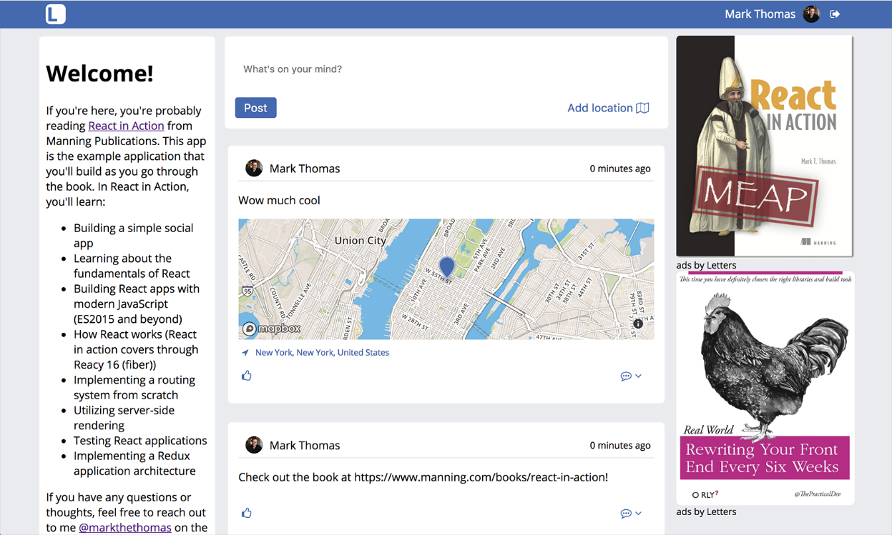
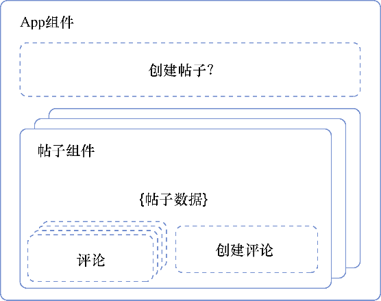

### 5.1.2　组件概览与层级

现在已经对要使用的数据有了一点点了解，可以开始考虑如何以组件的形式展示这些数据了。我们正在创建的这类社交网络应用有很多例子，所以应该不难想出见过的例子。图5-1展示了我们正在构建的最终产品，我们可以从中得到一些启发。


<center class="my_markdown"><b class="my_markdown">图5-1　正构建的Letters Social应用的最终状态。能想出什么办法将其分解成组件吗</b></center>

在本书前面，我曾谈及建立组件层次结构及关系并强调了它们在用React创建应用中的重要性。在开始创建组件之前，我们要再强调一遍。下面是到目前为止Letters Social中已实现的功能：

+ 来自API的可用的帖子数据，有些帖子包含图片，有些帖子包含链接；
+ 每个帖子的用户数据，包含头像信息；
+ 作为整个应用总控的App组件；
+ 迭代来自API的数据时使用的Post组件。

我们需要添加创建帖子的功能，并且这些帖子有位置信息和文本内容。我们需要让用户选择位置，然后在信息流的每个帖子中展示这个位置。CreatePost组件应该放在哪里？根据原型和用户的需求，似乎把它作为迭代的帖子列表的同级别比较合理，所有这些都放在主 App 组件中，如图5-2所示。


<center class="my_markdown"><b class="my_markdown">图5-2　现有的和未来的组件。已经创建了帖子组件和App组件来获取和迭代数据。
 CreatePost组件将放在用于显示帖子的组件之外</b></center>

来看看如何为组件创建骨架。只创建渲染组件基本元素的基础、导入正确的工具、导出组件类，并设置之后要定义的PropTypes。代码清单5-2展示了如何创建这个基础骨架。

代码清单5-2　创建组件的骨架（src/components/post/Create.js）

```javascript
import React, { Component } from 'react';  ⇽--- 导入React和PropTypes对象，以便使用
import PropTypes from ‘prop-types’;
class CreatePost extends Component {  ⇽--- 创建一个React组件
  static propTypes = {  ⇽--- 在类中声明PropTypes静态属性
 }
  constructor(props) {  ⇽--- 设置构造函数，稍后会用到它
    super(props);
  }
  render () {
    return (
      <div className="create-post">
        Create a post — coming (very) soon
      </div>
    );
  }
}
export default CreatePost;  ⇽--- 导出组件以便在其他地方使用

```

