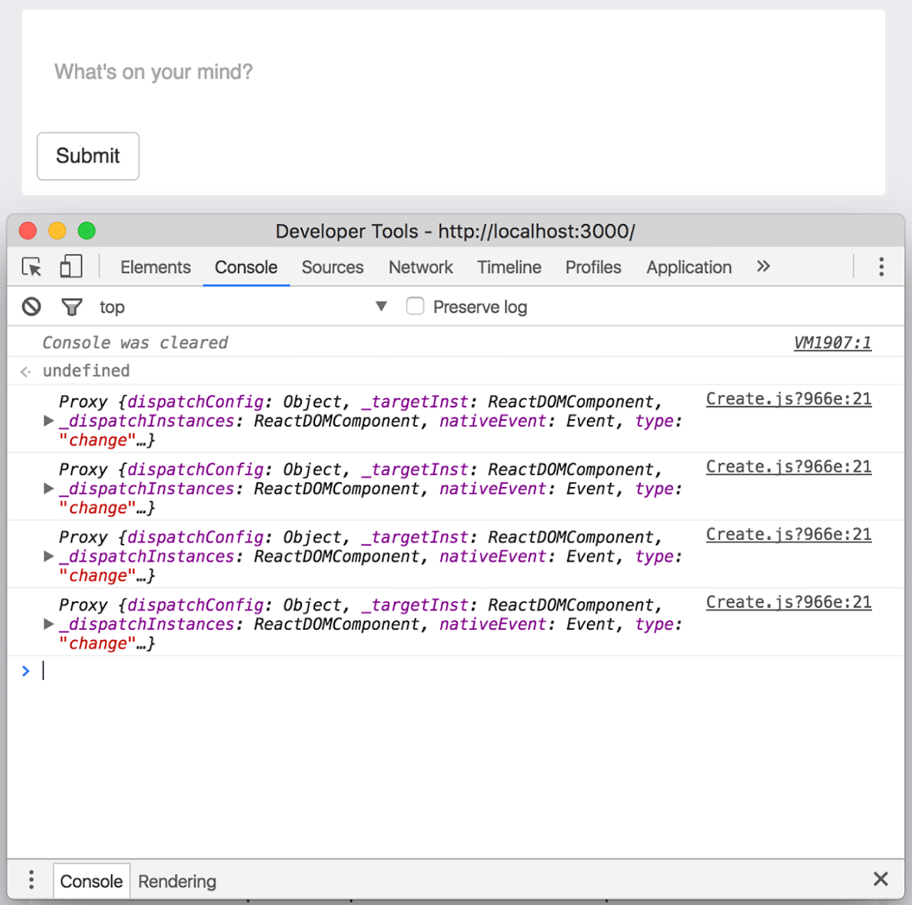

### 5.2.2　表单元素和事件

要创建帖子，需要确保将帖子存储到数据库中、更新帖子的UI，以及更新用户的帖子列表。就像构建常规HTML表单一样，首先要搭建好需要构建的表单元素。标记并不多——只需要接收一个输入并且不需要显示其他内容。代码清单5-3展示了组件的初始部分：渲染一个 `textarea` 输入框。

代码清单5-3　向CreatePost组件添加内容（src/components/post/Create.js）

```javascript
//...
class CreatePost extends Component {
  render() {
    return (
      <div className="create-post">
                <textarea
                    placeholder="What's on your mind?"
                />
                </div>
                <button>Post</button>
            </div>
    );
  }
}
//...

```

现在已经为表单创建了基本标记，可以开始将它们连接起来了。读者应该还记得在前面章节中提到过，React能够像常规浏览器JavaScript那样让开发者与事件进行交互。它允许开发者监听诸如点击、滚动和其他常规事件，并对它们做出响应。在处理表单时，我们将利用这些事件。

> **注意　** 如果你已经做了一段时间的前端开发工作，那应该知道不同浏览器之间会有很多不一致的地方，尤其是涉及事件时。除了其他可以获得的各种好处，React还做了大量工作来抽象这些浏览器实现中的差异。这是个没有得到太多关注的优点，但却有莫大的帮助。不必过多担心浏览器之间的差异，可以让开发者更关注应用的其他领域，这通常会让开发者更开心。

随着用户交互，浏览器中可能会出现许多不同的事件，包括鼠标移动、键盘输入、点击等。当涉及应用时，我们应该特别关注其中一些类型的事件。对我们来说，要使用两个主要的事件处理程序进行监听—— `onChange` 和 `onClick` 。

+ `onChange` ——当 `input` 元素发生变化时触发。可以使用 `event.target.value` 来访问表单元素的新值。
+ `onClick` ——当元素被点击时触发。可通过监听此事件来了解用户何时想要向服务器发送帖子。

接下来将为这些事件分配一些事件处理程序。现在，我们将为这些函数添加控制台日志以便观察它们的触发情况，稍后再用真正的功能替换它们。代码清单5-4展示了如何通过在组件类的构造函数中绑定事件处理程序，然后在组件中分配它们来设置事件处理程序。

代码清单5-4　向CreatePost组件添加内容（src/components/post/Create.js）

```javascript
class CreatePost extends Component {
  constructor(props) {
    super(props);
    this.handleSubmit = this.handleSubmit.bind(this);  ⇽--- 绑定类方法以处理帖子的提交和更改
    this.handlePostChange = this.handlePostChange.bind(this);  ⇽--- 在类上声明当正文文本发生更新时（onChange 事件）需要使用的方法
}
handlePostChange(e) {  ⇽--- 声明处理提交事件的方法，React会把事件传递给处理程序
          console.log('Handling an update to the post body!');
}
handleSubmit() {
   console.log('Handling submission!');
}
render() {
  return (
     <div className="create-post">
              <button onClick={this.handleSubmit}>Post</button>  ⇽--- 将事件处理程序传递给button和textarea组件
              <textarea
                  value={this.state.content}  ⇽--- 组件的值将从组件state中读取
                  onChange={this.handlePostChange}  ⇽--- 将事件处理程序传递给button和textarea组件
                  placeholder="What's on your mind?"
              />
          </div>
    );
  }
}

```

事件处理程序接收一个合成事件作为参数，我们可以访问这个合成事件上的许多可用属性。表5-1展示了合成事件上可以访问的一些属性。这里所说的合成事件指的是由React从浏览器事件转换而来的，开发者可以在React组件中使用的事件。

<center class="my_markdown"><b class="my_markdown">表5-1　React合成事件中可用的属性和方法</b></center>

| 属性 | 返回值 |
| :-----  | :-----  | :-----  | :-----  |
| `bubbles` | `boolean` |
| `cancelable` | `boolean` |
| `currentTarget` | `DOMEventTarget` |
| `defaultPrevented` | `boolean` |
| `eventPhase` | `number` |
| `isTrusted` | `boolean` |
| `nativeEvent` | `DOMEvent` |
| `preventDefault()` |
| `isDefaultPrevented()` | `boolean` |
| `stopPropagation()` |
| `isPropagationStopped()` | `boolean` |
| `target` | `DOMEventTarget` |
| `timeStamp` | `number` |
| `type` | `string` |

继续之前，我们稍作尝试：在post组件的 `change` 事件处理程序中添加 `console.log(event)` 。打开浏览器的开发者控制台并在 `textarea` 元素中输入一些内容，应该会看到打印出来的消息（参见图5-3）。如果探查这些对象或尝试访问表5-1中的一些属性，应该能获取有关事件的信息。对我们而言，我们将关注获取到的 `target` 属性。记住，与通常的JavaScript一样， `event.target` 只是对发出事件的DOM元素的引用。


<center class="my_markdown"><b class="my_markdown">图5-3　React将一个合成事件传递给使用者设置的事件处理程序。这是一个规范化的
 事件，这意味着可以如同访问常规浏览器事件那样访问相同的属性和数据</b></center>

