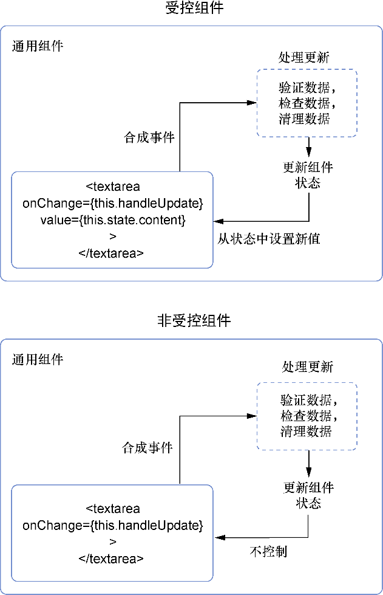

### 5.2.4　受控和非受控组件

这种更新表单中组件状态的方式可能是React中最常见的表单处理方式——通过使用事件和事件处理器更新状态来严格控制如何更新。按照此过程设计的组件通常被称为受控组件。这是因为我们严格地控制组件以及状态如何变化。但还有另外一种使用表单的组件的设计方法，称为非受控组件。图5-4展示了受控和非受控组件的工作方式并说明了它们之间的一些差异。


<center class="my_markdown"><b class="my_markdown">图5-4　受控组件监听由DOM元素发出的事件，操作发出的数据，更新组件状态并设置元素的值。
 这使所有东西都保持在组件领域并创建出一个统一的状态宇宙。非受控组件维护它们自己的
 内部状态并在组件中创建出一个微型世界，这切断了对该状态的访问和控制</b></center>

在非受控组件中，组件保持自己的内部状态，而不再使用 `value` 属性来设置数据。开发者仍然可以使用事件处理程序监听输入框的更新，但不再管理输入框的状态。代码清单5-6展示了使用非受控组件的方法。我们在本书中将坚持使用受控组件，但重点是至少要知道非受控组件这种模式实际是什么样子的。

代码清单5-6　使用非受控组件（src/components/post/Create.js）

```javascript
class CreatePost extends Component {
  constructor(props) {
    super(props);
    this.state = {
      content: '',
    };
    this.handleSubmit = this.handleSubmit.bind(this);  ⇽--- 处理程序与以前相同，但是更改state的效果不相同
    this.handlePostChange = this.handlePostChange.bind(this);
  }
  handlePostChange(event) {  ⇽--- 处理程序与以前相同，但是更改state的效果不相同
    const content = event.target.value;
    this.setState(() => {
        return {
            content,
        };
    });
  }
  handleSubmit() {  ⇽--- 处理程序与以前相同，但是更改state的效果不相同
     console.log(this.state);
  }
  render() {
    return (
<div className="create-post">
                <button onClick={this.handleSubmit}>Post</button>
                <textarea
                    onChange={this.handlePostChange}  ⇽--- 如前所述，现在没有value元素监听组件状态
                    placeholder="What's on your mind?"
                />
       </div>
     );
  }
}

```

