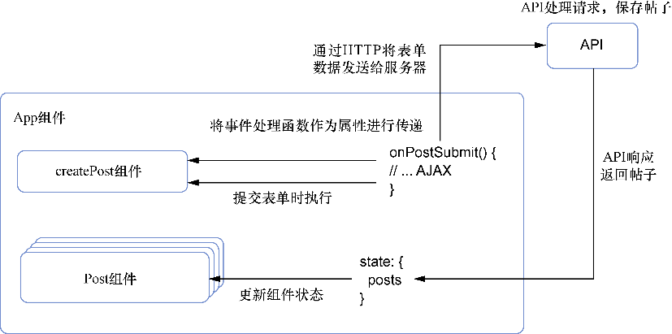

### 5.3　创建新帖子

现在对帖子做了一些基本的验证和清理，之后则需要将它们发送到服务器来创建它们。我们将引入稍微复杂一点的东西来实现这一点，因此我们将简要地检查每个步骤，然后再看看将所有步骤组合在一起的示例。

要将帖子发送到API，除了CreatePost组件已经做的工作，还需要做以下工作，包括跟踪状态、进行一些基本的验证和完成一些基本的内容清理工作。

接下来，需要完成下面的工作才能将数据发送给API。

（1）捕获将要作为帖子的用户输入，更新状态并执行之前实现的数据检查逻辑。

（2）调用从父组件（在本例中是主要App组件）作为属性传递过来的事件处理函数并向其提供帖子数据。

（3）重置CreatePost组件的状态。

（4）在父组件中，使用从CreatePost子组件传递过来的数据来向服务器发送HTTP POST请求。

（5）使用从服务器接收的新帖子数据更新本地组件的状态。

（6）要更好地了解接下来要做什么，参见图5-5。


<center class="my_markdown"><b class="my_markdown">图5-5　CreatePost组件概览。CreatePost组件接收一个函数作为属性，使用其内部状态作为
 该函数的输入，并在用户点击Submit时调用它。该函数来自父App组件，将数据发送到
 API，更新本地帖子，以及用API返回数据进行帖子更新</b></center>

我们将从添加一个函数开始，该函数将在父组件（App.js）中处理帖子的提交。这个函数有好几个部分，可以一次添加一个部分，我们将逐一介绍这些部分。代码清单5-9展示了如何将提交帖子的功能添加到App组件中。

代码清单5-9　处理帖子提交（src/app.js）

```javascript
import * as API from './shared/http';  ⇽--- 导入Letters API模块
//...
export default class App extends Component {
  //...
  createNewPost(post) {
     this.setState(prevState => {
                    return {
                        posts: orderBy(prevState.posts.concat(newPost),
     'date', 'desc')  ⇽--- 合并新帖子并确保帖子已排序
                    };
                });
  }
  //...
}
```

我们已经在父组件中设置了创建帖子的处理函数，但此时它不会做任何事情，因为还没什么东西会调用它。这是因为需要将其传递给子组件（一直在处理的CreatePost组件）。还记得如何将数据作为props从父组件传递给子组件吗？也可以传递函数。这一点至关重要，因为它允许组件协同工作。即使组件可以相互交互，它们也不会因为互相交织或耦合在一起使你无法再移动它们。CreatePost组件可以轻松地移动到应用的其他部分并向其他处理程序发送相同的数据。代码清单5-10展示了将回调作为props传递的例子。

代码清单5-10　用props传递回调函数（src/app.js）

```javascript
import CreatePost from './post/Create';  ⇽--- 导入组件以供使用
export default class App extends Component {
  //...
  render() {
   return (
     //...
     <CreatePost onSubmit={this.createNewPost} />  ⇽--- 使用属性传递handlePostSubmit函数
     //...
      )
     }
  //...
}

```


**练习5-2　受控组件和非受控组件**

React中受控组件和非受控组件有哪些不同之处？是什么决定了一个组件是受控的还是非受控的？


至此，已经在父组件中设置了基本的事件处理程序并将其传递给子组件，这有助于分离关注点——CreatePost组件只负责打包帖子数据，然后将其发送给父组件以执行它想要的操作，也就是，将其发送到API。第6章将介绍这些内容。

