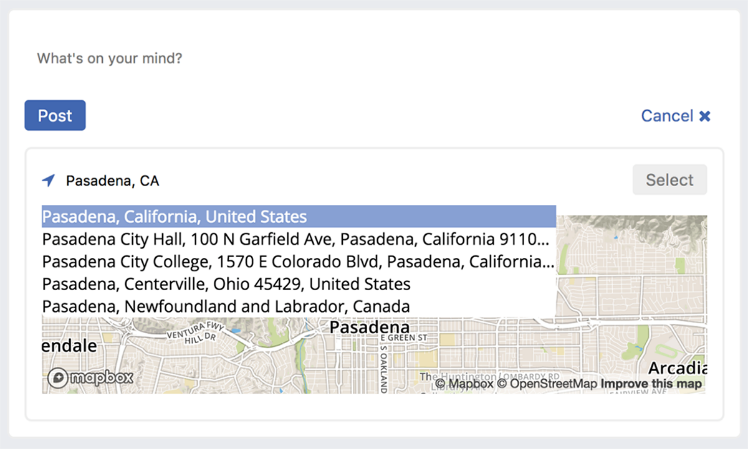
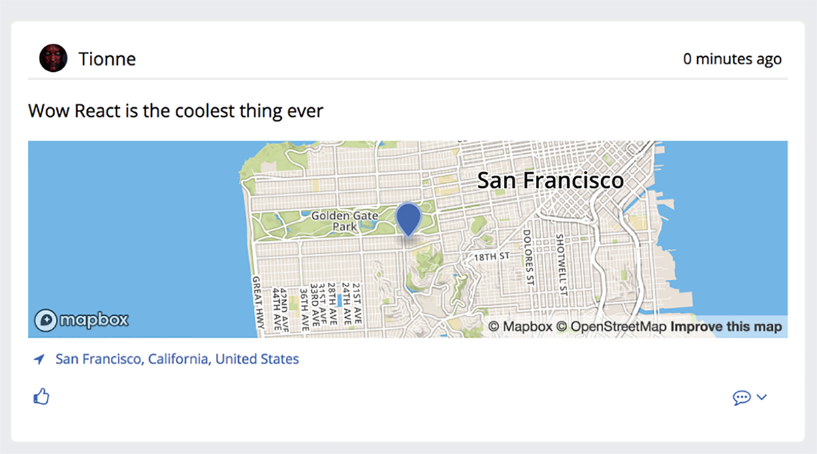

### 6.2　用地图增强组件

现在已经添加了创建帖子并将其发送给服务器的功能，我们可以继续稍微加强一下它。Letter Social的虚拟投资者一直在使用Facebook和Twitter，他们注意到这些应用可以让用户给帖子添加位置。他们真的很想让Letter Social应用也拥有这个功能，所以你要增加选择帖子时选择和展示位置的功能。我们还要复用地图展示组件，以便用户信息流中的帖子可以显示位置。图6-1展示了将要构建的内容。

<b class="my_markdown">图6-1　将为Letters Social创建的内容。将加强当前帖子的功能，以便用户可以给
 他们的帖子添加位置。功能添加完毕后就可以在创建帖子时搜索和选择位置</b>

从图6-1可以看出，我们将使用Mapbox来创建地图。Mapbox是一个地图和地理信息服务平台，其提供了各种各样的地图和位置相关服务。使用者可以使用数据定制地图、创建不同风格的地图和图层、搜索地理图形、添加导航等。我无法一一说明Mapbox的所有功能，如果想了解更多，请访问Mapbox官方文档。

