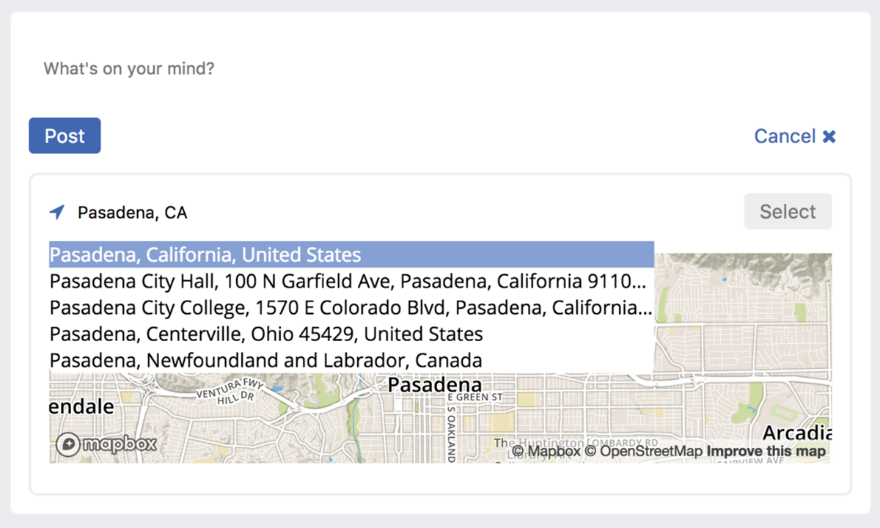

### 6.2.2　创建LocationTypeAhead组件

虽然可以在应用中显示地图，但尚不能创建它们。要支持该特性，就需要构建另一个组件——位置预输入。下一节将在CreatePost组件中使用这个组件让用户搜索位置。这个组件将使用浏览器的Geolocation API及Mapbox API来搜索位置。

创建另一个文件src/components/map/LocationTypeAhead.js开始工作。图6-2显示了本节将创建的预输入组件。


<center class="my_markdown"><b class="my_markdown">图6-2　位置预输入组件可以与地图组件一起使用来让用户给他们的帖子添加位置信息</b></center>

下面是该组件完成时具有的基本功能：

+ 显示位置列表供用户选择；
+ 将选定的位置交给父组件使用；
+ 使用Mapbox和Geolocation API让用户选择他们当前的位置或通过地址进行搜索。

接下来，我们将开始创建组件框架。代码清单6-7展示了其初稿。我们将再次使用Mapbox，但这次使用的是另一组不同的API。上一节使用了地图展示API，但这里将使用的这组API允许用户进行反向地理编码——这是“通过文本搜索实际位置”的时髦说法。项目已经安装了Mapbox模块并将使用相同的公共Mapbox键来工作。如果之前已经添加了自己的API键，应用程序配置在这里应该使用相同的键。


**练习6-1　Mapbox的替代选择**

本章使用了Mapbox，但还有其他地图库，如谷歌地图。要怎么把Mapbox换成谷歌地图？要做什么不同的事情？


代码清单6-7　初始的LocationTypeAhead组件

```javascript
import React, { Component } from 'react';
import PropTypes from 'prop-types';
import MapBox from 'mapbox';  ⇽--- 导入Mapbox
export default class LocationTypeAhead extends Component {
    static propTypes = {
        onLocationUpdate: PropTypes.func.isRequired,  ⇽--- 暴露两个方法，一个用于位置更新，另一个用于位置选择
        onLocationSelect: PropTypes.func.isRequired
    };
    constructor(props) {
        super(props);
        this.state = {  ⇽--- 设置初始状态
            text: '',
            locations: [],
            selectedLocation: null
        };
        this.mapbox = new MapBox(process.env.MAPBOX_API_TOKEN);  ⇽--- 创建一个Mapbox客户端实例
    }
    render() {
        return [  ⇽--- 返回由预输入组件的标记所组成的元素数组。需要实现所有事件处理程序所引用的方法（onChange、onClick等）
            <div key="location-typeahead" className="location-typeahead">
                 <i className="fa fa-location-arrow"
      onClick={this.attemptGeoLocation} />  ⇽--- 返回由预输入组件的标记所组成的元素数组。需要实现所有事件处理程序所引用的方法（onChange、onClick等）
                 <input
                     onChange={this.handleSearchChange}  ⇽--- 返回由预输入组件的标记所组成的元素数组。需要实现所有事件处理程序所引用的方法（onChange、onClick等）
                     type="text"
                     placeholder="Enter a location..."
                     value={this.state.text}
                 />
                 <button
                      disabled={!this.state.selectedLocation}  ⇽--- 返回由预输入组件的标记所组成的元素数组。需要实现所有事件处理程序所引用的方法（onChange、onClick等）
                     onClick={this.handleSelectLocation}
                     className="open"
                 >
                     Select
                 </button>
            </div>
         ];
    }
}
```

现在，可以开始填写组件的 `render` 方法中引用的方法。注意，需要一个处理搜索文本变更的方法、一个允许用户选择位置的按钮和一个让用户选择当前位置的图标。接下来我将介绍这个功能；现在，需要一些方法来让用户使用文本搜索位置以及选择位置。代码清单6-8展示了如何添加这些方法。这些地点从哪儿来呢？我们将根据用户类型使用Mapbox API搜索位置并用这些结果来显示地址。这只是Mapbox的一种用法。也可以反着做——输入坐标并将其转换为地址。代码清单6-9将使用Geolocation API来实现这个功能。

代码清单6-8　搜索位置（src/components/map/LocationTypeAhead.js）

```javascript
//...
constructor(props) {
    super(props);
    this.state = {
        text: '',
        locations: [],
        selectedLocation: null
    };
    this.mapbox = new MapBox(process.env.MAPBOX_API_TOKEN);
    this.handleLocationUpdate = this.handleLocationUpdate.bind(this);  ⇽--- 绑定类方法
    this.handleSearchChange = this.handleSearchChange.bind(this);
    this.handleSelectLocation = this.handleSelectLocation.bind(this);
    this.resetSearch = this.resetSearch.bind(this);
}
componentWillUnmount() {
    this.resetSearch();  ⇽--- 组件卸载时，重置搜索
}
handleLocationUpdate(location) {
    this.setState(() => {  ⇽--- 选中一个位置时，更新本地组件状态
        return {
            text: location.name,
            locations: [],
            selectedLocation: location
        };
    });
    this.props.onLocationUpdate(location);  ⇽--- 同时，通过属性回调将位置传给父组件
}
handleSearchChange(e) {
    const text = e.target.value;  ⇽--- 当用户在搜索框中输入文本时，从接收的事件中提取文本
    this.setState(() => ({ text }));
    if (!text) return;
    this.mapbox.geocodeForward(text, {}).then(loc => {  ⇽--- 通过Mapbox客户端使用用户输入的文本来搜索位置
        if (!loc.entity.features || !loc.entity.features.length) {
            return;  ⇽--- 如果没有结果就什么也不做
        }
        const locations = loc.entity.features.map(feature => {  ⇽--- 将Mapbox的结果转换为在组件中更容易使用的格式
            const [lng, lat] = feature.center;
            return {
                name: feature.place_name,
                lat,
                lng
            };
        });
        this.setState(() => ({ locations }));  ⇽--- 使用新位置更新本地组件状态
    });
}
resetSearch() {
    this.setState(() => {  ⇽--- 允许重置组件状态（查看componentWillUnmount）
        return {
            text: '',  ⇽--- 允许重置组件状态（查看componentWillUnmount）
            locations: [],
            selectedLocation: null
        };
        });
    }
    handleSelectLocation() {
        this.props.onLocationSelect(this.state.selectedLocation);  ⇽--- 当选中了位置时，将当前选中的位置向上传递
    }
//....
```

接下来，我们想让用户为帖子选择他们的当前位置。为此，我们将使用到浏览器的Geolocation API。如果之前没有用过Geolocation API也没关系。它在很长一段时间里一直是一个前沿特性，只能在某些浏览器上使用。现在，它已经获得了广泛的应用并且用途更多。

Geolocation API所做的事情基本上是：询问用户是否可以在应用中使用他们的位置。目前几乎所有浏览器都支持Geolocation API，所以我们可以利用它来让用户为帖子选择当前位置。注意，Geolocation API只能在安全的上下文中使用，因此，如果将Letters Social部署到不安全的主机上，它就无法工作。

我们需要再次使用Mapbox API，因为Geolocation API返回的只是坐标。还记得如何使用用户输入的文本在Mapbox中搜索位置吗？我们可以反过来做：向Mapbox提供坐标并获取匹配的地址。代码清单6-9展示了如何使用Geolocation API和Mapbox API让用户为帖子选择他们的当前位置。

代码清单6-9　添加Geolocation（src/components/map/LocationTypeAhead.js）

```javascript
constructor(props) {
    super(props);
    this.state = {
        text: '',
        locations: [],
        selectedLocation: null
    };
    this.mapbox = new MapBox(process.env.MAPBOX_API_TOKEN);
    this.attemptGeoLocation = this.attemptGeoLocation.bind(this);  ⇽--- 绑定类方法
    this.handleLocationUpdate = this.handleLocationUpdate.bind(this);
    this.handleSearchChange = this.handleSearchChange.bind(this);
    this.handleSelectLocation = this.handleSelectLocation.bind(this);
    this.resetSearch = this.resetSearch.bind(this);
}
//...
attemptGeoLocation() {
    if ('geolocation' in navigator) {  ⇽--- 检测浏览器是否支持geolocation
        navigator.geolocation.getCurrentPosition(  ⇽--- 获取用户设备的当前位置
            ({ coords }) => {  ⇽--- 这将返回可以使用的坐标
                const { latitude, longitude } = coords;
                this.mapbox.geocodeReverse({ latitude, longitude },
{}).then(loc => {  ⇽--- 使用Mapbox对坐标进行地理编码，如果什么也没有找到就尽早返回
                    if (!loc.entity.features ||
!loc.entity.features.length) {
                       return;  ⇽--- 使用Mapbox对坐标进行地理编码，如果什么也没有找到就尽早返回
                    }
                    const feature = loc.entity.features[0];  ⇽--- 获取要用的第一个（最近的）地点
                    const [lng, lat] = feature.center;  ⇽--- 提取经纬度
                    const currentLocation = {  ⇽--- 创建要使用的位置荷载并用其更新组件状态
                        name: feature.place_name,
                        lat,
                        lng
                    };  ⇽--- 创建要使用的位置荷载并用其更新组件状态
                    this.setState(() => ({
                        locations: [currentLocation],  ⇽--- 创建要使用的位置荷载并用其更新组件状态
                        selectedLocation: currentLocation,
                        text: currentLocation.name
                    }));
                    this.handleLocationUpdate(currentLocation);  ⇽--- 使用新位置信息调用handleLocationUpdate属性
                });
            },
            null,
            {
                enableHighAccuracy: true,  ⇽--- 传递给Geolocation API的选项
                timeout: 5000,
                maximumAge: 0
            }
        );
    }
}
//...
```

组件能够用Mapbox搜索位置并让用户通过Geolocation API选择他们自己的位置。但它还没有向用户展示任何东西，接下来我们会完善它。如代码清单6-10所示，需要使用检索的位置结果以便用户能够通过点击选择一个位置。

代码清单6-10　向用户展示检索结果（src/components/map/LocationTypeAhead.js）

```javascript
//...
render() {
        return [
            <div key="location-typeahead" className="location-typeahead">
                <i className="fa fa-location-arrow"
    onClick={this.attemptGeoLocation} />
                <input
                    onChange={this.handleSearchChange}
                    type="text"
                    placeholder="Enter a location..."
                    value={this.state.text}
                />
                <button
                    disabled={!this.state.selectedLocation}
                    onClick={this.handleSelectLocation}
                    className="open"
                >
                    Select
                </button>
            </div>,
            this.state.text.length && this.state.locations.length ? (  ⇽--- 如果有搜索查询并且有匹配结果，那么就显示结果
                <div key="location-typeahead-results"
                     className="location-typeahead-results">
                    {this.state.locations.map(location => {  ⇽--- 遍历从Mapbox中返回的位置
                        return (
                            <div
                                onClick={e => {  ⇽--- 如果用户点击一个返回的位置位置，则设置该位置为选中位置
                                    e.preventDefault();
                                    this.handleLocationUpdate(location);
                                }}
                               key={location.name}
                                className="result"  ⇽--- 不要忘记给迭代组件指定Key
                            >
                               {location.name}
                            </div>  ⇽--- 显示位置名称
                        );
                    })}
                </div>
            ) : null  ⇽--- 如果没有位置和搜索查询，不要做任何事情
        ];
    }
//...
```

