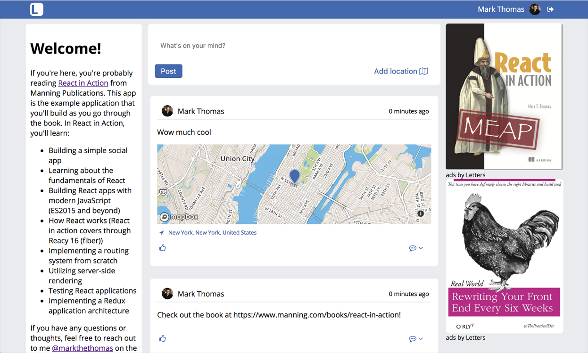

### 6.2.3　更新CreatePost，给帖子添加地图

现在已经创建了LocationTypeAhead和DisplayMap组件，可以将这些组件集成到CreatePost组件中了。这将把已创建的功能结合起来并允许用户创建具有位置的帖子。记得CreatePost组件是如何将数据回传给父组件来执行实际的帖子创建吗？LocationTypeAhead和DisplayMap组件将做同样的事情，但是是在CreatePost组件中。它们将协同工作，但不会绑得过于紧密以至于无法移动它们或在其他地方使用它们。

需要更新CreatePost组件来使用之前创建的LocationTypeAhead和DisplayMap组件，这两个组件分别用来生成和接收位置。在CreatePost组件中将跟踪位置并使用最近创建的两个组件作为位置数据的源和目的。代码清单6-11展示了向帖子添加位置所需的方法。

代码清单6-11　在CreatePost组件中处理位置（src/components/post/Create.js）

```javascript
constructor(props) {
        super(props);
        this.initialState = {
            content: '',
            valid: false,
            showLocationPicker: false,  ⇽--- 在state中添加键，以便能够跟踪位置和相关数据，设置一些默认的位置数据
            location: {
                lat: 34.1535641,
                lng: -118.1428115,
                name: null
            },
            locationSelected: false  ⇽--- 在state中添加键，以便能够跟踪位置和相关数据，设置一些默认的位置数据
        };
        this.state = this.initialState;
        this.filter = new Filter();
        this.handlePostChange = this.handlePostChange.bind(this);
        this.handleRemoveLocation = this.handleRemoveLocation.bind(this);  ⇽--- 绑定类方法
        this.handleSubmit = this.handleSubmit.bind(this);
        this.handleToggleLocation = this.handleToggleLocation.bind(this);  ⇽--- 绑定类方法
        this.onLocationSelect = this.onLocationSelect.bind(this);
        this.onLocationUpdate = this.onLocationUpdate.bind(this);
    }
//...
handleRemoveLocation() {  ⇽--- 允许用户从他们的帖子中删除位置
        this.setState(() => ({
            locationSelected: false,
            location: this.initialState.location
        }));
    }
    handleSubmit() {
        if (!this.state.valid) {
            return;
        }
        const newPost = {
            content: this.state.content
        };
        if (this.state.locationSelected) {  ⇽--- 提交帖子时，如果存在位置信息就添加到帖子的荷载中
            newPost.location = this.state.location;
        }
        this.props.onSubmit(newPost);
        this.setState(() => ({
            content: '',
            valid: false,
            showLocationPicker: false,
            location: this.initialState.location,
            locationSelected: false
        }));
    }
    onLocationUpdate(location) {
        this.setState(() => ({ location }));  ⇽--- 处理来自LocationTypeAhead组件的位置更新
    }
    onLocationSelect(location) {
        this.setState(() => ({  ⇽--- 处理来自LocationTypeAhead组件的位置更新
            location,
            showLocationPicker: false,
            locationSelected: true
        }));
    }
    handleToggleLocation(e) {  ⇽--- 切换显示位置选择器
        e.preventDefault();
        this.setState(state => ({ showLocationPicker:
     !state.showLocationPicker }));
    }
//...
```

CreatePost组件现在可以处理位置了，我们需要添加UI使之实现。一旦加入添加位置的相关UI，你会发现 `render` 方法变得有点儿混乱。这并不一定是件坏事，组件标记还没有复杂到需要重构的地步（我曾经处理过长达几百行的 `render` 方法），但这是探索React组件中不同的渲染技术的好机会——我称之为子渲染。


**练习6-2　使用ref的其他情况**

我们在本章花了些时间探讨了如何在React中使用ref。你能想到其他用得上ref的库或者场景吗？你过去参与过需要集成使用ref的React项目吗？


子渲染方法就是将 `render` 方法的一部分拆解为组件上的类方法（或者其他地方的函数），然后在主 `render` 方法的JSX表达式中调用它。如果需要分解较大的 `render` 方法、需要为UI的特定部分隔离逻辑或其他原因，就可以使用此技术。有可能会找到子渲染方法的其他有用的场景，但关键在于可以将 `render` 分解为多个部分，而这些部分无须成为组件。代码清单6-12说明了将 `render` 方法拆解成更小的部分。

代码清单6-12　添加子渲染方法（src/components/post/Create.js）

```javascript
constructor(props) {
        //...
        this.renderLocationControls = this.renderLocationControls.bind(this);  ⇽--- 在构造函数中绑定类方法
    }
renderLocationControls() {  ⇽--- 在构造函数中绑定类方法
        return (
            <div className="controls">
                <button onClick={this.handleSubmit}>Post</button>
                {this.state.location && this.state.locationSelected ? (  ⇽--- 如果选中一个位置，显示一个让用户删除其位置的按钮
                    <button onClick={this.handleRemoveLocation}  ⇽--- 绑定removeLocation方法并显示当前位置
     className="open location-indicator">
                        <i className="fa-location-arrow fa" />
                        <small>{this.state.location.name}</small>  ⇽--- 绑定removeLocation方法并显示当前位置
                    </button>
                ) : (  ⇽--- 显示切换位置选择器组件的按钮
                    <button onClick={this.handleToggleLocation}
     className="open">
                        {this.state.showLocationPicker ? 'Cancel' : 'Add
     location'}{' '}  ⇽--- 正确显示文本并根据位置状态使用正确的绑定方法
                        <i
                            className={classnames(`fa`, {  ⇽--- 正确显示文本并根据位置状态使用正确的绑定方法
                                'fa-map-o': !this.state.showLocationPicker,
                                'fa-times': this.state.showLocationPicker
                            })}
                        />
                    </button>
                )}
            </div>
        );
    }
    render() {
        return (
            <div className="create-post">
                <textarea
                    value={this.state.content}
                    onChange={this.handlePostChange}
                    placeholder="What's on your mind?"
                />
                {this.renderLocationControls()}  ⇽--- 调用子渲染方法
                <div
                    className="location-picker"
                    style={{ display: this.state.showLocationPicker ? 'block'
    : 'none' }}  ⇽--- 根据状态显示或隐藏位置选择器组件
                >
                  {!this.state.locationSelected && [  ⇽--- 如果没有选择位置，则显示位置选择器组件
                        <LocationTypeAhead
                            key="LocationTypeAhead"  ⇽--- 如果没有选择位置，则显示位置选择器组件
                            onLocationSelect={this.onLocationSelect}
                            onLocationUpdate={this.onLocationUpdate}
                        />,
                        <DisplayMap
                            key="DisplayMap"
                            displayOnly={false}
                            location={this.state.location}
                            onLocationSelect={this.onLocationSelect}
                            onLocationUpdate={this.onLocationUpdate}
                        />
                    ]}
                </div>
            </div>
        );
    }
```

最后，需要给有位置的帖子添加地图。之前已经完成DisplayMap组件的构建并且确保其能在纯显示模式下工作，因此需要做的是将它包含到Post组件中。代码清单6-13展示了要怎么做。

代码清单6-13　给帖子添加地图（src/components/post/Post.js）

```javascript
import React, { Component } from 'react';
import PropTypes from 'prop-types';
import * as API from '../../shared/http';
import Content from './Content';
import Image from './Image';
import Link from './Link';
import PostActionSection from './PostActionSection';
import Comments from '../comment/Comments';
import DisplayMap from '../map/DisplayMap';  ⇽--- 导入DisplayMap组件以供使用
import UserHeader from '../post/UserHeader';
import Loader from '../Loader';
export class Post extends Component {
    static propTypes = {
        post: PropTypes.object
    };
    //...
    render() {
        if (!this.state.post) {
            return <Loader />;
        }
        return (
            <div className="post">
                <UserHeader date={this.state.post.date}
     user={this.state.post.user} />
                <Content post={this.state.post} />
                <Image post={this.state.post} />
                <Link link={this.state.post.link} />
                {this.state.post.location && <DisplayMap
     location={this.state.post.location} />}  ⇽--- 如果帖子有与之关联的位置，显示位置并启用displayOnly模式
                <PostActionSection showComments={this.state.showComments} />
                <Comments
                    comments={this.state.comments}
                    show={this.state.showComments}
                    post={this.state.post}
                    handleSubmit={this.createComment}
                    user={this.props.user}
                />
            </div>
        );
    }
}
export default Post;
```

至此，在帖子上添加和显示位置的功能就为用户添加完了。投资者肯定会为这样一个改变游戏规则的特性感到高兴并印象深刻！图6-3示出了本章工作的最终成果。


<center class="my_markdown"><b class="my_markdown">图6-3　本章工作的最终成果。用户可以创建帖子并给帖子添加位置</b></center>

