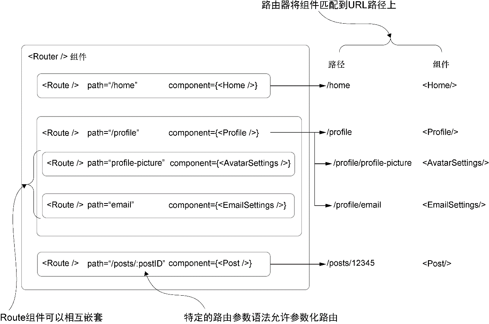

### 7.2.2　创建<Route />组件

我们将创建一个Router组件，它将用子组件匹配URL到组件的路由并将组件渲染出来。如果你很难想象这会是什么样子，记住，你不必一开始就理解所有东西，我们将精心讲解每一步。

我们从Route组件开始，可以用Route将组件和路由关联起来。代码清单7-2展示了如何创建Route组件。这看起来可能没什么内容，但很快你就会看到，这就足够了。Router组件会完成大部分繁重的工作，而Route组件主要作为URL和组件映射的数据容器。

代码清单7-2　创建一个Route组件（src/components/router/Route.js）

```javascript
import PropTypes from 'prop-types';
import { Component } from 'react';
import invariant from 'invariant';  ⇽--- 引入invariant库以确保Route组件不会被渲染，或者渲染时会抛出一个错误
class Route extends Component {
    static propTypes = {
        path: PropTypes.string,
        component: PropTypes.oneOfType([PropTypes.element, PropTypes.func]),
    };  ⇽--- 每个Route需要一个路径和一个函数，所以用PropTypes指定这些属性
    render() {
        return invariant(false, "<Route> elements are for config only and
     shouldn't be rendered");  ⇽--- 整个Route组件只是一个返回对invariant库调用的函数——如果有调用的话，就会抛出错误，我们就知道事情不对了
    }
}
export default Route;  ⇽--- 用命名导出来让组件可用于外部模块
```

可能注意到这里导入一个被称为 `invariant` 的新库。它是一个简单的工具，用于确保在某些条件不满足的情况下抛出错误。要使用它，只需要传入一个值和一个消息。如果这个值是假（ `null` 、 `0` 、 `undefined` 、 `NaN` 、 `' '` 或者 `false` ），它就会抛出一个错误。React经常使用 `invariant` 库，所以如果曾经在开发者工具控制台里看到警告或者错误消息报告了“invariant violation”这样的东西，就可能使用了 `invariant` 库。这里将使用它来确保Route组件不渲染任何东西。

没错，Route组件不渲染任何东西。如果渲染的话， `invariant` 工具将抛出错误。乍一听，这似乎是在做一件奇怪的事。毕竟，到目前为止我们一直在组件中进行大量渲染。但是，这仅是以React可以理解并让使用者能够利用的方式将路由和组件组织在一起的办法。我们将使用Route组件存储props并传入想要的children。随着构建出Router组件，这会变得更加清晰，但在继续检验你的理解之前，先看一下图7-2。


<center class="my_markdown"><b class="my_markdown">图7-2　Route和Router组件的工作原理的概览。下一节要构建的Router组件拥有作为其子组件的
 Route组件。每个组件都有两个属性：一个path字符串和一个组件。<Router />将使用每个
 <Route />来匹配URL并渲染正确的组件。因为所有东西都是React组件，使用者可以在
 渲染时给路由器传递属性并将这些作为高层数据的初始应用状态，如用户、认证状态等</b></center>

