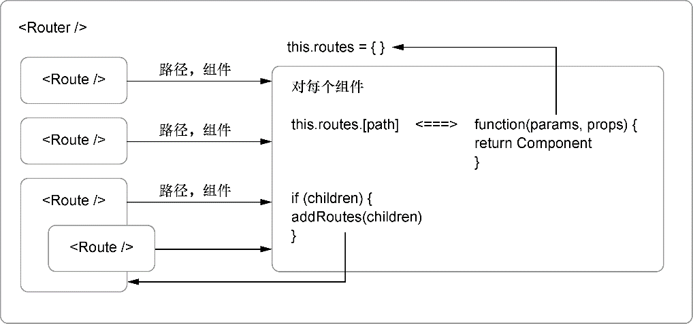

### 7.2.5　向Router组件添加路由

为了向路由器添加路由，需要两样东西：要使用的正确URL字符串以及这个URL对应的组件。我们会在Router组件上创建 `addRoute` 方法，该方法会将这两样东西联系在一起。如果快速浏览 `enroute` 的用法示例，就能看到 `enroute` 的工作原理。它接收一个键为URL字符串而值为函数的对象，当其中一个路径被匹配上时，它就调用相应函数并传递一些额外的数据。代码清单7-7展示了在没有React的情况下如何使用enroute库。使用 `enroute` 可以将接收参数和任何附加数据的函数匹配到URL字符串。

代码清单7-7　路由配置示例（src/components/router/Router.js）

```javascript
function edit_user (params, props) {  ⇽--- 使用两个参数：路由参数（像/users/:user）和任何传入的附加数据
   return Object.assign({}, params, props)
}
const router = enroute({  ⇽--- 传入一个带有路径和创建来处理这些路径的函数的对象
        '/users/new': create_user,
        '/users/:slug': find_user,
        '/users/:slug/edit': edit_user,
        '*': not_found
      });
enroute('/users/mark/edit', { additional: 'props' })  ⇽--- 要使用enroute，传入地址和附加数据，然后正确的函数将会被执行

```

现在已经对 `enroute` 如何工作有了些概念，让我们看看如何将它集成到路由器中并让它运转起来。不是像之前代码清单那样返回对象，而是想要返回组件。但现在没有办法获取路由的路径或组件。还记得是如何创建了一个Route组件来存储这些信息但没有渲染任何东西的吗？需要从父组件（Router组件）访问这些数据。这意味着需要用到 `children` 属性。

> **注意　** 我们已经看到了如何在React中通过创建组件之间的父子关系来组合组件以创建新的组件。到目前为止，我们只是在将组件彼此嵌套时“外部地”使用了子组件。任何时候嵌套组件和组合组件都在利用React的子组件概念。但我们还没有从父组件动态访问任何嵌套的子组件。我们可以通过组件属性访问传递给父组件的子组件，猜得没错，这个属性就是 `children` 。

每个React组件或元素上的 `children` 属性就是我们所说的不透明数据结构，因为与React中的几乎所有其他东西不同，它不只是数组或JavaScript纯对象。这也许会在React今后的版本中发生改变，但同时，这意味着 `React.Children` 上有许多方法可以用来处理 `children` 这个不透明数据结构，包含下面这些。

+ `React.Children.map` ——类似于原生JavaScript中的 `Array.map` ，它在 `children` 中的每个直接子组件上调用一个函数（意味着它不会遍历每个可能的后代组件，只是直接后代）并返回一个其遍历元素组成的数组。如果 `children` 属性是 `null` 或者 `undefined` ，就返回 `null` 或者 `undefined` 而不是空数组： `React.Children.map(children, function[(thisArg)])`
+ `React.Children.forEach` ——类似于 `React.Children.map` 的工作方式，但是不会返回数组： `React.Children.forEach(children, function[(thisArg)])`
+ `React.Children.count` ——返回 `children` 中发现的组件的总数，等于 `React. Children.map` 或 `React.Children.forEach` 在相同元素集合上调用其回调的次数： `React.Children.count(children)`
+ `React.Children.only` ——返回 `children` 中唯一的子组件，否则抛出一个错误： `React.Children.only(children)`
+ `React.Children.toArray` ——将 `children` 作为一个摊平的数组返回并将键分配给每个子元素： `React.Children.toArray(children)`

由于想将路由信息添加到Router组件的 `this.routes` ，因此会使用 `React.Children. forEach` 遍历Router的 `children` 的每个元素（记住，它们是Route组件）并访问它们的属性。我们将用这些属性来设置路由并告诉 `enroute` 哪个URL应该渲染哪个组件。


**React中的“自消除”组件**

当React 16问世，它允许组件从 `render` 方法中返回数组。这在之前是不可能的，它带来了一些有趣的可能性，其中一个是“自解构”或“自消除”组件<sup class="my_markdown">[1]</sup>的概念。之前，当任意给定组件仅返回单个节点时，通常发现只是为了JavaScript输出有效而将组件包装在div或者span中，常见场景看起来像这样：

```javascript
export const Parent = () => {
    return (
        <Flex>
            <Sidebar/>  ⇽--- 顶层组件，并排，使用Flexbox布局（或者CSS网格）
            <Main />
            <LinksCollection/>
        </Flex>
    );
}
export const LinksCollection = () => {
    return (
        <div>  ⇽--- 添加包装用的div，因为User、Group以及Org在JavaScript中不能被一起返回——它不支持返回多个值
            <User />
            <Group />
            <Org />
        </div>
    );
}
```

对许多团队来说，这曾是许多烦恼的来源，即使它确实没有阻止人们使用React。而它造成的主要问题可不只是包装div显得多余。正如所见，这个应用使用了Flexbox来布局（或者一些其他在这个场景中会被破坏的CSS布局API）。

包装div造成的问题是，它强制使用者向上移动组件以便它们不用在单个节点的分组中。当然还有造成问题或强制变通的其他原因，但这是我多次遇到的问题。

随着React 16及后续版本的到来，返回数组成为可能，所以现在我们有一个办法来实现它。React 16引入了很多其他强大的功能，但这个方法是非常受欢迎的改变。开发者现在可以这么做：

```javascript
export const SelfEradicating = (props) => props.children
```

这个组件充当了某种直通角色，当它渲染其子组件时可以避开或者“自消除”。通过这种方式，在维持组件分离的同时不必防范破坏CSS布局技术之类的东西。使用“自消除”组件的场景看起来像这样：

```javascript
export const SelfEradicating = (props) => props.children
export const Parent = () => {
    return (
        <Flex>
            <Sidebar/>
            <Main />
            <LinksCollection/>
        </Flex>
    );
}
export const LinksCollection = () => {
    return (
        <SelfEradicating>
            <User />
            <Group />
            <Org />
        </SelfEradicating>
    );
}
```


记住， `enroute` 希望为每个路由都提供一个函数，以便它能将参数信息或其他数据传给路由。这个函数将告诉React创建组件以及处理其他子组件的渲染。代码清单7-8展示了组件中的 `addRoute` 和 `addRoutes` 方法。 `addRoutes` 使用 `React.Children.forEach` 遍历所有子Route组件，获取它们的数据，并设置 `enroute` 使用的路由。这是路由器的核心，一旦实现了这一点，路由将启动并运行！

代码清单7-8　addRoute和addRoutes方法（src/components/router/Router.js）

```javascript
  addRoute(element, parent) {
    const { component, path, children } = element.props;  ⇽--- 使用解构获取组件、路径和children属性
    invariant(component, `Route ${path} is missing the "path" property`);  ⇽--- 确保每个Route都有路径和组件属性，否则抛出错误
    invariant(typeof path === 'string', `Route ${path} is not a string`);
    const render = (params, renderProps) => {  ⇽--- render是一个提供给enroute的函数，其接收路由相关的参数和额外的数据
    const finalProps = Object.assign({ params }, this.props, renderProps);  ⇽--- 将父组件的属性与子组件的属性合并在一起
    const children = React.createElement(component, finalProps);  ⇽--- 使用合并后的属性创建新组件
      return parent ? parent.render(params, { children }) : children;  ⇽--- 如果有父组件，调用parent参数的render方法，但使用已创建的子组件
    };
    const route = this.normalizeRoute(path, parent);  ⇽--- 使用normalizeRoute辅助函数来确保URL路径正确设置
    if (children) {  ⇽--- 如果当前Route组件还有嵌套的子组件，重复这个过程并传入路由和父组件
      this.addRoutes(children, { route, render });
    }
    this.routes[this.cleanPath(route)] = render;  ⇽--- 使用cleanPath实用方法在路由对象上创建路径并将已完成的函数赋值给它
  }
//...

```

这几行代码中包含不少东西，请随时回顾以确保吃透这些概念。一旦添加了 `addRoutes` 方法，我们就概括这些步骤并进行可视化的回顾。但首先要添加 `addRoutes` 方法。相比而言， `addRoutes` 方法非常短小，代码清单7-9展示了如何实现它。


**练习7-3　props.children**

本章我们讨论了React的 `props.children` 。 `props.children` 和其他属性有什么不同？为什么会有不同？


代码清单7-9　addRoutes方法（src/components/router/Router.js）

```javascript
//...
constructor(props) {  ⇽--- 即使在addRoute方法中使用addRoutes，也要在组件的构造函数中添加它，以开始设置路由
    super(props);
    this.routes = {};
    this.addRoutes(props.children);  ⇽--- 即使在addRoute方法中使用addRoutes，也要在组件的构造函数中添加它，以开始设置路由
    this.router = enroute(this.routes);
}  ⇽--- 即使在addRoute方法中使用addRoutes，也要在组件的构造函数中添加它，以开始设置路由
addRoutes(routes, parent) {  ⇽--- 当addRoute方法中有要迭代的子元素时使用addRoutes
    React.Children.forEach(routes, route => this.addRoute(route, parent));  ⇽--- 使用React.Children.forEach实用方法遍历每个子组件，然后为每个子Route组件调用addRoute方法
}

```

向路由器添加路由的过程如图7-3所示。


<center class="my_markdown"><b class="my_markdown">图7-3　向路由器添加路由的过程。对于 Router组件中找到的每个Route组件，将取得路径和组件属性，
 然后使用这些信息创建一个用来与URL路径配对的函数 `enroute` 。如果Route有子组件，继续之前对
 这些组件运行相同的过程。当完成的时候，routes属性将设置好所有正确的路由</b></center>

至此，路由器就完成了并且准备好运转。代码清单7-10展示了最终的Router组件，而且为了简洁省略了辅助工具（路径规范化，不变量的使用）。在下一章我们会将Router组件投入使用。

代码清单7-10　完成的Router组件（src/components/router/Router.js）

```javascript
import PropTypes from 'prop-types';
import React, { Component } from 'react';
import enroute from 'enroute';
import invariant from 'invariant';
export default class Router extends Component {
    static propTypes = {
        children: PropTypes.array,
        location: PropTypes.string.isRequired
    };
    constructor(props) {
        super(props);
        this.routes = {};
        this.addRoutes(props.children);
        this.router = enroute(this.routes);
    }
    addRoute(element, parent) {
        const { component, path, children } = element.props;
        invariant(component, `Route ${path} is missing the "path" property`);
        invariant(typeof path === 'string', `Route ${path} is not a string`);
        const render = (params, renderProps) => {
            const finalProps = Object.assign({ params }, this.props,
    renderProps);
            const children = React.createElement(component, finalProps);
            return parent ? parent.render(params, { children }) : children;
        };
        const route = this.normalizeRoute(path, parent);
        if (children) {
            this.addRoutes(children, { route, render });
        }
        this.routes[this.cleanPath(route)] = render;
    }
    addRoutes(routes, parent) {
        React.Children.forEach(routes, route => this.addRoute(route,
     parent));
    }
    cleanPath(path) {
        return path.replace(/\/\//g, '/');
    }
    normalizeRoute(path, parent) {
        if (path[0] === '/') {
            return path;
        }
        if (!parent) {
            return path;
        }
        return `${parent.route}/${path}`;
    }
    render() {
        const { location } = this.props;
        invariant(location, '<Router/> needs a location to work');
        return this.router(location);
    }
}
```

