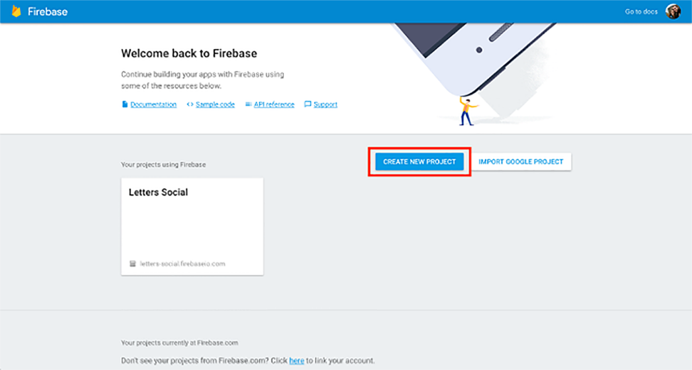
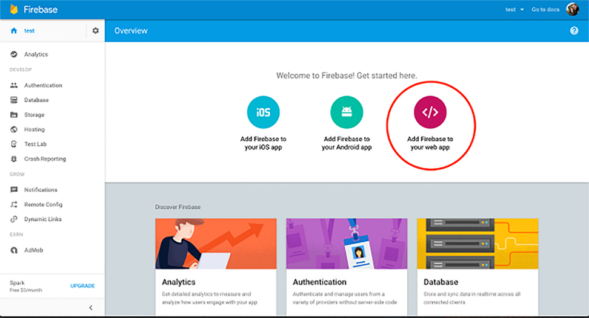
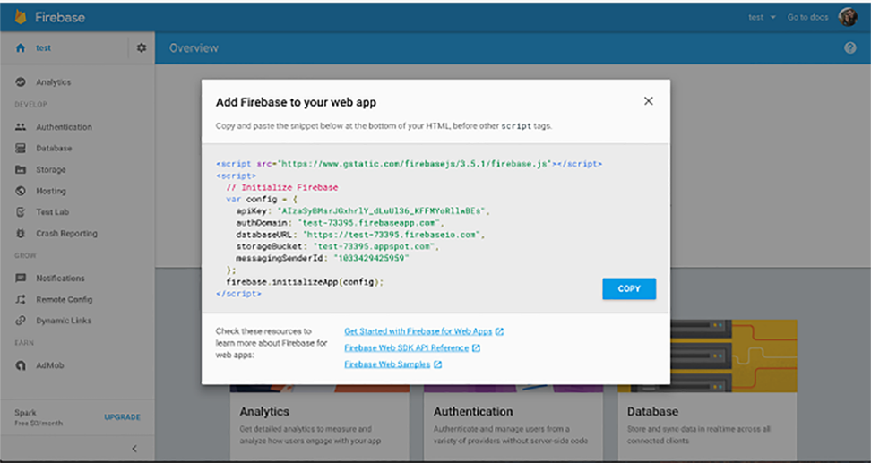
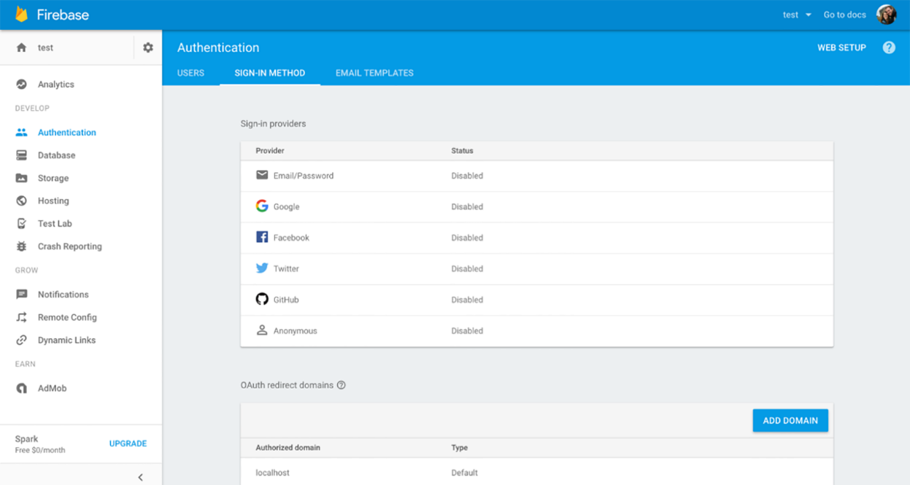

### 8.2　集成Firebase

随着路由器完善并运作起来，我们还想在本章解决一个以前无法解决的问题：启用用户登录和身份验证。我们将使用流行且易用的“后端即服务”平台Firebase来完成它。Firebase提供的服务抽象或替代了用于处理用户数据、身份验证以及其他关注点的后端API。就我们的目的而言，可以将Firebase视为后端API的简易替代。

我们不会使用Firebase完全替换应用的后端（仍然会使用自己的API服务器），但会使用Firebase来处理用户登录和用户管理。在开始使用Firebase之前，如果还没有账户就创建一个。一旦注册好，转去Firebase控制台并创建一个用于Letters Social的新项目。一旦完成，点击“Add Firebase to Your Web App”按钮打开一个模态窗口，会看到一些将被用到的应用配置信息，参见图8-2。




<center class="my_markdown"><b class="my_markdown">图8-2　Firebase控制台。创建用于Letters Social应用实例的新项目</b></center>

一旦创建了项目并且可以访问项目的配置值，就准备好开始了。Firebase SDK已经随示例应用代码一起安装了，因此可以继续，并在src下的backend新目录中创建名为core.js的新文件（src/backend/core.js）。代码清单8-11展示了如何使用应用配置的值来设置core.js。我已经在源代码中包含了公开的Firebase API键，以便你能在没有账户的情况下运行应用，但如果你想替换成自己的键，可以很容易地修改配置目录中的值。

代码清单8-11　配置Firebase后端（src/backend/core.js）

```javascript
import firebase from 'firebase';
const config = {
    apiKey: process.env.GOOGLE_API_KEY,  ⇽--- Webpack注入的值——如果想换成自己的，改变配置目录中的值
    authDomain: process.env.FIREBASE_AUTH_DOMAIN
};
try {
    firebase.initializeApp(config);  ⇽--- 使用自己的凭证来初始化Firebase
} catch (e) {
    console.error('Error initializing firebase — check your source code');
    console.error(e);
}
export { firebase };  ⇽--- 导出配置好的firebase实例以便在其他地方使用
```

由于要用Firebase做身份验证，因此需要设置一些代码来利用这项功能。如图8-3所示，开始使用之前，先选择一个要使用的身份验证平台。选择GitHub、Facebook、Google或者Twitter，会让已经拥有这些账号的用户直接登录，而无须管理另一套用户名/密码。因为访问应用的大多数用户可能都有GitHub账号，所以我建议选择GitHub，不过你可以完全自由地设置一个或者多个其他平台来用。简单起见，我将在示例中使用GitHub。一旦确定，点击选择供应商并遵照指示进行平台设置。


<center class="my_markdown"><b class="my_markdown">图8-3　使用Firebase设置身份验证方法。导航到身份验证部分，然后选择社交供应商。接着遵照所选择的社交身份验证者的指示，确保Firebase可以访问正确的认证信息来使用所选择的平台进行身份验证</b></center>

设置好与Firebase一起使用的平台之后，需要设置更多代码，以便与Firebase交互来执行用户登录。Firebase附带了可以使用各种社交平台进行身份验证的内置工具。如前所述，我会使用GitHub，你可以自由使用自己设置的任何一个或者多个供应商。它们都遵循相同的模式（如创建供应商对象、设置作用域等）。代码清单8-12展示了如何在src/backend/auth.js文件中设置身份验证实用工具。我们会创建函数获取用户和token以及登录和登出。

代码清单8-12　设置身份验证工具（src/backend/auth.js）

```javascript
import { firebase } from './core';  ⇽--- 导入最近配置的Firebase库
const github = new firebase.auth.GithubAuthProvider();  ⇽--- 使用Firebase设置GitHub身份验证供应商
github.addScope('user:email');
export function logUserOut() {  ⇽--- 创建包装了Firebase的登出方法的函数
    return firebase.auth().signOut();
}
export function loginWithGithub() {
    return firebase.auth().signInWithPopup(github);  ⇽--- 创建简单的loginWithGithub实用方法，其返回一个Firebase身份验证操作的Promise
}
export function getFirebaseUser() {  ⇽--- 创建获取Firebase用户的包装方法
    return new Promise(resolve => firebase.auth().onAuthStateChanged(user =>
     resolve(user)));
}
export function getFirebaseToken() {  ⇽--- 之后会需要token，所以创建一个帮助获取token的方法
    const currentUser = firebase.auth().currentUser;
    if (!currentUser) {
        return Promise.resolve(null);
    }
    return currentUser.getIdToken(true);
}
```

现在，所有一切都已准备就绪了，我们可以创建一个处理登录的新组件。创建一个名为src/pages/Login.js的新文件。我们会在这个文件中创建一个告诉用户如何登录Letter Social的简单组件。代码清单8-13展示了Login页面组件。

代码清单8-13　Login组件（src/pages/Login.js）

```javascript
import React, { Component } from 'react';
import { history } from '../history';  ⇽--- 导入该组件需要的库
import { loginWithGithub } from '../backend/auth';
import Welcome from '../components/welcome/Welcome';
export class Login extends Component {
    constructor(props) {
        super(props);
        this.login = this.login.bind(this);  ⇽--- 创建并绑定login方法
    }
    login() {  ⇽--- 创建并绑定login方法
        loginWithGithub().then(() => {  ⇽--- 使用之前创建的包装方法来用GitHub登录
            history.push('/');
        });
    }
    render() {
        return (
            <div className="login">
                <div className="welcome-container">
                    <Welcome />  ⇽--- 渲染Welcome组件（包含在源代码中）或者任何其他使用者喜欢的东西
                </div>
                <div className="providers">
                    <button onClick={this.login}>  ⇽--- 确保当用户点击登录按钮时登录方法会被调用
                        <i className={`fa fa-github`} /> log in with Github
                    </button>
                </div>
            </div>
        );
    }
}
export default Login;
```

