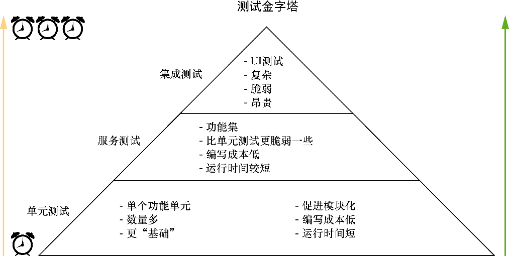

### 9.1　测试的类型

就像我说过的，测试软件是使用软件来验证假设的过程。正因为是使用软件来测试软件，所以测试最终将使用与构建软件时相同的基本类型，如布尔值、数字、字符串、函数、对象等。重要的是要记住，这里没有魔法——只是更多的代码。

测试有不同类型，我们将使用其中一些类型来测试我们的React应用程序。它们涵盖了应用程序的不同方面，当一起使用并且比例适当，它们会极大地提升对应用程序的信心。不同类型的测试处理应用程序的不同部分和范围。一个经过良好测试的应用程序不但会测试组成应用基础部分的独立的功能单元，还会测试这些功能单元的集合，以及在最高层次上所有东西结合在一起的点（如用户界面）。

下面是一些测试类型。

+ 单元测试——聚焦于单个功能单元。例如，有一个从服务器端获取新帖子的工具方法。单元测试将只关注这一个函数，而不关心其他任何事情。与组件一样，这些测试允许重构并促进了模块化。
+ 服务测试——聚焦于功能集。“测试谱系”这一部分可能包含各种粒度和关注点。关键的一点是测试的东西即不是最高层次的功能（参见接下来的集成测试）也不是最低层次的功能。一个服务测试的例子可能是一个使用了几个功能单元的工具，但它本身并不在集成测试的层次上。
+ 集成测试——聚焦于更高层次的测试：应用程序的各个部分的集成。它们测试了服务和低层功能结合在一起的方式。通常，这些测试通过应用的用户界面来测试应用，而不是通过用户界面背后的单独代码。这些测试可以模拟点击、用户输入以及其他驱动应用程序的交互。

你可能想知道这些测试代码是什么样子的，我们很快就会讲到，但我们需要先讨论这些测试在整个测试方法中是如何协同工作的。如果之前做过测试，你可能听说过测试金字塔。如图9-1所示，这个金字塔通常指的是应该编写的不同类型测试的比例。本章将只为组件编写单元测试。

<b class="my_markdown">图9-1　测试金字塔是一种指导开发者在测试应用程序时编写多少和哪种类型测试的方法。需要注意的是，某些类型的测试需要花费更长时间，因此在时间方面更“昂贵”（财务成本亦然）</b>

