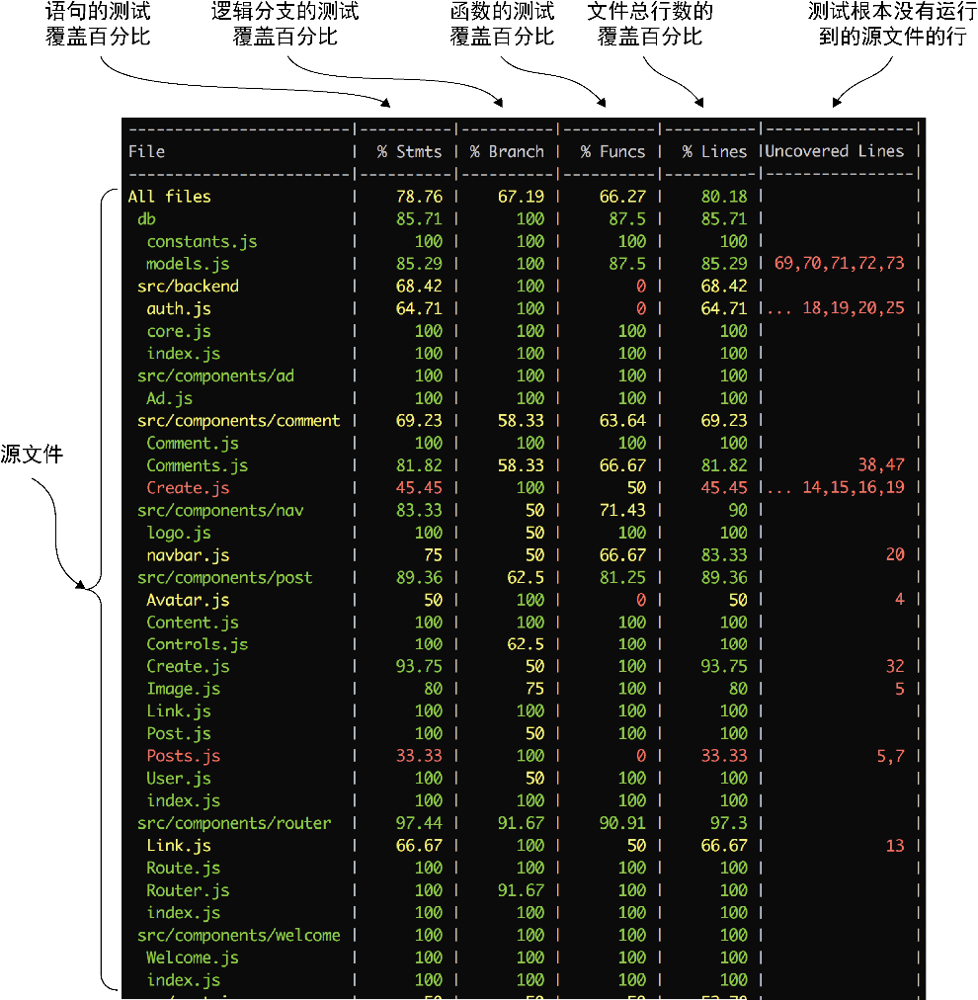
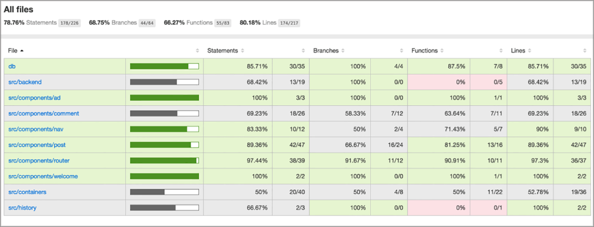
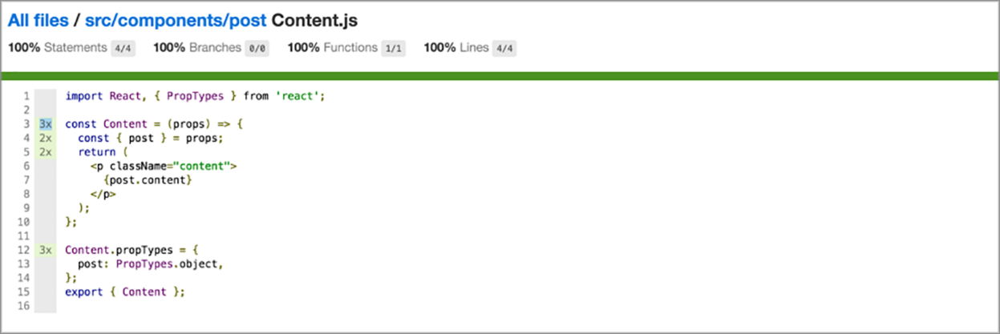

### 9.3.4　测试覆盖率

现在我们已经亲自测试了一些组件，让我们看看测试覆盖率并看一下取得了哪些进展。在命令行终端，终止测试运行器，然后执行代码清单9-11中的命令，该命令将打开Jest中包含的coverage选项。

代码清单9-11　启用测试覆盖率（项目根目录）

```javascript
> npm run test:w
```

一旦测试运行器执行完测试，它就会输出一个类似于图9-3的彩色表格（覆盖率更小）。该图展示了带有每列注释的Jest覆盖率输出。有不同形式（如HTML）的可读的代码覆盖率报告，但在开发过程中终端输出是最有用的，因为它可以提供即时反馈。


<center class="my_markdown"><b class="my_markdown">图9-3　Jest的测试覆盖率输出显示了项目中不同文件的覆盖率统计数据。每一列反映了不同方面的
 覆盖率。对于每种覆盖率，Jest会显示已覆盖的百分比。语句和函数是简单的JavaScript语句和
 函数，而分支是逻辑分支。如果测试没有处理if语句的一个分支，就会在Uncovered Lines列的
 代码覆盖率中反映出来，也会在分支覆盖的百分比统计中反映出来</b></center>

Istanbul是生成图9-3中统计数据的工具。如果想看到更详细的覆盖信息，请打开带有coverage选项的 `jest` 命令生成的coverage目录。在这个目录中，Istanbul创建了一些文件。如果在浏览器中打开./coverage/lcov-report/index.html，应该会看到类似图9-4所示的内容。


<center class="my_markdown"><b class="my_markdown">图9-4　Istanbul以计算机可读和人类可读的格式生成覆盖率元数据。这里展示的覆盖率报告对于更
 详细地探究代码覆盖率非常有用。我们甚至可以按照不同的列进行排序并优先选出低覆盖率的文件。
 注意，这些列有语句、分支（if/else语句）、函数（调用了哪些函数）和行（代码行）</b></center>

Istanbul的输出很有用，但也可以深入到不同文件中，获得关于单个文件更深入的信息。每个文件应该展示不同行被覆盖的次数以及哪些行没有被覆盖的信息。大多数情况下，高层摘要已经足够好了，但有时可能想要检视单个报告，就像图9-5中的报告。当编写测试时，一旦覆盖了所有用例，我喜欢至少看一遍这些文件，以确保没有遗漏任何边缘用例或逻辑分支。


<center class="my_markdown"><b class="my_markdown">图9-5　Istanbul生成的单个文件覆盖率报告。可以看到有不同行被覆盖了多少次
 或者未被覆盖，从而准确地了解代码覆盖了代码的哪些部分</b></center>

对软件开发来说，测试覆盖率是一个重要而有用的工具，但不能把它当作代码正常工作的神奇保证。虽然可以达到100%的覆盖率，但仍旧有代码会出错。从技术上讲，也存在0%覆盖率的工作代码。覆盖率是为了确保测试执行了代码的所有不同部分，而不是保证没有错误或性能之类的问题，但它对这些是有用的，而且当考虑代码“完整度”时，覆盖率应该被当作一个重要的数据点。我曾在的团队对特定用户故事或任务的成功定义（除了其他方面）包括代码覆盖率超过80%、总体覆盖率没有下降。用覆盖率作为代码是否被测试过的指导，并检查测试进度。


**练习9-2　对覆盖率的思考**

我们在本章讨论了测试覆盖率。那么100%的测试覆盖率是否说明代码是完美的呢？代码覆盖率在测试中应该扮演什么角色？


