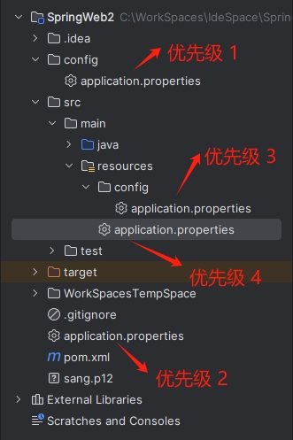

[toc]

### 1. 配置文件优先级

Spring Boot 项目中的 `application.properties` 配置文件一共可以出现在如下 4 哥位置：

+ 项目根目录下的 config 文件夹中。
+ 项目根目录下。
+ classpath 下的 config 文件夹中。
+ classpath 下。

如果这 4 哥位置中都有 application.properties 文件，那么加载的优先级从 1 到 4 依次降低。



> 提示：使用 application.yml 作为配置文件的优先级与此一致。

### 2. 自定义配置文件名

如果不想使用 `application.properties` 作为配置文件名，也可以自己定义。例如，在 `resources` 目录下创建一个配置文件 `app.properties`，然后将项目打包成 `jar` 包，打包成功后，使用如下命令运行：

```shell
$ java -jar chapter02-2-0.0.0.1-SNAPSHOT.jar --spring.config.name=app
```

在运行时再指定配置文件的名字。使用 `spring.config.location` 也可以指定配置文件所在目录（注意需要以 `/` 结束），代码如下：

```shell
$ java -jar chapter02-2-0.0.0.1-SNAPSHOT.jar --spring.config.name=app --spring.config.location=classpath:/
```

