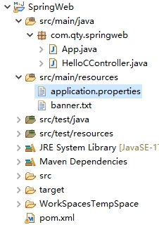
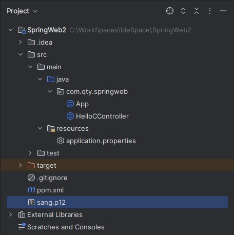
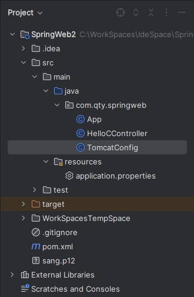

[toc]

在 Spring Boot 项目中，可以内置 Tomcat、Jetty、Undertow、Netty 等容器。

### 1. Tomcat 配置

#### 1.1 常规配置

当开发者添加了 `spring-boot-starter-web` 依赖之后，默认会使用 `Tomcat` 作为 `web` 容器。如果需要对 `Tomcat` 做进一步的配置，可以在 `application.properties` 中进行配置，代码如下：

```properties
server.port=8081
server.error.path=/error
server.servlet.session.timeout=30m
server.servlet.context-path=/
server.tomcat.uri-encoding=utf-8
server.tomcat.max-threads=500
server.tomcat.basedir=C:\WorkSpaces\TempSpace
```

文件路径如下：



代码解释：

+ `server.port`：配置了 Web 容器的端口号。
+ `error.path`：配置了当项目出错时跳转去的页面。
+ `session.timeout`：配置了 `session` 失效时间， 30m 表示 30 分钟，如果不写单位，默认单位是秒。由于 Tomcat 中配置 `session` 过期时间以分钟为单位，因此这里单位如果是秒的话，该时间会被转换为一个不超过所配置秒数的最大分钟数，例如这里配置了119，默认单位为秒，则实际 `session` 过期时间为 1 分钟。
+ `context-path`：表示项目名称，不配置时默认为 `/`。如果配置了，就要访问路径中加上配置的路径。
+ `uri-encoding`：表示配置 Tomcat 请求编码。
+ `max-threads`： 表示 Tomcat 最大线程数。
+ `basedir`：是一个存放 Tomcat 运行日志和临时文件的目录，若不配置，则默认使用系统的临时目录。

#### 1.2 HTTPS 配置

JDK 中提供了一个 Java 数字证书管理工具 `keytool`，在 `\jdk\bin` 目录下，通过这个工具可以自己生成一个数字证书，生成命令如下：

```shell
$ keytool -genkey -alias tomcathttps -keyalg RSA -keysize 2048 -keystore sang.p12 -validity 365
```

命令解释：

+ `-genkey`：表示要创建一个新的密钥。
+ `-alias`：表示 keystore 的别名。
+ `-keyalg`：表示使用的加密算法是 RSA，一种非对称加密算法。
+ `-keysize`：表示密钥的长度。
+ `-keystore` 表示生成的密钥存放位置。
+ `-validity` 表示密钥的有效时间，单位为天。

将生成的 sang.p12 文件复制到项目的根目录下：



然后在 `application.properties` 文件添加如下配置：

```properties
server.ssl.key-store=sang.p12
server.ssl.key-alias=tomcathttps
server.ssl.key-store-password=123456
```

代码解释：

+ `key-store`：表示密钥文件名。
+ `key-alias`：表示密钥别名。
+ `key-store-password`：就是在 cmd 命令执行过程中输入的密码。

配置成功后，启动项目，在浏览器中输入 <https://localhost:8080/hello> 来查看结果。

此时，如果以 HTTP 的方式访问接口，就会访问失败。这是因为 Spring Boot 不支持同时在配置中启动 HTTP 和 HTTPS。这个时候可以配置请求重定向，将 HTTP 请求重定向为 HTTPS 请求。配置方式如下：

```java
package com.qty.springweb;

import org.apache.catalina.Context;
import org.apache.catalina.connector.Connector;
import org.apache.tomcat.util.descriptor.web.SecurityCollection;
import org.apache.tomcat.util.descriptor.web.SecurityConstraint;
import org.springframework.boot.web.embedded.tomcat.TomcatServletWebServerFactory;
import org.springframework.context.annotation.Bean;
import org.springframework.context.annotation.Configuration;

@Configuration
public class TomcatConfig {

    @Bean
    TomcatServletWebServerFactory tomcatServletWebServerFactory() {
        TomcatServletWebServerFactory factory = new TomcatServletWebServerFactory() {
            @Override
            protected void postProcessContext(Context context) {
                SecurityConstraint constraint = new SecurityConstraint();
                constraint.setUserConstraint("CONFIDENTIAL");
                SecurityCollection collection = new SecurityCollection();
                collection.addPattern("/*");
                constraint.addCollection(collection);
                context.addConstraint(constraint);
            }
        };
        factory.addAdditionalTomcatConnectors(createTomcatConnector());
        return factory;
    }

    private Connector createTomcatConnector() {
        Connector connector = new Connector("org.apache.coyote.http11.Http11NioProtocol");
        connector.setScheme("http");
        connector.setPort(8080);
        connector.setSecure(false);
        connector.setRedirectPort(8081);
        return connector;
    }
}
```

文件结构如下：



### 2. Jetty 配置

除了 Tomcat 外，也可以在 Spring Boot 中嵌入 Jetty，配置方法如下（在 pom.xml 文件中修改）：

```xml
<dependency>
  <groupId>org.springframework.boot</groupId>
  <artifactId>spring-boot-starter-web</artifactId>
  <!-- 排除默认的 Tomcat 依赖 -->
  <exclusions>
    <exclusion>
      <groupId>org.springframework.boot</groupId>
      <artifactId>spring-boot-starter-tomcat</artifactId>
    </exclusion>
  </exclusions>
</dependency>
<dependency>
  <groupId>org.springframework.boot</groupId>
  <artifactId>spring-boot-starter-jetty</artifactId>
</dependency>
</dependencies>
```

主要是从 spring-boot-starter-web 中除去默认的 Tomcat，然后加入 Jetty 的依赖即可。

### 3. Undertow 配置

Undertow 是一个红帽公司开源的 Java 服务器，具有非常好的性能，配置方式与 Jetty 类似，代码如下：

```xml
<dependency>
  <groupId>org.springframework.boot</groupId>
  <artifactId>spring-boot-starter-web</artifactId>
  <!-- 排除默认的 Tomcat 依赖 -->
  <exclusions>
    <exclusion>
      <groupId>org.springframework.boot</groupId>
      <artifactId>spring-boot-starter-tomcat</artifactId>
    </exclusion>
  </exclusions>
</dependency>
<dependency>
  <groupId>org.springframework.boot</groupId>
  <artifactId>spring-boot-starter-undertow</artifactId>
</dependency>
```

