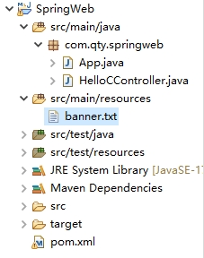

Spring Boot 项目在启动时会打印一个 banner：

```
  .   ____          _            __ _ _
 /\\ / ___'_ __ _ _(_)_ __  __ _ \ \ \ \
( ( )\___ | '_ | '_| | '_ \/ _` | \ \ \ \
 \\/  ___)| |_)| | | | | || (_| |  ) ) ) )
  '  |____| .__|_| |_|_| |_\__, | / / / /
 =========|_|==============|___/=/_/_/_/
 :: Spring Boot ::                (v3.2.0)

```

这个 banner 是可以定制的，在 resources 目录下创建一个 banner.txt 文件，在这个文件中写入的文本将在项目启动时打印出来。如果想将 TXT 文本设置成艺术字体，有以下几个在线网站可供参考：

+ <http://www.network-science.de/ascii>
+ <http://www.kammerl.de/ascii/AsciiSignature.php>
+ <http://patorjk.com/software/taag>

例如：

```text

  ________                  .___ .__                 __    
 /  _____/  ____   ____   __| _/ |  |  __ __   ____ |  | __
/   \  ___ /  _ \ /  _ \ / __ |  |  | |  |  \_/ ___\|  |/ /
\    \_\  (  <_> |  <_> ) /_/ |  |  |_|  |  /\  \___|    < 
 \______  /\____/ \____/\____ |  |____/____/  \___  >__|_ \
        \/                   \/                   \/     \/
 :: Spring Boot ::                (v3.2.0)
 
```

