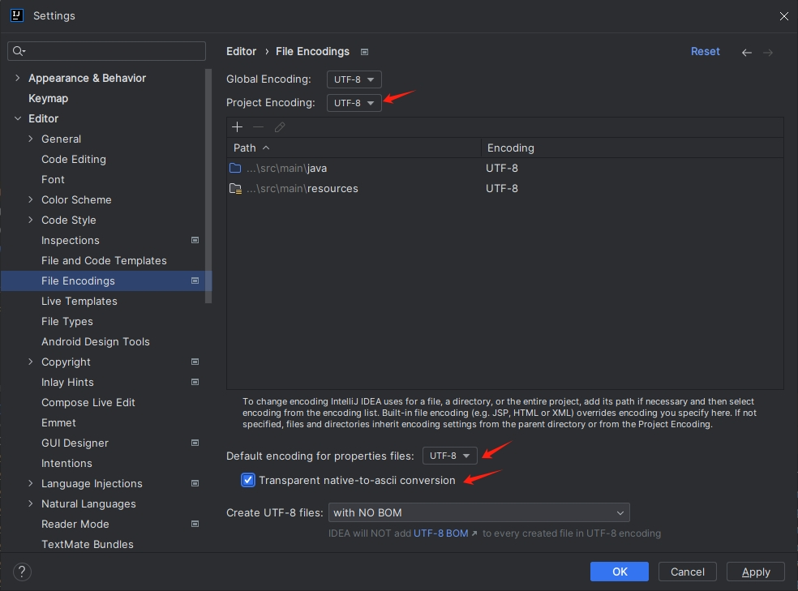

无论是 `Properties` 配置还是 `YAML` 配置，最终都会被加载到 `Spring Environment` 中。`Spring` 提供了 `@Value` 注解以及 `EnvironmentAware` 接口来将 `Spring Environment` 中的数据注入到属性上，Spring Boot 对此进一步提出了类型安全配置属性，这样即使在数据量非常庞大的情况下，也可以更加方便地将配置文件中的数据注入 `Bean` 中。考虑在 `application.properties` 中添加如下一段配置：

```properties
book.name=三国演义
book.author=罗贯中
book.price=30
```

将这一段配置数据注入如下 `Bean` 中：

```java
package com.qty.springweb;

import org.springframework.boot.context.properties.ConfigurationProperties;
import org.springframework.stereotype.Component;

@Component
@ConfigurationProperties(prefix = "book")
public class Book {
    private String name;
    private String author;
    private float price;
	// 省略 getter/setter
}
```

代码解释：

+ `@ConfigurationProperties` 中的 `prefix` 属性描述了要加载的配置文件的前缀。
+ 如果配置文件是一个 YAML 文件，那么可以将数据注入一个集合中。
+ Spring Boot 采用了一种宽松的规则来进行属性绑定，如果 `Bean` 中的属性名为 `authorName`，那么配置文件中的属性可以是 `book.author_name`、`book.author-name`、`book.authorName` 或者 `book.AUTHORNAME`.

> 注意：
>
> 以上的配置可能会乱码，需要对中文进行转码。在 IntelliJ IDEA 中，这个转码非常容易，在 `File` -> `Settings...` 中进行简单配置即可：
>
> 

最后创建 `BookController` 进行简单测试：

```java
package com.qty.springweb;

import org.springframework.beans.factory.annotation.Autowired;
import org.springframework.web.bind.annotation.GetMapping;
import org.springframework.web.bind.annotation.RestController;

@RestController
public class BookController {

    @Autowired
    Book book;

    @GetMapping("/book")
    public String book() {
        return book.toString();
    }
}
```

