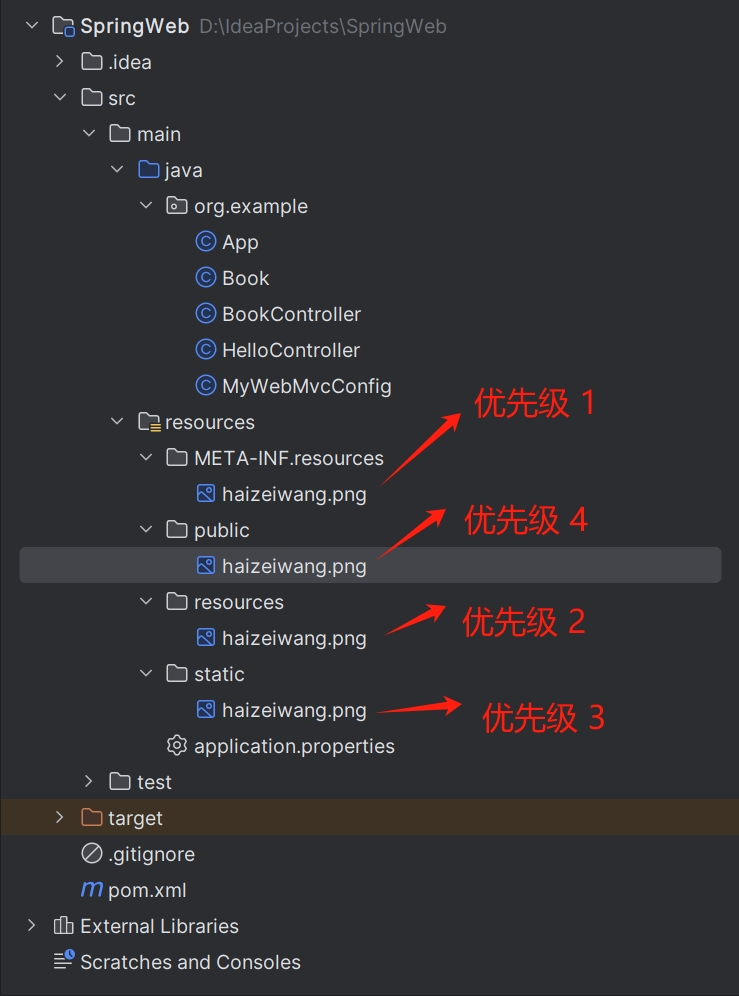

[toc]

### 1. 默认策略

`Spring Boot` 中对于 `Spring MVC` 的自动化配置都在 `WebMvcAutoConfiguration` 类中，因此对于默认的静态资源过滤器策略可以从这个类中一窥究竟。

在 `WebMvcAutoConfiguration` 类中有一个静态内部类 `WebMvcAutoConfigurationAdapter`。`WebMvcConfigurer` 接口中有一个方法 `addResourceHandlers`，是用来配置静态资源过滤的。方法在 `WebMvcAutoConfigurationAdapter` 类中得到了实现，部分核心代码如下：

```java
private void addResourceHandler(ResourceHandlerRegistry registry, String pattern, Consumer<ResourceHandlerRegistration> customizer) {
    if (!registry.hasMappingForPattern(pattern)) {
        ResourceHandlerRegistration registration = registry.addResourceHandler(new String[]{pattern});
        customizer.accept(registration);
        registration.setCachePeriod(this.getSeconds(this.resourceProperties.getCache().getPeriod()));
        registration.setCacheControl(this.resourceProperties.getCache().getCachecontrol().toHttpCacheControl());
        registration.setUseLastModified(this.resourceProperties.getCache().isUseLastModified());
        this.customizeResourceHandlerRegistration(registration);
    }
}
```

`Spring Boot` 在这里进行了默认的静态资源过滤配置，其中 `staticPathPattern` 默认定义在 `WebMvcProperties` 中，定义内容如下：

```java
private String staticPathPattern = "/**";
```

通常静态资源存储在 `classpath:/META-INF/resources/`、`classpath:/resources/`、`classpath:/static/`、`classpath:/public/` 以及 `/`。



### 2. 自定义策略

#### 2.1 在配置文件中定义

可以在 `application.properties` 中直接定义过滤规则和静态资源位置，代码如下：

```properties
spring.mvc.static-path-pattern=/static/**
spring.resources.static-locations=classpath:/static/
```

过滤规则位 `/static/**`，静态资源位置位 `classpath:/static/`。

重新启动项目，在浏览器中输入 <http://localhost:8080/static/p1.png>，即可看到 `classpath:/static/` 目录下的资源。

> 注意：
>
> 在 `Spring Boot` 的最新版本中，`spring.resources.static-locations` 属性已经失效了。查看 `WebProperties.java` 的代码，发现 `staticLocations` 实例对应的类并没有添加属性配置注解：
>
> ```java
> public static class Resources {
>     private static final String[] CLASSPATH_RESOURCE_LOCATIONS = new String[]{"classpath:/META-INF/resources/", "classpath:/resources/", "classpath:/static/", "classpath:/public/"};
>     private String[] staticLocations;
>     private boolean addMappings;
>     private boolean customized;
>     private final Chain chain;
>     private final Cache cache;
>     ...
> }
> ```

### 2. Java 编码定义

可以通过 `Java` 编码方式来定义，此时只需要实现 `WebMvcConfigurer` 接口即可，然后实现该接口的 `addResourceHandlers` 方法，代码如下：

```java
import org.springframework.context.annotation.Configuration;
import org.springframework.web.servlet.config.annotation.ResourceHandlerRegistry;
import org.springframework.web.servlet.config.annotation.WebMvcConfigurer;

@Configuration
public class MyWebMvcConfig implements WebMvcConfigurer {

    @Override
    public void addResourceHandlers(ResourceHandlerRegistry registry) {
        registry.addResourceHandler("/static/**")
                .addResourceLocations("classpath:/static/");
    }

}
```

重新启动项目，在浏览器中输入 <http://localhost:8080/static/p1.png>，即可看到 `classpath:/static/` 目录下的资源。
