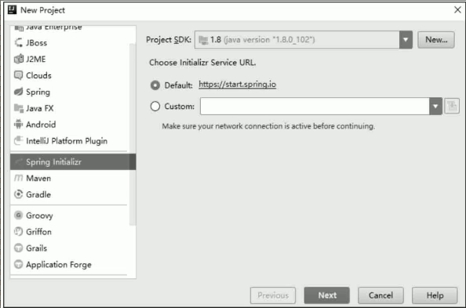
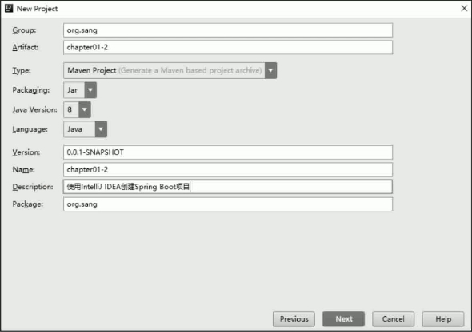
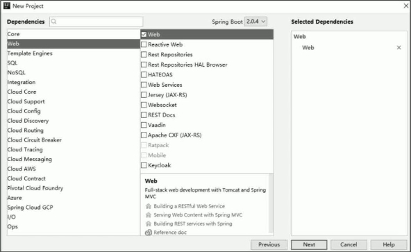
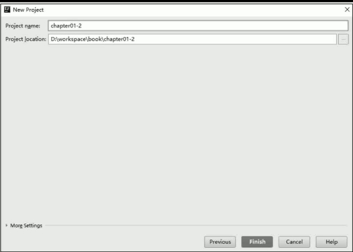

IntelliJ IDEA 可以直接创建一个 Spring Boot 项目，但是注意直接创建 Spring Boot 项目这个功能在社区版的 IntelliJ IDEA 上是不存在的。创建方式如下：

**步骤 01** 创建项目时选择 Spring Initializr。

**步骤 02** 输入项目基本信息

**步骤 03** 选择依赖。

**步骤 04** 选择项目创建路径。

